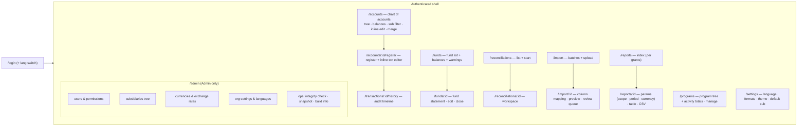
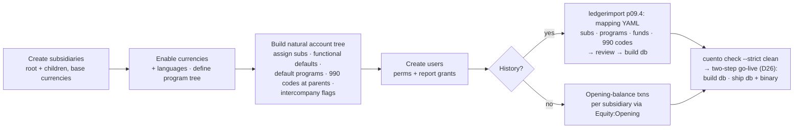
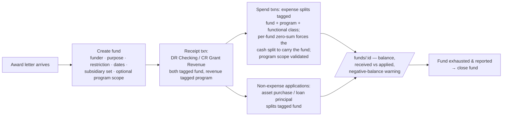
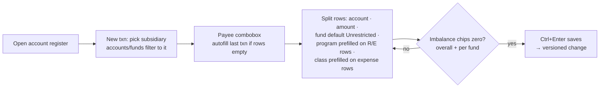
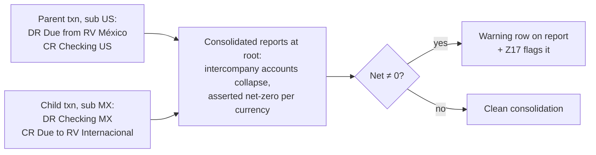
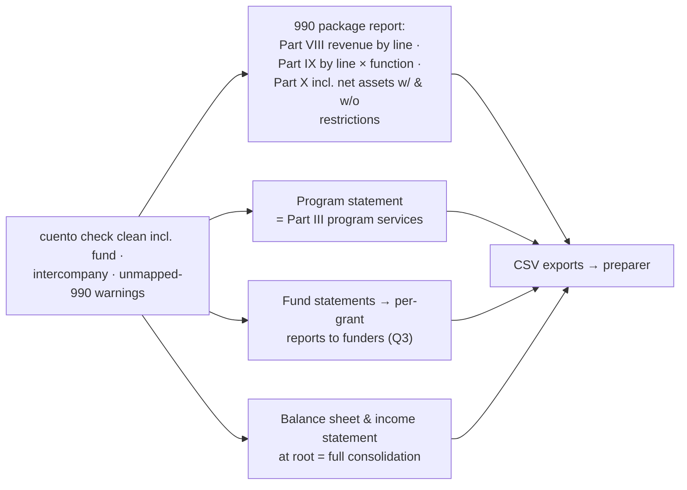

# PLAN.md — cuento implementation plan

Read AGENTS.md first; it defines the working method, hard rules, and commit format.
Execution loop per step: write the listed tests → confirm they fail for the right reason → implement to green → refactor → `make lint test check` → tick the checkbox → commit `pNN.M area: summary`.

Legend: `[ ]` todo · `[x]` done · `[P]` parallel-safe (may dispatch to a subagent alongside its siblings).
Human inputs required: place the cleaned full-ledger CSV export in `fixtures/source/` before p09.2; iterate the production mapping with the agent at p09.4 (this is the go-live gate, D26); answer open questions Q5–Q6 (below) whenever possible — affected steps are tagged.

---

## Settled decisions (p00.1 seeds docs/DECISIONS.md from this table)

| ID | Decision | Rationale |
|----|----------|-----------|
| D1 | Amounts stored as `int64` in the currency's **minor units**; exponent per currency from `currencies` table. | Exact arithmetic; JPY/BHD-style exponents cost nothing to support. |
| D2 | **Net-debit** signed amounts (debits +, credits −). Every transaction sums to exactly 0 in its currency — and to 0 **within each fund** (D20). Signed vs DR/CR is display-only, per user. | Single column; mixed revenue/expense subtrees subtotal naturally. |
| D3 | Transactions are **single-currency**. Cross-currency flows = two transactions through a multicurrency **FX Clearing** account (equity-class). Its converted balance on reports is cumulative FX gain/loss. GnuCash-style per-split value/amount pair rejected for schema+UI complexity; revisit if clearing proves awkward. | Keeps the zero-sum invariant trivial and honest. |
| D4 | Audit = append-only `*_versions` tables: entity id + `change_id` + `valid_from` + `op(create/update/delete)` + full snapshot of business columns. Current tables are the denormalized latest state. State as of time T = row with max(`valid_from`) ≤ T per entity, excluded if `op='delete'`. Versions tables never see UPDATE/DELETE. | Fast current-state queries, mechanical point-in-time, pure append. |
| D5 | v1 audit surface: per-transaction history UI + per-entity as-of store queries + integrity check that current == latest version. Whole-report "books as edited at time T" is supported by the data but deferred as a feature. | Keeps report toolkit single-plane for v1. |
| D6 | **sqlc** (queries) + **goose** (migrations, embedded). Forward-only migrations; runner backs up the db file before applying. No down migrations. | SQL stays visible/optimizable; backup beats theoretical rollbacks. |
| D7 | Driver: `modernc.org/sqlite` (pure Go). | CGO-free static binary, trivial cross-compile; perf ample at this scale. |
| D8 | Hosting: GCE **e2-micro always-free VM** + persistent disk + **Litestream → GCS** (free 5 GB). TLS via in-process autocert. Cloud Run rejected: ephemeral FS + scale-to-zero vs a single-writer SQLite file. | One binary, one VM, one systemd unit. |
| D9 | Auth primitives: scs sessions (SQLite store), argon2id, stdlib `http.CrossOriginProtection` (fallback nosurf), `html/template` escaping + strict CSP, `x/time/rate` on login. | Nothing hand-rolled; everything provable via route-registry tests. |
| D10 | Permissions: per-user `txn_perm ∈ {none,read,write}` + per-report-group read grants; `is_admin` implies everything. Report groups are declared in code and synced to the db at startup. Permissions are org-global in v1 (per-subsidiary grants → backlog, Q2). | Matches stated needs; no RBAC machinery. |
| D11 | Tree rules: A/L/E children must match parent type exactly; revenue and expense may interleave freely under R/E parents. Placeholders (accounts with children) hold no splits. | Balance sheet stays clean; mixed groupings stay possible — though the chart holds *natural* categories, since programs are a dimension (D24). |
| D12 | FX conversion happens only in reports: balance-sheet figures at the closing (as-of) rate; P&L activity at each transaction-date rate; rate lookup = latest on-or-before date, direct pair then reciprocal. Rates stored as REAL; conversion rounds half-even at final aggregates. | Standard treatment; storage stays integer-exact. |
| D13 | Splits in a **finalized** reconciliation are locked (amount/account/txn/date/fund); editing requires an audited unreconcile first. Reconciliation is per `(account, currency)` and spans all funds — a bank statement covers one balance. | Statements stay provable; a key reason funds are a dimension, not currencies (D20). |
| D14 | **Bilingual UI (en, es) in v1**, extensible: `internal/i18n` embedded key→string catalogs + `t` template func; missing key falls back to en; a parity test enforces identical key sets across catalogs; adding a language = adding one catalog file (+ account names in that language, optional). No CLDR or i18n dependency. Supersedes the earlier English-chrome-only decision. | The bookkeepers work in Spanish; catalogs are a page of code, not a framework. |
| D15 | Dependency allowlist: modernc.org/sqlite, pressly/goose/v3, sqlc (tool), alexedwards/scs/v2 (+sqlite3store), alexedwards/argon2id, golang.org/x/crypto (autocert), golang.org/x/time, google/go-cmp (tests). Additions need a DECISIONS entry. | Lightweight by construction. |
| D16 | Date/number formats are small enumerations implemented and tested in `internal/money` — no CLDR dependency. Date entry uses text inputs (never `input[type=date]`). | Users pick from a handful of formats; browsers don't get a vote. |
| D17 | IDs are `INTEGER PRIMARY KEY AUTOINCREMENT` on financial tables (no rowid reuse after delete — audit-friendly). | Cheap referential permanence. |
| D18 | **Subsidiaries**: `subsidiaries` is a tree with exactly one root; each subsidiary has a `base_currency`. Accounts map to **one or more** subsidiaries via `account_subsidiaries`, with the invariant **parent set ⊇ union of children's sets** (superset, not equality — org-wide placeholders may hold sub-specific children; assigning a sub to an account auto-propagates to its ancestors). Every transaction belongs to **exactly one** subsidiary and all its split accounts must include that subsidiary. Report scope = a chosen subsidiary **consolidated with all descendants**; the root is full consolidation. Default report currency = the scoped subsidiary's base currency. | NetSuite-shaped without OneWorld machinery; superset keeps shared placeholders from forcing sub-specific accounts org-wide. |
| D19 | **Intercompany**: cross-subsidiary funding = paired transactions through due-to/due-from accounts flagged `intercompany`. Consolidated reports whose scope covers both sides collapse flagged accounts after asserting they net to zero per currency; a nonzero net renders as a warning row (never silently dropped). Elimination journal entries are out of scope. | Single-sub transactions make this unavoidable; the flag makes consolidation honest and cheap. |
| D20 | **Restricted funds are a split dimension with fund-level conservation.** `funds` table documents grants/restricted gifts (funder, purpose, restriction type, dates); a fund is scoped to **one or more subsidiaries** via `fund_subsidiaries` (not inherited by descendants — a transaction's subsidiary must be in the fund's set, Q1 resolved) and optionally to a **program subtree** (R/E splits tagged the fund must carry a program inside it). Every split carries `fund_id` (NULL = unrestricted); every transaction must sum to zero **within each fund**, not just overall — so restricted money is conserved through *any* account: cash, buildings, loan payoffs. Modelling funds as sub-currencies (`USD.grant`) was evaluated and rejected: identical semantics (per-fund zero-sum ⇔ per-currency zero-sum), but it breaks single-statement reconciliation (D13), multiplies the currency/rate/report surface, and a grant partially converted cross-currency would mint pseudo-currencies on both sides. The UI presents the dimension as "Fund: Unrestricted General / ⟨grant⟩" per split, with a transaction-level apply-to-all. GAAP "released from restrictions" presentation is **derived** in reporting (restricted-fund expenses + non-expense applications), not journaled. | All the tracking power of the sub-currency idea, none of the collateral damage. |
| D21 | **Functional expenses (990 Part IX)** are a fixed enum `program | management | fundraising` ("development" = fundraising column). Expense accounts carry a **default** class; every expense split **requires** a class (prefilled from the account default, overridable per split — covers rent/salary allocations); non-expense splits must be NULL. Trigger-enforced. Duplicating the account hierarchy per class rejected: Part IX is natural × functional — a matrix, and matrices are dimensions. | One report renders Part IX; the tree stays single and clean. |
| D22 | Import source is the **cleaned full-ledger CSV** (former O1, resolved). `cmd/ledgerimport` is driven by a reviewable mapping file: per source account → {type, parent, subsidiaries, default functional class}; per row → subsidiary and fund (defaults: root subsidiary, unrestricted) with optional source-column overrides. | The export is already a ledger; converting it beats re-keying history. |
| D23 | Negative restricted-fund balances (spending a grant past its receipts) are surfaced as **warnings** by `cuento check` and on fund pages — never blocked at write time. | Backdated entries make hard blocks hostile; visibility beats prevention here. |
| D24 | **Programs are a dimension**: `programs` tree with a single seeded root ("General" — the unallocated default); every **revenue and expense** split carries `program_id` (required; prefilled from the account's optional default program, else root); A/L/E splits carry none. Programs are org-global (Q5). Consequence: the chart of accounts holds *natural* categories (salaries, supplies, occupancy, program fees) and mission structure lives in the program tree — same reasoning as D21, matrices are dimensions. Program and functional class are **orthogonal**: a fundraising event benefiting one program is class `fundraising` + that program; Part IX columns come from class, Part III rows from programs. | 990 needs program-level revenue *and* expenses; decision-makers need per-program statements; duplicating programs in the account tree was the same mistake as functional duplication. |
| D25 | **990 line mapping**: seeded `form990_lines` reference table (part, line, label, allowed account types) covering Parts VIII (revenue), IX (expenses), and X (balance sheet); `accounts.form990_code` nullable with **effective code = own or nearest ancestor's** (inheritable, so mapping happens at a handful of parents). Not hard-required: 990 reports render an explicit **Unmapped** bucket instead of dropping rows, and a warning check flags active R/E leaves with activity but no effective code. Goal: the full 990 package (Parts III, VIII, IX, X) is producible directly. | One field, set ~10 times, and year-end becomes running four reports. |
| D26 | **Two-step go-live**: the production database is produced by `cmd/ledgerimport` from the cleaned CSVs + a reviewed mapping file, built and rehearsed during p09.4 (locally; mapping lives gitignored beside the source data). Deploy = (1) build db + `cuento check --strict`, (2) ship db + binary. The historical mapping assigns subsidiaries, funds, programs, functional classes, and 990 codes (inherited from the created tree) up front. | Import is the deployment path, not an afterthought; rehearsing it early means cutover is mechanical. |

## Open questions (defaults chosen so work is never blocked)

Resolved (2026-07): **Q1** funds are not inherited but scope to one or more subsidiaries, optionally to a program subtree (D20). **Q2** permissions stay global (D10). **Q3** reports split only with/without donor restrictions; per-grant funder reporting = the fund statement (p15.8). **Q4** hosting, FX, and "development" = fundraising column confirmed.

| ID | Question | Default until answered | Affects |
|----|----------|------------------------|---------|
| Q5 | Should programs be scopeable per subsidiary, or org-global? | Global — every program usable in every sub; per-sub scoping → backlog if miscoding actually occurs. | p07, p08 |
| Q6 | Seed the full Form 990 line set, or the 990-EZ subset? | Full 990 (supersets EZ; EZ preparers ignore extra granularity). | p05.1, p15.11 |

---

## Functional / end-to-end tests (Playwright) — cross-cutting (added 2026-07-11 at human request)

Browser-based functional tests that drive the **real** `cuento serve -dev`. Test-only (Node/npm under `e2e/`), never a Go dependency, opt-in via `make e2e` (needs a browser; kept out of the hermetic `make test`). See DECISIONS "Functional testing". The suite grows with the UI: the harness is built once, then each UI phase adds specs for its real flows.

- [x] **pE.1 build: Playwright functional-test harness.**
  Tests first: a `login.spec` that (bad creds → error shown; good creds → authenticated landing) drives the actual login page.
  Build: `e2e/` with `package.json` (playwright pinned), `playwright.config`, a dev-server fixture (build binary → temp db → migrate → seed admin via `cuento user add --admin` → launch `serve -dev` on an ephemeral port → teardown), the login spec, and a `make e2e` target. `.gitignore` node_modules + Playwright artifacts. Prove it runs green locally (chromium is available).
- [ ] **pE.2+ per-UI-phase specs.** As phases 11–17 land, each adds functional specs for its delivered flows (chart of accounts CRUD, transaction entry incl. per-fund imbalance + keyboard entry, funds workspace, reconciliation toggle, reports params→table, bank-import review→post, settings/locale). Tracked as part of each UI step's work; `docs/qa-entry.md` (p12.6) references the keyboard-entry spec.

---

## Phase 0 — Scaffold

- [x] **p00.1 chore: repository scaffold.**
  No tests (bootstrap). `go mod init cuento` (module path placeholder — rename if it gets a home on GitHub). Directory layout per AGENTS. Makefile with all targets (stubs where the phase hasn't arrived). `.golangci.yml` (govet, staticcheck, errcheck, gofumpt or gofmt). `.gitignore`: `fixtures/source/`, `fixtures/sample.db`, `*.db*`, `/bin`, `.env`. Seed `docs/DECISIONS.md` from the table above. Commit AGENTS.md, PLAN.md, DECISIONS.md.
- [x] **p00.2 web: hello server.**
  Tests first: `TestHealthz` (200, JSON `{status:"ok",version}`), `TestStaticEmbedded` (a placeholder asset serves from the embedded FS).
  Build: `cuento serve` with graceful shutdown (context + signal), `/healthz`, embedded `web/static` skeleton.
- [x] **p00.3 chore: CI.**
  Checks: `go vet`, golangci-lint, `go test ./...`, `govulncheck`. Done when they pass **locally** (no hosted CI; the GitHub Actions workflow was removed 2026-07-11 at the human's request — DoD clarified in DECISIONS p00.3).

## Phase 1 — Database foundation

- [x] **p01.1 db: Open with pragmas.**
  Tests: `TestOpenSetsPragmas` (query `journal_mode`, `foreign_keys`, `busy_timeout`, `synchronous`), `TestForeignKeysEnforced` (violating insert fails).
  Build: `db.Open(path)` — DSN, pragmas, sane pool settings; the only place pragmas are set.
- [x] **p01.2 db: migration runner.**
  Tests: `TestMigrateFreshReachesLatest`, `TestMigrateIdempotent`, `TestMigrateBacksUpFile` (a `<db>.pre-<version>.bak` copy exists before changes apply; skipped for brand-new files).
  Build: goose with embedded FS; `cuento migrate` subcommand; auto-migrate on `serve` start.
- [x] **p01.3 db: sqlc + test harness.**
  Tests: `TestNewDBIsolated` (two harness dbs don't interfere), `TestSqlcSmoke` (one trivial generated query round-trips).
  Build: `sqlc.yaml` (engine sqlite, schema = migrations dir, queries dir), `make gen`, `testutil.NewDB(t)` returning migrated temp-file db.

## Phase 2 — Change & versioning framework

- [x] **p02.1 db: users (minimal) + changes.**
  Tests: schema smoke via sqlc; `TestChangesRequiresActor` (FK to users enforced); system user (id 1, `system`) seeded.
  Build: migration — `users(id, username UNIQUE, display_name, created_at, disabled_at)`; `changes(id, actor_id → users, at RFC3339, kind, note)`.
- [x] **p02.2 store: write funnel.**
  Tests: `TestWriteRequiresActor` (no actor in ctx → error, nothing written), `TestWriteRecordsChange` (exactly one `changes` row per call), `TestWriteAtomicRollback` (fn error → no change row, no side effects).
  Build: `store.Store`, `store.Actor` + `WithActor(ctx)/ActorFrom(ctx)`, internal `write(ctx, kind, note, fn(tx, changeID))` helper; per-table version-append helpers follow the Appendix A pattern; `testutil.AssertVersioned` contract helper.

## Phase 3 — Money, formats & i18n

- [x] **p03.1 db: currencies.**
  Tests: `TestSeedCurrencies` (USD, MXN, EUR present with correct exponents), `TestExponentBounds` (CHECK 0–4).
  Build: migration `currencies(code PK, exponent, symbol, name, active)` + seed; store reads.
- [x] **p03.2 [P] money: Amount.**
  Tests: table tests for parse/format across all number formats, negative styles (minus/parentheses), and display modes (signed, DR/CR); property test `parse(format(x)) == x` over random minors and formats; `TestAddCurrencyMismatch`; `TestConvertRoundsHalfEven` (explicit tie cases).
  Build: `money.Amount{Minor, Currency}`, `Add/Neg/Split-safe` ops erroring on currency mismatch, `Parse`, `Format(opts)`, `ConvertMinor(minor, rate float64, fromExp, toExp)` with half-even rounding.
- [x] **p03.3 [P] money: date & number format enums.**
  Tests: format/parse tables for `DateFormat{ISO, US, EU}` (ISO always accepted on input regardless of setting); invalid inputs rejected with useful errors.
  Build: enums + tiny formatter/parser; these are the only date/number formatting entry points for the UI.
- [x] **p03.4 [P] i18n: catalog.**
  Tests: `TestCatalogParity` (en and es expose the exact same key set — the test that keeps translations honest forever), `TestFallbackToEnglish` (unknown lang / missing key), `TestInterpolation` (positional args).
  Build: `internal/i18n` — embedded `en.toml`/`es.toml` (flat key→string; hand-rolled minimal parser or key=value format to stay inside D15), `T(lang, key, args...)`, `Langs()`; template func registration happens in phase 10. Every later step adding a UI string adds it to **both** catalogs (AGENTS rule 9).

## Phase 4 — Subsidiaries

- [x] **p04.1 db: subsidiaries + versions.**
  Tests (direct SQL): exactly-one-root enforced (second NULL-parent insert rejected by trigger); FK to currencies; versions table exists.
  Build: migration — `subsidiaries(id, parent_id → subsidiaries, name UNIQUE, base_currency → currencies, active, sort_order)` + `subsidiaries_versions`; trigger `trg_subsidiaries_single_root`; seed root subsidiary (`Organization`, USD) so a single-entity org works with zero setup.
- [x] **p04.2 store: subsidiary operations.**
  Tests: `TestCreateSubsidiaryVersioned`, `TestMoveRejectsCycle`, `TestRootImmovable` (root keeps NULL parent), `TestDeactivateBlockedWithActiveChildren`, `TestSubTree` (depth-first order), `TestDescendants` (self + transitive closure — the primitive report scoping uses).
  Build: `CreateSubsidiary`, `UpdateSubsidiary` (rename/move/base-currency — base-currency change allowed; it only affects report defaults), `DeactivateSubsidiary` (blocked while it has active children; deactivated subs reject new transactions but keep history), `SubTree()`, `Descendants(id)` via recursive CTE.

## Phase 5 — Accounts

- [x] **p05.1 db: accounts + names + subsidiary map + versions + triggers.**
  Tests (direct SQL): inserting an expense under an asset fails; asset under asset succeeds; revenue under expense succeeds; `functional_class` on a non-expense account rejected; `form990_lines` seeded (spot-check known Part VIII/IX/X codes, Q6 default: full 990); versions tables exist for `accounts`, `account_names`, `account_subsidiaries`.
  Build: migration per Appendix A — `form990_lines(code PK, part, line, label, account_types, sort)` seeded reference (static; updated only by migration, not versioned), `accounts` (with `functional_class` default column, `intercompany` flag, `form990_code → form990_lines`), `account_names(account_id, lang, name)`, `account_subsidiaries(account_id, subsidiary_id)`, all three `*_versions`, triggers `trg_accounts_parent_typeclass`, `trg_accounts_function_expense_only`. (Leaf/no-splits triggers arrive in p08.1 when `splits` exists; `default_program_id` arrives in p07.1 once `programs` exists.)
- [x] **p05.2 store: account operations.**
  Tests: `TestCreateAccountVersioned` (AssertVersioned for account + names + sub map), `TestCreateRequiresAtLeastOneSub`, `TestMoveRejectsCycle`, `TestMoveRejectsCrossTypeClass`, `TestMoveRejectsSubMismatch` (new parent's sub set must cover the moving account's), `TestAssignSubPropagatesToAncestors` (adding sub S to a leaf silently adds S up the chain), `TestRemoveSubBlockedByChildOrSplits` (can't remove S while a child has S; split-usage guard lands in p08 and is noted here as a TODO test tag), `TestDeactivate`, `TestTreeOrdering`, `TestAccountNameAsOf` (rename, then query the old name at an earlier T via versions), `TestEffective990Inherited` (code set on a parent resolves for all descendants; a child's own code wins), `TestSet990CodeTypeMismatch` (a revenue line on an expense account rejected against `form990_lines.account_types`).
  Build: `CreateAccount(subs ≥ 1)`, `UpdateAccount` (move/flags/default currency/functional default/intercompany/990 code), `SetAccountName(lang)`, `SetAccountSubsidiaries` (superset invariant per D18, ancestor auto-propagation), `DeactivateAccount`, `Tree(lang, subFilter)` and `Effective990Codes()` (nearest-ancestor resolution, D25) via recursive CTE.
- [x] **p05.3 store: name fallback.**
  Tests: user lang → en → any, exercised through `Tree`.
  Build: COALESCE join in the tree/name queries.

## Phase 6 — AuthN/Z

- [x] **p06.1 db+auth: credentials, perms, settings columns.**
  Tests: `TestHashVerify` (argon2id wrapper), `TestUsersVersionOmitsPasswordHash` (**critical** — snapshot never contains the hash), grant FK tests.
  Build: migration — users gain `password_hash`, `is_admin`, `txn_perm CHECK(none/read/write)`, settings columns (`locale`, `date_format`, `number_format`, `display_mode`, `neg_style`, `theme`, `default_subsidiary_id`); `report_groups`, `user_report_grants` (+ versions for users and grants).
- [x] **p06.2 web: sessions, login, security middleware.**
  Tests: `TestLoginSuccessSetsSession`, `TestLoginWrongPassword` (uniform error, no user enumeration), `TestLoginRateLimited`, `TestCookieFlags` (HttpOnly, SameSite=Lax, Secure outside `-dev`), `TestCrossOriginBlocked` (spoofed `Sec-Fetch-Site: cross-site` → 403), `TestSecurityHeaders` (CSP, X-Content-Type-Options, Referrer-Policy), `TestLoginPageLocalized` (`?lang=es` or es cookie renders Spanish strings via the catalog).
  Build: scs + sqlite3store (its `sessions` table created by our migration so goose stays canonical); middleware chain: secure headers → CSRF → session → auth → lang resolution (user setting → cookie → en); login/logout handlers with minimal templates (styling comes in phase 10); `x/time/rate` limiter keyed by IP+username.
- [x] **p06.3 web: route registry + provable enforcement.**
  Tests: `TestRouteRegistryComplete` (mounting happens only through the registry; every pattern accounted for), `TestPermissionMatrix` (auto-generated: every route × persona {anon, NoAccess, ReadOnly, Bookkeeper, ReportsOnly, Admin} → expected status).
  Build: `routes.go` — `[]Route{Method, Pattern, Perm, Handler}` with `Perm ∈ {Public, AnyUser, TxnRead, TxnWrite, ReportGroup(name), Admin}`; single mount function; middleware enforcement; startup sync of code-declared report groups into `report_groups`.
- [x] **p06.4 cli: user management + bootstrap.**
  Tests: `TestUserAddAndLogin`, `TestDisabledUserCannotLogin`.
  Build: `cuento user add|passwd|disable` (add supports `--admin`); `serve` logs a bootstrap hint when no human users exist.

## Phase 7 — Programs & funds

- [x] **p07.1 db+store: programs.**
  Tests: single root enforced by trigger; versions table exists; `TestCreateProgramVersioned`, `TestMoveRejectsCycle`, `TestRootImmovable`, `TestDeactivateBlocksNewUseOnly` (history intact; asserted fully once splits exist), `TestProgramTree` (depth-first), `TestDescendants`, `TestAccountDefaultProgramREOnly` (default program on an A/L/E account rejected).
  Build: migration — `programs(id, parent_id → programs, name UNIQUE, active, sort_order)` + `programs_versions`, trigger `trg_programs_single_root`, seed root program (i18n-labeled "General" — the unallocated default, D24); `ALTER TABLE accounts ADD COLUMN default_program_id REFERENCES programs(id)` (meaningful only on R/E accounts, store-enforced). Store: `CreateProgram`, `UpdateProgram` (rename/move), `DeactivateProgram`, `ProgramTree()`, `Descendants(id)`.
- [x] **p07.2 db: funds + scoping + versions.**
  Tests (direct SQL): restriction CHECK; program FK; date GLOB checks; versions tables exist for `funds` and `fund_subsidiaries`.
  Build: migration — `funds(id, name, funder, purpose, restriction CHECK ('purpose','time','perpetual'), program_id REFERENCES programs(id), start_date, end_date, notes, active)` + `fund_subsidiaries(fund_id, subsidiary_id)` (≥1 enforced in store) + both `*_versions`. NULL `fund_id` on splits *is* unrestricted (D20) — no seeded "general fund" row; the UI label comes from the i18n catalog.
- [x] **p07.3 store: fund operations.**
  Tests: `TestCreateFundVersioned` (fund + sub map under one change), `TestCreateRequiresAtLeastOneSub`, `TestCloseFundBlocksNewUse` (asserted properly in p08, tagged here), `TestActiveFundsForSubsidiary` (only funds whose set contains the sub, D20/Q1), `TestProgramScopeStored`, `TestNarrowSubsBlockedBySplits` (tagged; enforced once splits exist in p08), `TestReopenAudited`.
  Build: `CreateFund(subs ≥ 1)`, `UpdateFund` (incl. subsidiary-set and program-scope changes), `CloseFund`/`ReopenFund`, `ActiveFunds(subsidiary)` (the transaction editor's option source).

## Phase 8 — Transactions & splits core

- [x] **p08.1 db: payees, transactions, splits (+versions, triggers, indexes).**
  Tests (direct SQL): split on a placeholder account rejected; adding a child under an account with splits rejected; `amount = 0` rejected; expense split with NULL `functional_class` rejected and non-expense split with a class rejected; revenue/expense split with NULL `program_id` rejected and A/L/E split carrying a program rejected (triggers join accounts); deleting a referenced account/currency/subsidiary/fund/program rejected; indexes exist.
  Build: migration per Appendix A — `transactions` (with `subsidiary_id NOT NULL`), `splits` (with `fund_id`, `program_id`, `functional_class`); triggers `trg_splits_leaf_active_only`, `trg_accounts_no_children_over_splits`, `trg_splits_function_matches_type`, `trg_splits_program_matches_type`.
- [x] **p08.2 store: post / update / delete transactions.**
  Tests: `TestPostBalanced` (AssertVersioned: txn + every split under one change), `TestPostUnbalancedRejected` (typed `ErrUnbalanced`), `TestPostFundUnbalancedRejected` (**the D20 invariant**: overall zero-sum but fund groups don't individually net to zero → typed `ErrFundUnbalanced`), `TestPostMixedFundsBalanced` (60/40 grant/unrestricted expense with correspondingly split cash side posts fine), `TestPostSingleSplitRejected`, `TestPostPlaceholderRejected`, `TestPostInactiveAccountRejected`, `TestPostAccountNotInSubsidiary` (split account lacking the txn's sub → typed error), `TestPostFundSubsidiaryScope` (fund scoped to two subs posts in both, rejected in a third), `TestPostInactiveFundRejected`, `TestPostExpenseRequiresFunction` / `TestPostNonExpenseFunctionRejected`, `TestPostProgramDefaulted` (omitted program on an R/E split → account default, else root), `TestPostProgramOnBalanceSheetRejected`, `TestPostInactiveProgramRejected`, `TestPostFundProgramScope` (R/E split tagged a fund whose program scope excludes the split's program → typed error), `TestUpdateDiffsSplits` (changed/added/removed splits each get correct version ops; untouched splits get none), `TestDeleteIsSoft`, `TestTransactionAsOf` (post → edit → edit; as-of between edits reconstructs the middle state including splits), `TestConcurrentPostsSerialize`.
  Build: `PostTransaction(input)` validating ≥2 splits, zero-sum in txn currency overall **and per fund group (NULL = one group)**, leaf+active accounts each mapped to the txn's active subsidiary, active currency, funds active with the txn's subsidiary in their scope, program present exactly on R/E splits (defaulted account default → root; active; inside the fund's program subtree when both are set), functional class present exactly on expense splits (defaulted from the account when omitted); `UpdateTransaction` (replace-set diff by split id, same validations); `DeleteTransaction` (soft flag + delete version op). Also: complete the deferred guards — removing a subsidiary from an account (p05.2) or a fund (p07.3) is blocked if splits exist in that subsidiary.
- [x] **p08.3 ledger: integrity suite (`cuento check`).**
  Tests: fixture passes clean; one negative test per rule (corrupt a copy of the db with raw SQL, assert the rule flags it); warning-severity rules reported but exit-zero unless `--strict`.
  Rules (severity **error** unless noted): Z1 every non-deleted txn sums to 0 · Z2 splits reference leaf accounts · Z3 each current row equals its latest version snapshot · Z4 `PRAGMA foreign_key_check` clean · Z5 every version row has a valid change · Z6 no orphan splits · Z7 account tree acyclic · Z8 reconciled splits match their reconciliation's account and currency · Z9 finalized reconciliations still sum to their statement chain · **Z10** every txn sums to 0 within each fund group · **Z11** every split's account is mapped to its txn's subsidiary · **Z12** every account's subsidiary set ⊇ union of its children's · **Z13** every non-NULL split fund's subsidiary set contains the txn's subsidiary · **Z14** functional_class present iff expense account · **Z15** program_id present iff revenue/expense account, and inside the fund's program subtree when both are set · **Z16** subsidiary and program trees acyclic, exactly one root each · **Z17 (warning)** intercompany-flagged accounts net to zero per currency at full consolidation · **Z18 (warning)** no restricted fund has a negative cumulative balance in any currency (D23) · **Z19 (warning)** every active R/E leaf with activity has an effective 990 code (D25).
  Build: `ledger.Check(db) []Violation` (with severity) as named SQL checks; `cuento check` prints violations, exits non-zero on errors; wired into `make check` and CI.
- [x] **p08.4 store: balance queries.**
  Tests: hand-computed expectations on a small in-test dataset for `SubtreeBalancesAsOf(date, scope)` (per account, per currency; scope = subsidiary + descendants), `PeriodActivity(from, to, scope)`, `FundBalancesAsOf(date, scope)` (per fund incl. NULL/unrestricted, per currency), `FunctionalActivity(from, to, scope)` (expense account × class), `ProgramActivity(from, to, scope)` (R/E account × program, rollup-ready over both trees), `RegisterPage(account, cursor, filters)` including window-function running balance per currency, fund/sub/program filters, and keyset paging edges.
  Build: recursive CTE + window functions; these queries are the backbone of registers, fund pages, program pages, and reports.
- [x] **p08.5 store: merge accounts.**
  Tests: `TestMergeRepointsSplitsAndRecons`, `TestMergeBlockedCrossTypeClass`, `TestMergeBlockedIntoPlaceholder`, `TestMergeBlockedSubsetSubs` (destination's sub set must cover the source's), `TestMergeFunctionDefaultKept`, `TestMergeHistoryIntact` (as-of before the merge still shows splits on the source account), all under a single change.
  Build: `MergeAccount(src, dst)` — both leaves, same type-class, dst subs ⊇ src subs; repoint splits and reconciliations; deactivate source; fully versioned.

## Phase 9 — Fixtures & historical ledger import

- [x] **p09.1 testutil: canonical synthetic fixture.**
  Tests: `TestFixtureIntegrity` (`ledger.Check` clean, warnings included), `TestFixtureKnownAggregates` (exported constants: trial-balance zero per sub, specific account balances, fund balances, functional-matrix cells, per-program activity, 990 line rollups at specific dates).
  Build: `testutil.Fixture(t)` constructing Appendix D exactly — deterministic dates, amounts, edit history, one finalized reconciliation, FX pair, intercompany pair, restricted grant lifecycle. This is what CI and goldens use; the real export never is.
- [x] **p09.2 docs: inspect the real export.** *(needs the CSV in `fixtures/source/`)*
  Deliverable: `docs/ledger-export.md` describing file format, columns, encodings, quirks — **structure only, zero data values copied**. No code.
- [x] **p09.3 import: ledger converter.**
  Tests: parsers exercised against synthetic lines embedded in tests (shape per `docs/ledger-export.md`, fake values); `TestMappingAppliesSubFundProgramFunction` (defaults + per-account/per-column overrides per D22/D26 — program defaults account default → root); `TestImportedBooksBalance` (every produced txn balances overall and per fund; `ledger.Check` clean on output, warnings surfaced).
  Build: `cmd/ledgerimport accounts` emits a reviewable account-mapping YAML (type, parent, subsidiaries, functional default, default program, 990 code, en/es names); `cmd/ledgerimport build -o fixtures/sample.db` creates subsidiaries, programs, and funds (from mapping), accounts, opening balances (via `Equity:Opening Balances`, per subsidiary), payees, transactions with sub/fund/program/function assigned per D22; `--anonymize` hashes payees/memos. `make fixture` wires it (local only).
- [x] **p09.4 import: production mapping & go-live rehearsal.** *(best-guess rehearsal — `cuento check` Error-clean (0 errors, 151 Z19 unmapped-990 warnings); mappings, `--strict`, and the spreadsheet spot-check still await human review before cutover — see docs/golive.md)*
  Tests: none automated against real data (AGENTS rule 11); the acceptance gate is mechanical — `ledgerimport build` from `fixtures/source/` + the reviewed mapping → `cuento check --strict` clean, and spot-checked balances match the current reporting spreadsheet.
  Build: iterate `fixtures/source/mapping.yaml` (gitignored beside the data) with the human until the gate passes — subsidiaries, the natural account tree with 990 codes at parents, the program tree, funds with scopes, and functional defaults are all decided *here*, once; `docs/golive.md` documents the D26 two-step deploy: (1) `ledgerimport build -o cuento.db && cuento check --strict`, (2) ship db + binary per docs/deploy.md. Re-runnable any time before cutover to pick up newer CSVs.

## Phase 10 — Web shell & asset pipeline

- [x] **p10.1 web: hashed assets.**
  Tests: `TestAssetURLHashed` (`asset "app.css"` → `/static/app.<8hex>.css`), `TestAssetImmutableCacheHeaders`, `TestHTMLNoStore`, `TestDevModeUnhashed`.
  Build: startup manifest from embedded FS (SHA-256 → 8 hex), serving handler, `asset` template func.
- [x] **p10.2 web: base layout + theme + i18n wiring + CSS foundation.**
  Tests: `TestThemeCookieSSR` (request with theme cookie → `<html data-theme=...>`, no flash), `TestNavLocalized` (same page, en vs es user → catalog strings differ, keys resolve), nav renders only permitted sections per persona, `<html lang>` matches the resolved locale.
  Build: `base.tmpl` (landmarks, perm-gated nav, flash region, `{{t}}` used for every string), `t` template func bound to the request lang, theme toggle endpoint persisting cookie + user setting, lang switcher on the login page (post-login it's a user setting), CSS token/reset/component layers using `color-scheme` + `light-dark()`, `-dev`-only `/styleguide` page for visual review.
- [x] **p10.3 web: htmx wiring + form-error convention.**
  Tests: `TestFormErrorPartial` (invalid POST → 422 re-render of the form region with localized field errors and `autofocus` on the first invalid field).
  Build: vendored pinned htmx, response conventions (targeted swaps, error partials keyed by i18n error keys), `hx-boost` for top-level nav only.

## Phase 11 — Accounts & org structure UI

- [x] **p11.1 web: chart of accounts.**
  Tests: handler CRUD happy paths + permission denials; `TestParentOptionsExcludeDescendantsAndWrongClass`; `TestSubsidiaryFilter` (tree filtered to accounts mapped to the selected sub); `TestSubAssignmentPropagation` surfaces the p05.2 behavior in the form; balances column matches p08.4 queries.
  Build: tree table with per-currency balances, subsidiary filter, active filter; inline htmx create/edit (names en/es, type constrained by parent, default currency, reconcilable flag, subsidiary checklist, functional-class default and default program for R/E accounts, 990 line select filtered to the account's type with the inherited effective code shown as placeholder when unset, intercompany flag); move via filtered parent select. Extra test: `TestForm990OptionsFilteredByType`.
- [x] **p11.2 [P] web: merge UI.**
  Tests: handler-level, confirm-step required, consequences summarized (split count, recons repointed), sub-coverage rule surfaced as a validation message.
- [x] **p11.3 [P] web: subsidiaries admin.**
  Tests: CRUD + matrix perms (Admin); root protections; deactivation guard messages.
  Build: `/admin/subsidiaries` — tree list, create/edit (name, parent, base currency), deactivate.
- [x] **p11.4 [P] web+db: org settings & languages.**
  Tests: adding a language exposes a name column in account forms; org settings persist.
  Build: `org_settings(key, value)` migration (org name, enabled languages); minimal admin form. (Report base currency is no longer an org setting — it follows the scoped subsidiary, D18.)
- [x] **p11.5 [P] web: programs management.**
  Tests: CRUD + perms (view TxnRead, manage TxnWrite — program structure is bookkeeping, like funds); root protected; move options exclude descendants; deactivate messaging (blocks new use, history intact); activity totals match p08.4.
  Build: `/programs` — tree list with period R/E activity totals per program, inline create/edit/move/deactivate.

## Phase 12 — Transaction entry & register (the heart of the app)

- [x] **p12.1 web: account register.**
  Tests: keyset paging (boundaries, stable ordering by date+id), filters (date range, text, fund, subsidiary, program), running balance per currency, fund chip renders on restricted splits, subsidiary badge renders when the account maps to >1 sub, recon mark rendered only for `reconcilable` accounts, perms.
  Build: `/accounts/{id}/register` — date, sub badge, payee, memo, counter-account (or "Split"), fund chip, amount, running balance; htmx paging that appends/replaces without scroll loss.
- [x] **p12.2 web+js: transaction editor.**
  Tests: handler create/edit round-trips in both display modes (signed single column; DR/CR twin columns mapping to sign, entering one clears the other); subsidiary select filters both account comboboxes and the fund options (funds via `fund_subsidiaries`); fund apply-to-all sets empty rows only; program select appears only on R/E rows, prefilled account default → root; a fund-program scope violation renders a per-row error; functional-class select appears only on expense rows, prefilled from the account default; `node --test` units for amount-input parsing and the keyboard-grid state machine; server re-render keeps stable input ids.
  Build: editor grid per Appendix C — subsidiary select at the header (default = user's `default_subsidiary_id`, else sole sub), account/payee comboboxes (ARIA 1.2 listbox pattern in `combobox.js`) filtered by subsidiary, per-split fund select (default Unrestricted) + header apply-to-all, per-R/E-split program select (account default → root), per-expense-split functional class, select-on-focus module, text date field with `t`/`+`/`-` shortcuts, live imbalance chips **overall and per fund** (client-side display; server revalidates), sticky totals bar.
- [x] **p12.3 web: payee autocomplete + autofill.**
  Tests: `TestPayeeSuggestRanking` (prefix match, most-recent first), `TestPayeeTemplatePrefills` (last non-deleted txn's splits — accounts, memos, amounts, funds, programs, functional classes — become editable rows), `TestAutofillNeverOverwrites` (fires only when all split rows are empty), `TestAutofillRespectsSubsidiary` (template splits with accounts outside the selected sub are dropped with a notice).
  Build: `GET /payees/suggest?q=`, `GET /payees/{id}/template?sub=` returning an editor partial.
- [x] **p12.4 web: edit / void / duplicate + history panel.**
  Tests: history timeline renders actor, timestamp, per-field diffs and split-set diffs (including fund and functional-class changes) for create/update/delete; TxnRead may view history; void requires confirm and TxnWrite.
  Build: edit loads the same editor; delete = void with confirm; `/transactions/{id}/history` from versions.
- [x] **p12.5 web: funds workspace.**
  Tests: fund list shows per-currency balance, funder/scope columns, and warning badge on negative (Z18); fund detail = a filtered ledger of the fund's splits across all accounts with opening/closing balance; create/edit/close forms incl. subsidiary checklist and program scope; perms (view TxnRead, manage TxnWrite).
  Build: `/funds` (active + closed toggle, balances from p08.4), `/funds/{id}` statement view, `/funds/new` + edit — grants are bookkeeping data, so TxnWrite manages them; subsidiaries/users stay Admin.
- [x] **p12.6 ux: entry-flow hardening.**
  Tests: automate what's automatable (stable ids across all swap responses; no full-page redirects on in-flow actions).
  Build: manual QA script `docs/qa-entry.md` (focus retention, zero layout shift, scroll preservation, keyboard-only entry of a 4-split mixed-fund transaction end to end, es locale pass); fix all findings.
  Follow-up (from p12.2 e2e): htmx wires a swapped-in node's hx-* triggers on the settle tick (after it paints), so an interaction within ~1 frame of a form swap can miss (the account-form type select on `hx-get` re-fetch). Negligible for pointer/keyboard users but confirm during the keyboard-only pass; if ever real, target an inner region so the trigger isn't self-swapped. — CONFIRMED in p12.6 keyboard pass: does NOT bite the editor (its only swapped hx-trigger is the sub re-filter, set before typing).
  Follow-up (p12.2 gap surfaced in p12.6): `txngrid.js`'s keyboard state machine (`nextCell`: Enter-advance, Alt+Arrow row-move, Ctrl+Enter save, Escape) was built + node-tested but **never called** — `txneditor.js` imported it without wiring a grid keydown handler, so those shortcuts were inert in the browser. — RESOLVED (p12.6 follow-up, user green-lit): `nextCell` is now **visibility-aware** (`nextCell(grid, cell, key, shift, mods, isVisible)`) — `advance`/`retreat`/Enter skip cells where `isVisible(row,col)` is false, so the traversal walks over the hidden program/class cells of non-R/E rows instead of landing focus in a hole; `isVisible` defaults to all-visible (existing tests unchanged). `txneditor.js` now attaches a keydown handler to `.txn-grid` (scoped so it never fights the payee/date handlers in `.txn-header`) that maps the focused input id → `{row,col}` via a mode-aware column model, builds `isVisible` from the shared `rowReveal` source of truth, and performs move/add-row/save (`requestSubmit`)/cancel/move-row. Covered by new `txngrid.test.js` skip-hidden cases (forward/backward skip, Enter add-row at last visible incl. trailing-hidden, Alt+Arrow unaffected, fully-hidden-row no-loop) and the extended `e2e/tests/entry-keyboard.spec.js` (real `page.keyboard` proving Enter/Tab skip-hidden, Ctrl+Enter save, Alt+ArrowDown reorder). See DECISIONS "p12.6 keyboard grid wiring".

## Phase 13 — Settings & admin

- [x] **p13.1 web: my settings.**
  Tests: `TestFormatsFollowUserSettings` — two users with different date/number/display settings see the same register rendered differently, end to end; `TestLocaleSwitchSwapsChrome` (es user sees es catalog everywhere).
  Build: settings page (language, formats, display mode, negative style, theme, default subsidiary); audit all render paths go through the p03 formatters and `{{t}}`.
- [x] **p13.2 web: admin.**
  Tests: feature tests + `TestPermChangeVersioned` (grant/perm changes produce version rows naming the acting admin); matrix test picks the new routes up automatically.
  Build: users list/create/disable/reset-password, txn_perm select, report-group grants, currencies management, org settings.

## Phase 14 — Exchange rates

- [x] **p14.1 db+store: rates.**
  Tests: `TestRateOnOrBefore`, `TestRateReciprocalFallback`, `TestRateMissing` (typed error), `TestRateStaleness` (lookup returns the rate's actual date so reports can footnote gaps).
  Build: migration `exchange_rates(rate_date, base, quote, rate REAL, source, change_id, PK(rate_date, base, quote))`; `PutRates` (batch, one change), `RateOn(base, quote, date)`.
- [x] **p14.2 tools: ratesync + CSV import.**
  Tests: fetch parser against recorded response bodies in `testdata/`; `TestRatesCSVImport`.
  Build: `cuento ratesync` pulling configured pairs from Yahoo Finance behind a `RateSource` interface (it's unofficial and will break someday — isolate it); admin CSV upload for manual/backfill rates; systemd timer documented in phase 18.

## Phase 15 — Reporting

- [x] **p15.1 reports: framework.**
  Tests: registry sync creates groups; unknown report id → 404; new reports appear in the permission matrix automatically; CSV output escapes correctly; params form includes the subsidiary scope selector on every report.
  Build: `reports.Report{ID, TitleKey, Group, ParamsSpec, Run(ctx, *Toolkit, Params) (Table, error)}`; `Table` with typed cells (money/date/text), indent levels, subtotal flags, warning rows (for D19); HTML + CSV renderers; auto-mounted routes under `/reports/{id}` gated by `ReportGroup`; shared params form (**subsidiary scope** — default user's, consolidating descendants per D18; as-of / period; granularity; target currency defaulting to the scope's base).
- [x] **p15.2 reports: toolkit.**
  Tests: hand-computed expectations on `testutil.Fixture` — `BalancesAsOf` with `Scope{Sub}` at root vs a leaf sub, `ConvertOpts{To, Mode: Closing}`, `Activity` with `Mode: TxnDate`, `Rollup` (placeholder subtotal rows in tree order), `NetIncome(from, to)`, `FundBalances` (per fund per currency; unrestricted line), `FunctionalMatrix` cells, `ProgramActivity` (rollup over the program tree), `Group990` (effective-code rollup per D25 with an explicit Unmapped bucket; a fixture leaf overriding its parent's code lands on its own line), `IntercompanyNet` (zero on the balanced fixture; nonzero on a corrupted copy → warning row), conversion rounding edge cases.
  Build: Appendix E signatures over the p08.4 queries; conversion per D12; consolidation = the scope's descendant closure; intercompany collapse per D19.
- [x] **p15.3 [P] report: trial balance** (as-of; per scope; native currencies + converted column) + goldens.
- [x] **p15.3d reports: drill-down (framework capability).** (Inserted 2026-07-12 per user; framework-FIRST so p15.4–p15.11 emit drill links as they are built, and the budget reports (Phase 19) inherit it.)
  Tests: a report cell/row carrying a `Drill` filter renders as a link on the HTML report (omitted/annotated in CSV); the drill view lists exactly the transactions/splits whose signed sum equals the drilled figure (assert reconciliation against the toolkit number on the fixture); a converted/consolidated cell drills to its NATIVE underlying splits; perm = same `ReportGroup` as the report (a viewer who sees the number can drill it); drill rows link to the txn editor/history (p12.4).
  Build: extend the reports framework `Cell`/`Row` with an optional `Drill{Scope, Accounts, Fund, Program, Class, From/To|AsOf, Currency}`; a shared drill handler (`/reports/drill?…` or reuse the register filtered by those params) that lists the contributing transactions via the toolkit/store (reuse register rendering); retrofit p15.3 trial-balance cells to be drillable. p15.4–p15.11 then attach `Drill` to their balance/activity cells.
- [x] **p15.4 [P] report: balance sheet** (as-of; A/L/E sections; equity section shows **Net assets without donor restrictions** and **Net assets with donor restrictions** (Q3) computed from fund tagging, plus "Net surplus to date"; intercompany collapse with warning row when nonzero; per-currency detail toggle; converted totals at closing rate) + goldens including the multicurrency, multi-sub case.
- [x] **p15.5 [P] report: income statement** (period; mixed R/E tree preserved; comparative monthly/quarterly columns; conversion at txn-date rates) + goldens.
- [x] **p15.6 [P] report: account ledger** (printable register for a range with opening/closing balances; fund column) + goldens.
- [x] **p15.7 [P] report: functional expenses — 990 Part IX** (period; expense accounts grouped and subtotaled under their effective Part IX lines, Unmapped bucket last; columns = Program / Management & general / Fundraising / Total) + goldens.
- [x] **p15.8 [P] report: fund balances & activity** (as-of balances per fund with funder/restriction metadata; drill parameters for one fund's period statement: opening, received, applied — split into expenses vs non-expense applications like asset purchases and loan principal — closing) + goldens.
- [x] **p15.9 [P] report: activities by restriction** (statement of activities with Without / With donor-restrictions columns; the "net assets released from restrictions" line **derived** as total applications of restricted funds in the period per D20 — no journaled transfers) + goldens.
- [x] **p15.10 [P] report: program statement** (period; revenue and expense by natural account per program, program-tree rollup, net per program; parameterized to one program subtree or all top-level programs as comparative columns; this is the decision-maker view and feeds 990 Part III) + goldens.
- [x] **p15.11 [P] report: 990 package** (fiscal year; one page per part — Part VIII revenue by effective line · Part IX totals cross-checked against p15.7 · Part X balance-sheet lines at year-end incl. the net-assets with/without-restrictions split · Part III program service summary (expenses + revenue per top-level program from p15.10's toolkit calls); every section renders an explicit Unmapped bucket rather than dropping rows) + goldens.
- [x] **p15.12 reports: index + recipe.**
  Tests: index lists only permitted groups/reports per persona.
  Build: `/reports` index; `reports/README.md` — the "adding a report" checklist (folder, query, template, i18n keys, register, golden) so future reports are code-only additions.

## Phase 16 — Reconciliation

- [x] **p16.1 db: reconciliations + split lock.**
  Tests (direct SQL): updating amount/account/transaction/fund of a split in a *finalized* recon is rejected by trigger; allowed while the recon is open; `reconciliation_id` FK valid.
  Build: migration — `reconciliations(id, account_id, statement_date, statement_balance, currency, status CHECK(open/finalized), notes, ...)` + versions; `ALTER TABLE splits ADD COLUMN reconciliation_id REFERENCES reconciliations(id)`; trigger `trg_split_locked_when_finalized`.
- [x] **p16.2 store: reconciliation lifecycle.**
  Tests: full lifecycle with AssertVersioned; `TestFinalizeRequiresZeroDifference` (opening = prior finalized statement balance; opening + Σ this recon's splits must equal the new statement balance); `TestReconSpansFunds` (**the D13/D20 payoff**: restricted and unrestricted splits reconcile against one statement); `TestToggleValidatesAccountAndCurrency`; `TestReopenAudited`; `TestEditReconciledTxnBlocked` (store refuses date/amount/account/fund edits touching finalized-reconciled splits; memo/payee allowed).
  Build: `StartReconciliation`, `SetSplitReconciled(on/off)`, `Finalize`, `Reopen`; recon is per account **and** currency, across all funds and regardless of subsidiary badge.
- [x] **p16.3 web: reconciliation workspace.**
  Tests: handler toggles persist without scroll loss (targeted swap of the row + the diff chip); finalize disabled until difference is zero; perms (view TxnRead, act TxnWrite).
  Build: recon list (reconcilable accounts only, prior statement prefill) → workspace: uncleared splits, Space toggles the focused row, sticky cleared/difference summary.
- [x] **p16.4 web+reports: recon history + statement report.**
  Tests: goldens for the statement detail report; history page lists finalized recons per account.
  Build: report (group `reconciliation`): statement info, included splits, opening/closing chain.
- [x] **p16.5 store+web: reconciliation-lock hardening (extends D13).**
  Tests: `TestVoidReconciledTransactionBlocked` (store refuses to void a txn with a split cleared in a finalized recon — `ErrSplitReconciled`; succeeds after Reopen; Z9 stays clean) + no over-block for open-recon splits; `TestReopenBlockedWhenLaterFinalizedExists` (Reopen refuses when a later finalized recon exists on the same account+currency — `ErrReconciliationNotLatest`; reverse-chronological reopen); web void surfaces the lock as a clean 409 banner (not 500).
  Build: `DeleteTransaction` mirrors the UpdateTransaction split-lock; `Reopen` in-order guard via `HasLaterFinalizedReconciliation` (mirror of the opening-chain query); void handler + `reconReopen` map the typed errors; `void.error.reconciled` in both catalogs.

## Phase 17 — Bank CSV import

- [x] **p17.1 db: import schema.**
  Tests: schema smoke; dedupe hash uniqueness scoped per account.
  Build: migration — `mapping_profiles(id, name, config JSON)`, `import_batches(id, filename, account_id, subsidiary_id, profile_id, uploaded_by/at)`, `import_rows(id, batch_id, raw_json, parsed date/amount/payee/memo, status CHECK(pending/posted/discarded), dedupe_hash, posted_transaction_id)`. Batch binds one target account **and one subsidiary** (the account must map to it).
- [x] **p17.2 web: upload + mapping + staging.**
  Tests: parser table tests (delimiter sniffing, header detection, single signed amount vs debit/credit column pairs, sign flip, date formats); `TestDedupeFlagsExistingSplitsAndPendingRows`; `TestBatchSubValidated`.
  Build: upload → mapping UI (assign columns; pick account + subsidiary) → 20-row preview → save profile → stage rows with `dedupe_hash = sha256(account|date|amount|normalized payee+memo)`.
- [x] **p17.3 web: review queue → post.**
  Tests: posting links the row and creates a balanced txn (one side = batch account, other side prefilled via payee template — including fund and functional class); discard requires a reason and writes a change; `TestReimportFlagsDuplicates` (idempotent re-upload).
  Build: pending queue; "edit & post" opens the phase-12 editor prefilled with the batch's subsidiary locked; batch progress indicator.

## Phase 18 — Ops, deploy, hardening

- [x] **p18.1 build: release binary.**
  Tests: version string surfaces on `/healthz` and the footer.
  Build: `make release` — CGO-free linux/amd64, `-trimpath`, version from `git describe` via ldflags.
- [x] **p18.2 ops: config, TLS, deploy docs.**
  Tests: config parsing (flags/env `CUENTO_DATA_DIR`, `CUENTO_ADDR`, `CUENTO_DOMAIN`, `CUENTO_DEV`).
  Build: if `CUENTO_DOMAIN` set → autocert on :443 with :80 redirect (cert cache in data dir), else plain HTTP; `deploy/` — `cuento.service`, `litestream.service`, `ratesync.timer`, `litestream.yml` (replica → GCS); `docs/deploy.md` — e2-micro walkthrough (always-free region, 30 GB pd-standard, firewall 80/443, Litestream restore drill, backup retention).
- [x] **p18.3 web: admin ops page.**
  Tests: admin-only (matrix); snapshot download is a valid SQLite file (`PRAGMA quick_check` on the result); actions audited.
  Build: run `ledger.Check` with rendered violations (errors and warnings, incl. Z17–Z19); backup snapshot via `VACUUM INTO`; build info.
- [x] **p18.4 hardening sweep.**
  Tests: security-header assertions across all routes; CSP console clean in a `-dev` click-through; catalog parity green with the final key set.
  Build: govulncheck green, dependency prune to D15, session lifetime settings reviewed, `make check` run against local `sample.db`, `docs/security.md` (threat model: authenticated misuse + commodity web attacks; explicitly not storing bank credentials), DECISIONS.md tidy.

## Phase 19 — Budgeting (added 2026-07-12 per user; was a Phase-19 backlog non-goal, now promoted to v1)

Budget lines keyed by **(subsidiary, account [revenue/expense], fund, program)** + amount-per-occurrence + a **named schedule** that generates concrete occurrence DATES. FULL FUND TRACKING: forecasts, cashflow projection, and actuals-vs-budget all break out by fund (restricted vs unrestricted net assets projected separately). Reports inherit p15.3d drill-down. Budgets follow the append-only versioning / write-funnel discipline (audited, editable with history).

**Scheduling model (refined 2026-07-12 per user — DISCRETE dated occurrences, NOT pro-rata):** the amount lands in FULL on each occurrence date; reports just bucket occurrences by the report's period (week/month/year) and sum — no pro-rata. Budget horizon is capped at ~1 fiscal year (nobody budgets further out effectively); annual items are a single date. Schedules are **named, reusable, and importable**. Kinds: `onetime`/`annual` (a single date); `monthly` (a chosen day-of-month e.g. 15th, OR an ordinal weekday e.g. "2nd Monday"); `semimonthly` (two chosen days, e.g. 15th + last day, or 15th + 30th); `biweekly` (every 14 days from an anchor — naturally 3-in-a-month, crosses year boundaries); `weekly` (a chosen weekday from an anchor); `custom` (an explicit imported list of dates). **Weekend policy:** only day-of-month kinds can land on Sat/Sun (ordinal-weekday / biweekly / weekly are weekday-anchored by construction), so each schedule carries `weekend_adjust ∈ {actual, prev_business_day, next_business_day}`, default **prev_business_day**. Weekends ONLY in v1 — NO holiday calendar (holidays → Phase 21 backlog).

- [x] **p19.1 db+store: named schedules + budget model.**
  Tests: versioned CRUD (AssertVersioned) for schedules, budgets + lines; a schedule generates the RIGHT occurrence dates for each kind over a horizon (day-of-month incl. month-end/short-month clamping; ordinal-weekday; semimonthly; biweekly across a year boundary giving 3-in-a-month; weekly; custom list); weekend adjustment applies only to day-of-month kinds and rolls per policy; a line carries sub/account/fund/program/amount/currency + schedule ref; validation (account is R/E, fund/program/sub exist).
  Build: migration `budget_schedules(id, name, kind CHECK(onetime/annual/monthly/semimonthly/biweekly/weekly/custom), day_of_month, day_of_month_2, ordinal, weekday, anchor_date, weekend_adjust CHECK(actual/prev_business_day/next_business_day), notes)` + `budget_schedule_dates(schedule_id, occurs_on)` for custom/imported lists; `budgets(id, name, period_start, period_end, notes)` + `budget_lines(id, budget_id, subsidiary_id, account_id, fund_id NULL=unrestricted, program_id, amount INTEGER minor, currency, schedule_id)` + versions twins; a **schedule-expansion** function (pure, deterministic, no clock — horizon is a param) producing the occurrence dates; store CRUD + schedule import through the funnel.
- [x] **p19.2 toolkit: occurrences, actuals-vs-budget, projections.**
  Tests: a line expands (via its schedule) to the right dated occurrences within the budget period; bucketed sums to week/month/quarter/year are just occurrence sums (assert no pro-rata); `ActualsVsBudget` over a period per (sub,account,fund,program) — budgeted = Σ occurrences in bucket, actual = p15.2 `Activity`; `CashflowProjection` starts from CURRENT actual net-asset fund balances and adds budgeted occurrence flows forward to period end, per fund; hand-computed on the fixture.
  Build: toolkit budget methods over p19.1 + the p15.2 actuals toolkit; deterministic bucketing; no clock (period is a param).
- [x] **p19.3 web: schedules + budget management.**
  Tests: create/edit/delete named schedules (incl. import a custom date list) and budget lines (sub/account/fund/program/amount/schedule); perms (manage = TxnWrite or Admin — decide; view feeds reports).
  Build: schedule library (kind-specific pickers: day-of-month, ordinal-weekday, semimonthly, biweekly/weekly anchor, custom import; weekend policy) + budget list + line editor; fund/program selectors scoped to the sub.
- [x] **p19.4 [P] reports: forecast + actuals-vs-budget + cashflow projection** (weekly/monthly/annual buckets = summed occurrences, no pro-rata; per-fund; actuals vs budgeted variance; cashflow projection of net-asset fund balances start→end; drill-down on the actuals columns) + goldens.

## Phase 20 — Expense reports (added 2026-07-12 per user)

A submission→review workflow decoupled from book-editing: a low-privilege user submits an expense report; an editing user converts it to a balanced ledger transaction or rejects it. Data follows the versioning / write-funnel discipline; the posted transaction links back to its source report for audit.

- [x] **p20.1 db+store: expense-report model + submit permission.**
  Tests: a NEW standalone capability to submit expense reports, independent of `txn_perm` (none/read/write) and report grants — a pure submitter has no ledger access; matrix picks up the new perm; versioned lifecycle (draft→submitted→rejected→resubmitted→converted) with AssertVersioned; `posted_transaction_id` set only on convert.
  Build: migration `expense_reports(id, submitter_id, subsidiary_id, status CHECK(draft/submitted/rejected/converted), review_notes, posted_transaction_id NULL, …)` + `expense_report_lines(id, report_id, account_id, amount INTEGER minor, fund_id, program_id, memo)` + versions; a user capability (e.g. `can_submit_expenses` column or a new `Perm`); store: `SubmitExpenseReport`, `RejectExpenseReport(reason)`, `ConvertExpenseReport(→ links the posted txn)`, `ResubmitExpenseReport`.
- [x] **p20.2 web: submitter workspace.**
  Tests: a submit-only user (single sub) enters revenue/expense splits (need not balance), submits, sees status, and resubmits after a rejection with the reviewer's reason shown; cannot see the ledger/reports; perm enforced.
  Build: expense-report editor (one subsidiary; revenue/expense split rows with fund/program/memo — reuses phase-12 grid pieces but no balancing requirement); my-reports list with status.
- [x] **p20.3 web: reviewer queue → convert / reject.**
  Tests: an editing (TxnWrite) user sees the queue, opens a report in the phase-12 editor prefilled with the submitted splits, balances + posts it (a real versioned transaction, linked via `posted_transaction_id`), OR rejects with a reason routing it back to the submitter; the converted report is immutable and shows the resulting txn.
  Build: review queue; "review & post" = the phase-12 editor prefilled with the report's splits and its subsidiary locked; reject-with-reason; batch/status indicators.

## Phase 22 — v1 release wrap-up (added 2026-07-12 per user; run when feature-complete, i.e. after Phases 18–20)

Release-readiness pass to run once the build is feature-complete. NOT optional — the user asked for all of it explicitly.

- [x] **p22.1 docs: CLI reference.** Document EVERY `cuento` subcommand (serve, migrate, user, check, ratesync, + any flags/env) — a `docs/cli.md` (or a README section) covering usage, flags, env vars, examples. Cross-check against `cmd/cuento/main.go`'s dispatch so none is missed.
- [x] **p22.2 docs: deploy completeness.** Ensure `docs/deploy.md` explains ALL deploy steps end to end (VM, disk, firewall, binary, systemd units incl. ratesync timer, env, TLS/autocert, first-run migrate + admin, Litestream replicate + restore drill, backups, upgrades). Fill any gaps from p18.2.
- [x] **p22.3 record: commit the build session.** Committed as `docs/build-log/build-session.jsonl` (+ README). RULE-11 scrubbed: the session's early p09.4 profiling of the gitignored real export DID reach the transcript (real program/dept codes, functional-class names, USD/HNL rates, per-column distributions — NOT just "structural facts"), so it was two-tier redacted (wholesale profiling dumps + token-level codes/rates/counts) and verified clean before committing; the scrubbing script was deliberately not committed.
- [x] **p22.4 docs: deferred/pending/incomplete register.** A single `docs/deferred.md` listing EVERY deferred / pending / incomplete item: the Phase 21 backlog, the tracked follow-ups (p09.4 go-live mapping human review; the reopen-while-later-OPEN recon edge; the EU-decimal-amount import limitation; the account-ledger currency-in-range-only edge; any TODO(pNN) in code; report-group placeholder now resolved; etc.). Grep the codebase for `TODO`/`FIXME`/`deferred`/`backlog` and reconcile.
- [x] **p22.5 low-hanging fruit sweep.** Review the p22.4 register and IMPLEMENT the items that are genuinely low-effort/low-risk (each its own small verified change); leave the rest documented as backlog with a one-line rationale for why it's deferred. Landed: (1) `reconciliations`/`reconciliations_versions` wired into Z3+Z5; (2) `Reopen` refuses a later-OPEN recon on the same (account,currency); (3) account merge block-guard `ErrMergeSourceReconciled` for reconciled source splits (422 web mapping + preview text) — full recon repoint stays backlog. Item (4) account-ledger currency-in-range investigated and RECLASSIFIED as a non-issue (the drop cannot occur: in-range currencies are always a subset of the closing set), a regression guard added, no code change.

## Phase 23 — UI refinement (added 2026-07-13 per user; post-v1, ad-hoc UI polish)

Server-rendered UI adjustments the user asked for after v1 feature-complete. Keep a live dev server on `localhost:3390` (see AGENTS "UI / frontend work") so each change can be eyeballed. Same working method: adjust/add tests first, implement to green, `make lint test check`, tick + commit per step.

- [x] **p23.1 ux: consolidate the theme control into Settings.** Theme is already a Settings select; remove the redundant header `theme-control` form and the now-unneeded `POST /theme` route + `setTheme` handler (and its `safeRedirectTarget`/`sameOriginPath` helpers if unused elsewhere). Declutters the header for the two-row nav (p23.5). Update shell/settings/routes tests; catalogs keep matched key sets.
- [x] **p23.2 ux: transaction-entry form layout.** The single reusable `transaction-form` partial is functionally complete but visually cramped/unstyled (`.txn-editor`/`.txn-grid`/`.txn-header`/`.txn-cell`/`.txn-totals` have almost no CSS). Give the editor page a full-width opt-out from `.app-main`'s 60rem cap; lay the header fields across the horizontal space; render the split grid as a bordered table (column borders) with tight, keyboard-friendly cells; keep everything above the fold (no scroll for a typical entry). No behavior change — CSS + minimal template/class work only.
- [x] **p23.3 ux: flexible server-side date parsing.** `money.ParseDate` accepts partial/short forms against a reference date: `26-6-1`→2026-06-01, `6-1`→(implied current year)-06-01, plus the existing ISO/US/EU. Short forms parse big-endian (Y-M-D / M-D) regardless of the user's `DateFormat` (recorded in DECISIONS). Signature gains a reference `now time.Time` (deterministic; no wall-clock read inside); thread it from each caller. 2-digit-year pivot recorded in DECISIONS.
- [x] **p23.4 ux: reusable date-field client module.** Extract the glue-local date logic from `txneditor.js` into a node-tested `datefield.js`: flexible display parse/format, a "pick a date" button opening a hand-written calendar popover (rule 12: external module, no inline script/style; rule 10: never `input[type=date]`), and GnuCash shortcuts — `[`/`]` month back/forward, `-`/`+` day back/forward, `h` end-of-month, `t` today. Apply it to EVERY date text input (txn grid, reports, reconcile, budgets, import), not just the txn editor.
- [x] **p23.5 ux: two-level top nav.** Split the shell header into two rows: the top row is the existing global nav; a second row carries the current section's sub-navigation / filters / search (room for later). Add a data-driven `SubNav` slot to `baseData` (mirroring `navSections`/`visibleNav`); land the two-row frame with sections lit up incrementally. Internal mechanism choice recorded in DECISIONS.
- [x] **p23.6 ux: post-review hardening (e2e gate + date popover leak).** Run the Playwright specs over the changed surfaces (the functional gate, rule 12) and fix what they surface: (a) retarget `shell.spec.js`'s theme toggle to the Settings page (p23.1 removed the header control); (b) replace `datefield.js`'s per-field document click listener — which leaked one listener per `htmx:afterSwap` re-wrap of `#txn-date` — with a single delegated module-scope listener. csp-clean + txn-editor + entry-keyboard + shell + settings + reports/reconcile/budgets/register specs green.

### Phase 23 continued — IA + list-page polish (added 2026-07-13 per user)

- [x] **p23.7 ux: fix tree indentation + one-line row actions.** The depth indent on the accounts/subsidiaries/programs tree-tables was flattened by a CSS specificity bug (`.tree-table td`'s padding shorthand outranked `.acct-depth-N`); qualify the depth selectors so the hierarchy shows, add a nesting guide line. Collapse the stacked (2–3 line) Edit/Deactivate/Register action cells to a single non-wrapping row. CSS-only.
- [x] **p23.8 ux: home = chart of accounts.** The empty `/` landing is pointless; make it the chart of accounts for ledger-readers (redirect to `/accounts`), a minimal welcome/route to their workspace otherwise. Drop the redundant "Home" nav (the brand logo is home).
- [x] **p23.9 ux: nav hub restructure.** Fewer top-level nav items; group the ledger dimensions/operations (Funds, Programs, Reconciliations, Budgets, Import) under a **Ledger** hub whose page is a grid of cards linking to each (Admin is already such a hub). Reusable card-grid partial + CSS; section-bar (p23.5) groups updated. IA grouping recorded in DECISIONS.
- [x] **p23.10 ux: page controls into the section bar + auto-apply (accounts exemplar).** Move the accounts page's subsidiary filter, active-only toggle, New-account and Merge triggers from the page body into the second-level menu; changing the subsidiary or active-only APPLIES immediately (htmx GET on change, no Apply button). Establishes the reusable mechanism for injecting page controls into the shell's section bar.
- [x] **p23.11 ux: section-bar controls on the management list pages.** Funds, programs, subsidiaries: their New trigger (and funds' closed/active toggle) moved into the section bar via the p23.10 mechanism (`newShellPageControls` helper + guarded `{{template}}`); the body form region stays as the empty swap target. Verified via the funds/programs/subsidiaries e2e specs.
- [x] **p23.12 ux: section-bar controls on the remaining pages.** Corrected scope after reading the pages: only the **register** actually carried page-body filters — moved its date-range + text + fund/sub/program form into the section bar (`register-controls`) with auto-apply and the HX-Target partial-swap treatment (`register-results`, checked AFTER the keyset-cursor branch so paging still wins). **Budgets** had no filters, only a New-budget trigger → relocated to the section bar (`budgets-controls`, p23.11-style) and dropped the redundant body Schedules link (the More section bar already links /schedules; its dead catalog key removed). **Reconciliations** (both the list and the per-statement workspace) have no page-level filter — the workspace's cleared/uncleared marks are per-row toggles, not a filter — so there was nothing to relocate. register + txn-editor + budgets e2e specs green.

### Phase 24 — expenses IA consolidation + transaction notes (added 2026-07-13 per user)

- [x] **p24.1 ux: consolidate the two expense workspaces under one "Expenses" section.** The top nav carried `My expenses` (ExpenseSubmit) and `Expense review` (TxnWrite) as two separate items; fold them into ONE top-level `Expenses` parent whose second-level menu carries the two as perm-gated children (a pure submitter sees only My expenses; a pure reviewer only Expense review; admin both — the rejected-report resubmit flow is unchanged, already built in p20.2). `visibleNav` special-cases `/expenses` (shown if the user can do EITHER, landing on whichever they can reach so a pure reviewer doesn't 403 on `/expenses`); `subNav` gains longest-matching-prefix "current" so a nested `/expenses/review/{id}` marks only the more-specific child, never both. New `nav.expenses` catalog key (both locales). Covered by `TestExpensesNavConsolidated`; expense-submit/review + shell e2e green.
- [x] **p24.2 data: transaction-level notes.** Splits already carry short `memo`s; added a longer multiline `notes` free-text field to `transactions` (migration 00018, ALTER on both the live table and `transactions_versions`), with `notes` in every transactions_versions SELECT (`InsertTransactionVersion` snapshot, `TransactionVersionAsOf`, `TransactionVersionHistory`) and the Z3 current==snapshot comparison so as-of reconstruction/`cuento check` stay clean. Threaded through the sqlc queries / store `PostTransactionInput` + `TransactionState` / the editor handler (parse + edit-prefill + subsidiary-re-filter echo) + a full-width `<textarea>` below the grid, and surfaced as a `FieldNotes` header diff in the history timeline. `txn.notes` + `history.field.notes` catalog keys (both locales). Store round-trip + web persist/prefill tests; full suite + `make check` + editor/CSP e2e green.
- [x] **p24.3 investigate: notes on other records.** Findings: **funds** (fund_form.tmpl + funds.go + CreateFundInput/UpdateFundInput), **budgets** (budget_form.tmpl + BudgetInput), and **budget_schedules** (schedule_form.tmpl + ScheduleInput) ALREADY fully surface notes (form field + handler parse + store write) — nothing to do. **reconciliations** has a DORMANT `notes` column (00014): the column exists and defaults to '' but no form field, no handler parse, and StartReconciliation/InsertReconciliation never write it — surfacing it is a small follow-up but, because reconciliations is versioned, would need the notes threaded into the version-append + Z3 (like p24.2). **accounts / programs / payees** have NO notes column — adding one is a fresh migration each, lower value. Recommendation: transactions (done) + the three already-surfaced records cover the real need; treat reconciliation-notes and accounts/programs/payees-notes as optional, user-driven follow-ups rather than build-on-spec. Awaiting user's call on whether any of those are wanted.

### Phase 25 — list-page polish + expense-report overhaul + auto-row grid (added 2026-07-14 per user)

- [x] **p25.1 ux: programs amount spacing + accounts name-register + reconcile.** Programs activity (and fund balances) per-currency amounts ran together — space adjacent `.amount` spans (CSS). Accounts: the account NAME links to its register (drop the dedicated Register button); thread `Reconcilable` through the account tree (both `AccountTree` queries + store `TreeRow` + web `acctRow`) so a reconcilable account shows a Reconcile affordance → `/reconciliations#recon-acct-{id}`. `accounts.register` key repurposed as `accounts.reconcile`. `TestAccountsRowRegisterLinkAndReconcile`; register/txn-editor e2e retargeted to the name link.
- [x] **p25.2 ux: auto-row split grid.** Drop the "Add row" button: the transaction grid starts with ONE empty row and the client auto-appends a fresh trailing empty row as soon as the last row is edited (reusing the tested `isRowEmpty`), keeping exactly one trailing empty; the server already drops empty rows on submit. Applies EVERYWHERE the grid is entered (new txn, import edit-and-post, expense-review post). `txn.add_row` key removed. entry-keyboard/txn-editor/bank-import/expense-review e2e retargeted.
- [x] **p25.3 ux: expense-report subsidiary in-page + discard.** "New report" is a plain POST → draft in the default sub → the report page carries the subsidiary picker, editable until the first line (a store-side `UpdateExpenseReportSubsidiary` line-count guard locks it, mirroring the form). A draft is discardable (`DiscardExpenseReport`: hard-deletes the report + lines with op=delete versions, draft-only) from both the list (per-draft row) and the report page. New sqlc queries + `ErrExpenseReportHasLines`; the discard route is registered LAST of the /expenses routes so the permission-matrix reachability sweep's destructive delete doesn't strand the shared seed. Store guard tests + a web subsidiary/discard test; expense-submit/review e2e green.
- [x] **p25.4 ux: expense-report auto-row line grid.** Replaced the one-at-a-time "New line" inline form with the same auto-row grid (account/amount/fund/program/memo — NO balancing, NO min-2, NO DR/CR, NO functional-class, just a line-id round-trip). Added a bulk replace-set store method `ReplaceExpenseReportLines` (diff-by-line-id + versioning, mirroring `UpdateTransaction`'s split diff) that saves the grid under one change, replacing the per-line Add/Update/Remove routes/handlers + `expense_line_form.tmpl`. New `expensegrid.js` auto-appends the trailing empty row (reusing the tested `isRowEmpty` predicate); the handler preserves the positive-magnitude→signed-by-account-type derivation. OVERTURNS the p20.2 "NO bulk-save grid, NO new ES module" design note (that comment in expenses.go is updated to describe the grid). Covered by `TestReplaceExpenseReportLines` + the updated web handler tests; expense-submit/review + entry-keyboard e2e green.

### Phase 26 — entry-grid comboboxes, register readability, account-form pages (added 2026-07-14 per user)

Dispatched sequentially (each step tested + committed on its own); app.css is touched by several so no `[P]` fan-out. The combobox (p26.2) is the shared linchpin — proven live on ONE grid before fan-out. Payee stays **transaction-level** (per-split deferred: it would need a `splits.payee_id` migration + versioning — record one DECISIONS line and note it in the handoff; the user said "either way" on per-split, so the smallest reversible choice holds).

- [x] **p26.1 store: account split-options carry a dotted ancestor path.** Add a `Path` field (dotted ancestor chain, e.g. `Cash.BOA`) to the account *option* model that feeds the split dropdowns (`internal/store/accounts_options.go` + its option struct, threaded into the txn editor + expense grid page models). OPTIONS-ONLY: do not touch stored `Name`, the register counter-account column, read-only expense display, or any report golden. The split `<option>` label becomes the dotted path and carries a `data-path` attribute for the matcher (p26.2). Store test asserts the path chain; `make check` clean, zero golden churn.
- [x] **p26.2 web(js): fuzzy-filter combobox widget — pilot on the txn account select.** New PURE matcher module `combofilter.js` (node-tested): ranks option labels by a fuzzy score, dotted-path aware (`c.boa` → `Cash.BOA`), closest match first, empty query = original order. New DOM-glue module `combobox.js` that enhances a `.combo-input` native `<select>` into a type-to-filter autocomplete — the native select stays the value sink (no-JS fallback intact), an overlay input + listbox live-filters/reorders options, keyboard (↑/↓/Enter/Esc) + click pick. Explicit re-init/cleanup contract so it survives row-cloning in BOTH `txneditor.js` and `expensegrid.js` `addRow` (overlay regenerated per select on init; stale overlays stripped before clone so cloned rows never carry a dead wrapper/listeners). CSS for the combobox. Wire ONLY the txn form account select this step. `combofilter.test.js` (incl. the dotted-path case) + a txn-editor e2e proving type-to-filter + pick + clone; full suite green.
- [x] **p26.3 ux: combobox on txn fund/program + fuzzy payee autocomplete.** Extend the p26.2 combobox to the txn form's fund and program selects. Replace the payee dual control (native `<select>` + separate `.txn-payee-autocomplete` search) with the single combobox pattern: the select is the id value sink; typing fuzzy-filters existing payees and a typed-but-unmatched name still posts via `payee_name` (find-or-create on save, unchanged). Reuse the matcher for `/payees/suggest` ranking. Preserve the existing grid-level autofill-from-most-recent on pick (already built in `txneditor.js`). DECISIONS: payee remains transaction-level. payee-autofill + txn-editor e2e green.
- [x] **p26.4 ux: expense-report grid — auto-subsidiary, overlap CSS, amount, delete-row, comboboxes.** In `expense_detail.tmpl` / `expensegrid.js` / app.css: (a) the subsidiary select auto-submits on change (drop the "Set subsidiary" button + `expense.detail.set_subsidiary` usage); (b) fix the overlapping split inputs (account cell bleeds behind amount/fund) by reusing the `.txn-grid` cell layout; (c) amount input right-aligned + reformats on blur (reuse `txnamount.js` formatting); (d) an X delete-row button per row that RE-INDEXES the remaining rows so the `name="…_i"` scheme stays contiguous (or the save handler tolerates gaps — pick one and state it), with deleting the last/only row re-adding a fresh empty row; (e) apply the p26.2 combobox to the account/fund/program selects. New `common.delete_row` key (both locales). expense-submit/review e2e green.
- [x] **p26.5 ux: default-program setting.** Add an optional "default program for new transactions" to My settings (`settings.tmpl` + `settingsForm` + the user-settings store, mirroring `default_subsidiary`). Apply it as the program prefill on new R/E rows in the txn grid (and the expense grid program default) when the chosen account has no `default_program` of its own. New `settings.default_program*` keys (both locales). Store round-trip + settings e2e.
- [x] **p26.6 ux: parent-account register rollup.** A placeholder (parent) account's register lists the transactions of ALL its descendant leaf accounts with rolled-up totals and a combined date-ordered running balance across the descendant set (the hard part: merge per-account running balances into one ordered sequence). Counter-account column still names the leaf. Parents already cannot hold their own splits (`ErrPlaceholderAccount` + ledger Z2) — note it, nothing to add there. Register query/handler changes; store/query test + register e2e.
- [x] **p26.7 ux: account create/edit forms on their own page.** Move the account New and Edit forms out of the inline `#account-form` htmx swap into dedicated full-shell pages (GET `/accounts/new`, `/accounts/{id}/edit`), fixing the "form renders offscreen at the top when scrolled" problem. Do BOTH New and Edit. Preserve the deliberate anti-jank 422 re-render (POST failure re-renders the page with field errors + autofocus on first invalid). accounts + formerror e2e green.
- [x] **p26.8 ux: register readability (CSS).** Column widths so content stops wrapping (constrain date + amount to their fixed content, let payee/memo flex with ellipsis where needed); zebra striping (`tbody tr:nth-child(even)`); hover-row highlight; compact the `js-datefield` filter inputs to a fixed width so the `subnav-filters` bar collapses to a single line. CSS-only (`register.tmpl` + app.css). register + reports smoke e2e green.
- [x] **p26.9 ux: transaction listings in reverse chronological order (newest on top).** The account register now displays newest-first: only the terminal display `ORDER BY date, split_id` flips to `DESC` in `balances.sql` (RegisterPage) + the hand-edited sqlc Go; the running-balance window stays ascending (`ORDER BY t.date, sp.id`) so each row's `running_balance` is still the oldest→this-row cumulative (the TOP/newest row carries the latest balance). The Go keyset seek is inverted to match (cursor = last/oldest row shown; next page seeks STRICTLY OLDER rows, `<` instead of `>`), verified across pages by the updated `TestRegisterKeysetPaging` (no dup/gap at the same-date boundary). Per-surface audit applying the "everyday transaction listing → newest-first; report/statement/audit → keep ascending" principle: FLIPPED the register only; KEPT ascending the drill-down (stated exception), the fund statement (running-balance statement), the reconcile workspace/cleared lists (worked oldest-first against a statement + golden sum identity), the import queue/preview (`id` = file position, not date), and the expense reviewer queue (FIFO work queue of report headers, not transactions); `*_versions`/history + already-DESC lists unchanged. Zero report goldens changed. Store + web register tests updated to newest-first with correct running balances; new register e2e asserting newest-first + running balance.

- [x] **p26.10 ux: the split editor always displays a split's real account (even inactive/placeholder/out-of-sub), and a content row with no account never posts silently.** Bug fix for the user-reported "splits are missing accounts": `AccountEditorOptions` skips inactive+placeholder accounts, so editing a transaction whose split references a now-inactive account rendered a blank ("Choose account") select. Added `Store.AccountEditorOptionsWith(lang, sub, include []int64)` that appends any referenced-but-not-offered account as an `Unavailable`-marked option with real name/path/type/defaults (dedup keeps the NEW-txn set byte-unchanged). `injectRowAccounts` derives the include set from the model's rows and is called at EVERY prefilled-split render site — txn edit GET, duplicate GET, the create/update 422 re-render, and the import "edit&post" + expense "review&post" prefills AND their POST error re-renders — so the account never re-blanks on a save that fails validation. (The payee-template autofill DELIBERATELY drops out-of-subsidiary splits, so it is left unchanged; `budgets.go`'s line grid was out of scope and not touched.) The injected option renders SELECTED and carries a `data-unavailable` attribute + a `(unavailable)` suffix (new `txn.account.unavailable_suffix` key, en+es) appended into `data-path` so the combobox overlay shows it. `attributeRowError` treats `Unavailable` options as NOT in-sub so an inactive/not-in-sub error still lands on its row. Same include logic applied to the expense line grid (`expenseLineOptions(include...)` + `expense_detail.tmpl`). Client guard: a content-bearing row (isRowEmpty=false) with account 0 is flagged with the per-row error slot and blocks submit — in `txneditor.js` via `htmx:beforeRequest` (htmx does not honor `defaultPrevented` on submit) + a native-submit guard, and in `expensegrid.js` via native submit (plain POST). `parseSplitForms` aligned to `isRowEmpty` (memo/DR/CR count as content) so a content row with no account posts and the store returns `ErrAccountMissing` → visible per-row error rather than a silent drop. Verified the double-entry invariant is enforced on every server entry path (`PostTransaction`/`UpdateTransaction`/`PostImportRow`/`PostAndConvertExpenseReport` all funnel through `resolveSplit`, account 0 → `ErrAccountMissing`) with a new all-paths store test. OPEN QUESTION for the user: editing a pre-existing split whose account is now inactive still hits `ErrInactiveAccount` on save (AGENTS rule 7 "active leaf accounts") — display is now honest + the error clear, but whether an UNCHANGED inactive-account split should be savable is the user's policy call (invariant NOT loosened). Store test (deactivate → still-offered marked option) + web test (edit render) + all-paths account-0 test; txn-editor e2e (inactive account shows real account in the cell + overlay; content-row-no-account blocked, not posted); expense e2e green.
- [x] **p26.11 ux: grid focus-ring visibility, dark-mode subnav button contrast, expense delete-column placement + error-cell-not-an-input.** Three user-reported UI-polish fixes (CSS-first, one commit). (1) Tabbing to the account/fund/program combo cells showed NO focus: those combos keep the native `<select>` as the Tab stop, but the opaque overlay input (`.combo-text`) covers the select's native ring. Paint the ring on the topmost element via `.combo:focus-within > .combo-text` (same `--color-focus` token + inset offset the sibling `.txn-cell` inputs use), so focus is visible whether it lands on the covered select or the overlay, in both themes. (2) The section-bar "New account" `<a class="btn btn-primary">` (an anchor after p26.7 moved the form to its own page) rendered muted-gray text in dark mode: the generic `.app-subnav a` rule (specificity 0,1,1, `color:--color-text-muted`) out-specified `.btn`/`.btn-primary` color (0,1,0). Restore the button text colors in the controls scope (`.app-subnav-controls .btn` = 0,2,0, `-primary` following for source-order win) — fixes primary/ghost/plain consistently, without touching real nav-link color. (3) Expense grid: moved the per-row × delete cell to be the LAST column, AFTER the error column (header + row DOM reordered; JS is class-based `.el-delete`/`.el-row-error` so re-index/reset invariants are untouched; no colspan to bump — only the read-only table's `colspan="5"`, unchanged). Styled the trailing error cell as a status/message strip (page-`--color-bg`, danger text, message padding; dropped `txn-cell` so it loses the borderless-input-in-a-bordered-cell look) on BOTH grids; the txn grid got the error-cell treatment only (no per-row delete added — it auto-appends). No new i18n keys (`common.delete_row`, `txn.col.error` already exist). e2e: expense-submit asserts the new column order (delete after error) + delete-works incl. last-row reset; txn-editor asserts the account-combo focus ring is painted.
- [x] **p26.12 import: derive account parents from `stmt` + `typ` (two-level chain).** The `cmd/ledgerimport` `accounts` skeleton (`runAccounts`) now DERIVES each account's parent hierarchy from the `stmt` and `typ` columns as a two-level chain — `<stmt super-parent> → <(stmt,typ) intermediate> → <leaf acct>` (e.g. Assets → Bank → BOA Checking) — instead of copying the explicit `parent` COLUMN. New `stmtToSuperParent` (A/L/I/E/O → Assets/Liabilities/Revenue/Expenses/Equity, mirroring `stmtToType`); synthetic intermediate + super-parent rows are emitted into the reviewable account-mapping CSV (keyed by reserved `::super:`/`::typ:` prefixes so they can't collide with a real `acct`), each carrying (two-pass) the UNION of the subsidiaries of the leaves actually parented under it (rule 7/Z12: parent subs ⊇ children — since `typ` is per-journal-entry, a leaf recurs under many typs, so leaf parent chains are fixed at first sighting but each leaf's full subsidiary union is propagated UP its chain) and the leaf's cuento type. Intermediates keyed by (cuento-type, typ) so the same `typ` under two stmt supertypes stays distinct (type consistency). Edge cases: blank `typ` → leaf directly under the super-parent; `typ` == super-parent name → tier collapsed; a leaf named the same as a `typ`/super-parent never collides (namespaced keys). The explicit `parent` column is IGNORED for structure (stated in `docs/ledger-export.md` + DECISIONS, with the per-journal-entry `typ` caveat flagged for go-live review). `build.go` unchanged (it topo-sorts arbitrary parent chains from the reviewed CSV). Synthetic-only tests (rule 11): `TestRunAccountsEmitsTwoLevelChain` + `TestRunAccountsTypCollidesWithLeafName` + `TestRunAccountsLeafSpansTypsSubsetSubs`; `go vet` / `gofmt` / `go test ./cmd/ledgerimport/...` / `make test` green.
- [x] **p26.13 store: allow editing a historical txn whose UNCHANGED split account is now inactive.** Resolves the p26.10 OPEN QUESTION: a pre-existing split whose account is UNCHANGED from the persisted split may keep a now-inactive account on `UpdateTransaction`, so a historical transaction on a since-deactivated account stays editable (date/memo/etc.) without reactivating. New/account-changed splits, and every split on create (`PostTransaction`/`PostImportRow`/`PostAndConvertExpenseReport` funnel through `postTransactionTx` with `nil`), still require an active account. Threaded via a new `allowInactiveAccount bool` on `resolveSplit` (relaxes ONLY the `if acct.Active == 0` branch — missing/placeholder/subsidiary-map/fund/program/functional-class checks untouched), computed per split in `validateAndResolve` from a `map[split_id]→persisted account_id` that `UpdateTransaction` builds (loaded BEFORE validation; Post passes `nil`; map-miss/bogus id → active still required, caught later as `ErrSplitNotFound`). Predicate: `sp.ID != nil && liveAccountByID[*sp.ID] == sp.AccountID`. Versioning/audit unchanged. Consistent with `cuento check`: no at-rest active-account invariant exists (Z2 is leaf-only; the fixture already carries txn 7 on inactive account 5 and `make check` is clean). Store tests: memo-only change on an unchanged now-inactive account SUCCEEDS (+`AssertVersioned`); account CHANGED to a different inactive account → `ErrInactiveAccount`; NEW split on an inactive account → `ErrInactiveAccount`; create on an inactive account still rejected. e2e skipped (store-level guard; noted). `go vet` / `gofmt` / `make test` / `make check` green.
- [x] **p26.14 web: the chart-of-accounts page remembers + restores its filter selections.** `/accounts` (`accountsPage`) now persists the last-used subsidiary + active-only filter in the scs session (keys `accounts_sub_filter` / `accounts_active_only` — pure UI convenience, no DB column/migration/versioning) and restores it on a fresh navigation. Discriminator: the PRESENCE of the `sub` query key (`r.URL.Query().Has("sub")`) — the filter form's `sub` select always submits a value (min `sub=0`) on both the htmx change-fetch and the noscript submit, whereas a bare nav carries no params. A sub-present request reads `active` (false when unchecked) and SAVES it (so "active only OFF" is remembered as off, never mis-restored to the default), then falls through the existing `HX-Target == accounts-results` fragment return so a filter change still saves; a sub-absent request restores via `GetInt64`/`GetBool` (which return 0/false → today's defaults when nothing stored, so "none stored" needs no Exists-gating). The controls already render from the model's `SubFilter`/`ActiveOnly`, so restoring populates them. Register-filter stretch SKIPPED (its `text`/cursor/pagination params lack the clean key-presence signal — noted for follow-up). Handler tests: sub-present+active-off GET applies+saves, subsequent bare GET restores sub + active OFF (explicit unchecked-remembered-off case); mirror active-ON case. accounts e2e: set sub+active, nav to /funds and back, selection restored. `go vet` / `gofmt` / `make test` / `make check` / accounts e2e green.
- [x] **p26.15 db: per-split / per-line free-text `description` column (schema + store plumbing).** Step 1 of the payee→per-split-description migration: additive and INERT — schema + write/read plumbing only, no UI, no read-OUTPUT change, no payee removal (those land in later steps: importer write, entry UI, reads, payee drop). Migration `00020_split_and_line_description.sql` ALTERs `splits`, `splits_versions`, `expense_report_lines`, `expense_report_lines_versions` each `ADD COLUMN description TEXT NOT NULL DEFAULT ''` (named `description`, NOT the SQL reserved word `desc`), mirroring p24.2 notes (00018) — live table + its versions twin, existing/historical rows backfill to `''` so Z3 needs no new backfill row. Threaded `Description` through the splits write path (`SplitInput`/`resolvedSplit`/`resolveSplit`, `InsertSplit`, `UpdateSplit`, `splitUnchanged` so a description-only edit still versions) + EVERY splits_versions SELECT (`InsertSplitVersion` snapshot, `SplitVersionsAsOf`, `SplitVersionHistory`) + the editor-state round-trip read (`SplitsByTransaction`→`sqlc.Split`→`TransactionSplits`); and the expense_report_lines write path (`ExpenseReportLineInput`, `Add`/`Update`/`ReplaceExpenseReportLines` both diff branches, `InsertExpenseReportLine`, `UpdateExpenseReportLine`, `Get`/`ListExpenseReportLines` read, `InsertExpenseReportLineVersion` snapshot). Extended the Z3 current==snapshot comparison in `internal/ledger/checks.go` for BOTH `splits` and `expense_report_lines`. Everything through the single write funnel (rule 2). Store round-trip tests (`TestSplitDescriptionRoundTrip`, `TestExpenseReportLineDescriptionRoundTrip`): description survives post/read/edit, snapshot carries it, `AssertVersioned`. sqlc hand-regenerated (tool absent). `go vet` / `gofmt` / `make test` / `make check` green; ZERO golden churn.
- [x] **p26.16 import: per-split `description` from `desc`; stop minting payees.** Step 2 of the payee→per-split-`description` migration. `cmd/ledgerimport` (posts via `store.PostTransaction`, rule 2) now sets each split's `Description` from its own source row's `desc` in `resolveSplit` — a split's description is the description of the ledger ROW that produced it, so multi-row `tid` buckets give each split its own row's desc (no per-transaction collapse); synthesized counter-legs (FX Clearing / Opening Balances, built in `postBucket` from no source row) carry `""`. Payee minting REMOVED: deleted `Config.PayeeColumn`, the `payeeSource`/`payee` builder methods, the `b.payeeID` cache, and the `PostTransactionInput.PayeeID` assignment (payee left unset/nil) — the store payee MODEL is untouched (its removal is a later step). Because `ReadConfig` uses `DisallowUnknownFields`, a live `mapping.json` still carrying `"payee_column"` now fails the build loudly; `docs/golive.md` tells the reviewer to drop the key. `desc` still feeds `split.Memo`/txn memo (memo→description consolidation is a later step); `--anonymize` hashes both. Tests (synthetic): tid 2's two rows carry distinct desc so per-split mapping is observable; `TestSplitDescriptionFromSourceRow` asserts each split's own-row desc + empty counter-leg desc + zero payees (table empty, every txn `payee_id` NULL); `TestAnonymizeHashesPayeesAndMemos`→`TestAnonymizeHashesMemosAndDescriptions` (hashed memos+descriptions, zero payees). Docs: `docs/ledger-export.md` desc/payee mapping updated. `go vet` / `gofmt -l cmd/ledgerimport` / `go test ./cmd/ledgerimport/...` / `make test` / `make check` green.
- [x] **p26.17 reports: switch the register + ledger/statement read surfaces from payee to the split `description`.** Step 3 of the payee→per-split-`description` migration: the READ surfaces now render the split's own `description` (fallback `description → memo`; NO payee tier — payee is going away), while payee data/columns/routes still exist (dropped in a later step). Threaded `sp.description` through `RegisterPage` (`filtered` CTE + final SELECT → `RegisterPageRow` → `store.RegisterRow`), `DrillSplits` (→ `DrillSplitsRow` → `store.DrillRow`), and `ReconciliationClearedSplits` (→ `ReconciliationClearedSplitsRow` → `store.ReconciliationStatementSplit`); sqlc hand-regenerated (tool absent), ASCII/positional `?`. Register: renamed the **Payee** column to **Description** (`reg-payee`→`reg-description` class in `register.tmpl` + app.css; `regRow.PayeeName`→`Description` showing `sp.description` else "—"; the separate **Memo** column unchanged; dropped the `payeeNameMap` call + payee-name lookup used only for that column — the SQL `LEFT JOIN payees` STAYS for the text filter, `payeeNameMap` STAYS for drill/reconcile/void). i18n: ADDED `register.col.description` (both locales; kept `register.col.payee` — still used by the drill template). Reports: `lineDescription`/`statementDescription` now `description else memo` (dropped their `payees` arg + load; removed the now-dead `payeeNames` report helper). History: added `FieldSplitDescription` + its `history.field.description` label (both locales) and surfaced the per-split `description` diff in `splitDiff`/`splitFieldsFull` (splits_versions already carried it since p26.15); payee left in history (removal is later). Fixture: added a `desc` per-split field threaded into `SplitInput.Description`, with sensible descriptions on the CheckingMX legs (account-ledger golden) + CheckingUS legs (reconciliation golden). Golden diff reviewed: ONLY the Description cells moved (payee/memo text → the fixture descriptions) — amounts/funds/dates/running-balances/row-order all unchanged; no other report golden churned (fund_activity/functional_expenses/program_statement/990 read memo). `go vet` / `gofmt` / `make test` / `make check` green; register + reports + reconcile + txn-history e2e green.
- [x] **p26.18 web: per-split description autocomplete + per-row prefill backend.** Step 4a of the payee→per-split-`description` migration: the SERVER endpoints the entry grids consume in 4b (entry UI UNCHANGED here — header payee field left alone). Two TxnWrite routes (`routes.go`, permission-matrix-picked-up, rule 8), modelled on the old payee autofill they replace (whole-grid `/payees/{id}/template` → per-ROW `/descriptions/prefill`; the removed payee suggest → `/descriptions/suggest`): **(1) GET `/descriptions/suggest?q=&sub=`** — new `SuggestDescriptions` query (`descriptions.sql`) returns up to 10 DISTINCT non-empty `splits.description` values SUBSTRING-matching `q` (case-insensitive; `likeContains` neutralizes LIKE metachars like `likePrefix`), across NON-DELETED txns, ranked most-recently-used first (`MAX(t.date)` then `MAX(s.id)`), subsidiary `sub` PREFERRED not filtered (`MAX(CASE WHEN t.subsidiary_id=? …)`; `sub=0` → pure recency); handler renders the `desc-suggest` fragment (`<ul class="desc-suggestions"><li class="desc-suggestion" role="option" data-description="…">TEXT</li>`); blank `q` → empty listbox. **(2) GET `/descriptions/prefill?q=<exact>&sub=`** — new `PrefillDescription` query returns the MOST-RECENT non-deleted split whose `description` EQUALS `q` (sub-preferred via `ORDER BY (t.subsidiary_id=?) DESC`, else newest), carrying `account_id/amount/fund_id/program_id/functional_class/memo` + the split's own `t.currency`; handler renders the `desc-prefill` fragment `<div id="desc-prefill" data-found="1" data-account data-amount data-fund data-program data-class data-memo>` (amount signed, user number format, formatted in the MATCHED split's currency exponent — mirrors payeeTemplate; the endpoint has no in-progress-txn currency, DECISIONS p26.18); no match/blank `q` → `<div id="desc-prefill" data-found="0">` (200, not 204/error — the reachability sweep sends bare requests). CONTRACT: the returned account/fund/program ids are the split's RAW ids and may now be inactive or out-of-`sub` — returned regardless (the editor's p26.10 injection + save guard handle display/validation). sqlc hand-regenerated (tool absent): `internal/db/sqlc/descriptions.sql.go`, ASCII/positional `?`. NO new i18n keys (fragments are pure data). Store tests (`descriptions_test.go`): ranking + distinctness + substring + deleted-excluded + exact-only + no-match/blank. Web handler tests: sub-preference (suggest float + prefill choose sub over more-recent cross-sub), fragment shapes, empty-q/no-match→200. `go vet` / `gofmt` / `make test` / `make check` green.
- [x] **p26.19 ux: per-split description field on BOTH entry grids; remove the header payee from the editor.** Step 4b of the payee→per-split-`description` migration — the ENTRY-UI cutover consuming the p26.18 endpoints. New ES module `descfield.js` (DOM glue, Node-guarded like combobox.js; NO self-init — the parent editors call `initDescField(root)`): enhances ONE description input per grid row — debounced manual fetch of `/descriptions/suggest?q=&sub=` into the row's suggestion box, keyboard (↑/↓/Enter/Esc, `stopPropagation` ONLY while the listbox is open so the `.txn-grid` delegated keydown's Enter=save/Esc=cancel/Arrow=move never fire on a pick) + click (mousedown) pick, then a manual fetch of `/descriptions/prefill` whose fields fill the row via the PURE, node-tested `applyPrefillToRow` (reuses `isRowEmpty` from txnpayee.js: never overwrites a row carrying user input; amount shaped per display mode — `signed`/`drcr` twin-columns/`magnitude` for the expense grid) — then dispatches the account `change`/amount `input` the parent already listens for (gating, imbalance chips, subsidiary marking, auto-append run for free) + resyncs the fund/program combo overlays. Clone contract mirrors combobox: `stripDescField(clone)` (clear marker + empty listbox) BEFORE the id rewrite, re-index `data-desc-container`, `initDescField(clone)` after — in both `txneditor.addRow` and `expensegrid.addRow`. **Transaction editor:** added a per-split description input (`description_<i>`, `#txn-desc-<i>`, `.txn-desc.js-descfield`) + a per-row suggestion box before Memo, a `txn.col.description` header, and `desc` to the grid column model (Tab/arrows traverse it); REMOVED the whole `.txn-payee-field` header block + ALL payee glue from txneditor.js (`fetchAndApplyTemplate`/`applyTemplateRows`/`enhance(payeeSelect,…)`/`currentRowValues`; dropped the now-unused `allRowsEmpty`/`enhance` imports). Handler (`transactions.go`): parse `description_<i>` → `SplitInput.Description` (NOT added to the empty-row skip predicate — kept parallel with client `isRowEmpty` so both agree on the droppable trailing row), STOPPED parsing `payee`/`payee_name` (`PostTransactionInput.PayeeID` left nil), echoed description on the subsidiary re-filter + 422 + edit prefill (`sp.Description`). **Expense grid:** per-line description input (`description_<i>`, `#el-desc-<i>`, `.el-desc`, `data-desc-mode="magnitude"`) + box before Memo, `expense.line.col.description` header, same clone wiring; `expenses.go` parses `description_<i>` → line `Description`; conversion carries it — `prefillExpenseRows` seeds `row.Description = l.Description` so it round-trips (`description_<i>` → `parseSplitForms` → the CREATED split's `Description`, p26.15 was inert). CSS: the fetched `<ul.desc-suggestions>` is injected into a per-row `.desc-suggest-box` div (NOT nested in another `<ul>` — that collapsed the container to 2px and broke the click hit-test); `.txn-editor/#expense-grid-form:focus-within .txn-grid { z-index:3 }` lifts the grid table above the sticky totals bar so a last-row dropdown stays clickable. i18n (both locales, key sets identical): `txn.col.description`, `txn.description_hint`, `expense.line.col.description` (payee keys kept — removed next step). Node test `descfield.test.js` (applyPrefillToRow + signedToMagnitude: signed/drcr/magnitude shaping, never-overwrites, 0-id passthrough). Removed the now-invalid `TestPayeeCreateOnSave` (entry handler no longer create-on-saves a payee; store `EnsurePayee` still tested). e2e: rewrote `payee-autofill.spec.js` to per-row description (header payee GONE, autocomplete→pick→prefill-when-empty, never-overwrites, cloned-row autocompletes); expense-review carries + persists a line description into the converted split; entry-keyboard traverses the new desc cell; expense-submit header-count/desc-field updated. `go vet` / `gofmt -l` / `make test` / `make check` / txn-editor + entry-keyboard + expense + full e2e (58) green.
- [x] **p26.20 db: physically remove the payee entity (final step of the payee→per-split-`description` migration).** Payee was DORMANT after p26.15–p26.19 (columns/tables/entity present but nothing user-facing used it); this step deletes it. Migration `00021_drop_payee.sql` (forward-only, no down): `ALTER TABLE transactions DROP COLUMN payee_id` then `ALTER TABLE transactions_versions DROP COLUMN payee_id` (SQLite drops the inline column-level FK with the column, so no index/trigger needed dropping first — `txn_date`/`txn_sub` survive; grep confirmed nothing else referenced `payee_id`), then `DROP TABLE payees_versions; DROP TABLE payees;` (child audit twin before parent, after the FK column is gone). Kept Z3/Z5 green by removing `payee_id` from `InsertTransactionVersion`'s snapshot INSERT, every `transactions_versions` as-of/history SELECT, the txn version structs, the Z3 current-vs-snapshot comparison AND the whole `payees` Z3 arm + `payees_versions` Z5 line in `internal/ledger/checks.go` (parity holds without payee_id by construction). Deleted `internal/store/payees.go` + `internal/web/payees.go` (the payee entity + `payeeTemplate` handler + `SuggestPayees`/`EnsurePayee`/`LookupPayeeByName`/`PayeeLastTransactionTemplate`/`ListPayees`/`CreatePayee`/`likePrefix`) and the `GET /payees/{id}/template` route + `payee-template` template define + `#txn-payee` CSS; switched the surviving payee readers to `description`: the **drill report** (`report-drill.tmpl` + `reports_drill.go`, the read-switch that p26.17 missed) and the reconcile **workspace** now render `DrillRow.Description`/`WorkspaceSplitsRow.description` (added `s.description` to `WorkspaceSplits`), void review drops its header-payee line, history drops `FieldPayee`, the register text filter searches `sp.description` (was `py.name`), and `payeeNameMap`/`ListPayees` are gone. **Bank-import dedupe (section B, highest regression risk):** renamed `DedupeHash`'s text parameter + `ParsedRow`/`StagedRow`/`ImportRow`/`ImportBatchRow` fields `Payee`→`Description` (Go-side) keeping the hash FORMULA (still `account|date|amount|desc-text|memo`), rewrote `LedgerSplitDedupeKeys` to source the re-hash text from `s.description` (dropped the `LEFT JOIN payees` / `t.payee_id` — it referenced the now-dropped column), and made the import edit&post WRITE path seed the bank-account split's `Description` from the staged text so write/read agree on the same split (bank-import e2e proves the round-trip); the `parsed_payee` DB column + `payee_col`/`PayeeCol` mapping-config + `import.col.payee` label are justified survivors (staging metadata, not the entity). i18n: removed the now-dead `register.col.payee`/`txn.payee`/`txn.payee_none`/`txn.payee_search`/`txn.autofill.dropped_out_of_sub`/`history.field.payee`/`void.payee` from BOTH catalogs, renamed `recon.col.payee`→`recon.col.description` (key sets stay identical). Removed the obsolete `TestTxnPayeeDeleteBlocked`/payee-template prefill test/payee-table enumerations; retargeted the Z3-missing-version test to a `programs` row; renamed `txnpayee.js`→`rowstate.js` (dropped dead `allRowsEmpty`, kept the shared `isRowEmpty`). sqlc hand-edited (tool absent, scan orders kept in lockstep). `go vet` / `gofmt -l` / `make test` / `make check` (Z3/Z5 clean without payee; fixture builds through 00021) / node (102) / txn-editor + bank-import + reconcile + reports(drill) + expense + register + txn-history e2e green; remaining `grep payee` hits are comments, forward-only old migrations, or the justified `payee_col`/`parsed_payee` survivors.
- [x] **p26.21 ops: rebuild the dev database from the import onto the payee-free schema.** Ran `make fixture` (ledgerimport → `fixtures/sample.db`, gitignored) against the local `fixtures/source/` export after removing the now-rejected `payee_column` key from the local `mapping.json` (p26.16 deleted `Config.PayeeColumn`; `ReadConfig` uses `DisallowUnknownFields`). Result: 3 subsidiaries, 26 programs, 259 accounts (two-level stmt→typ→leaf parents from p26.12), 144,961 splits of which 96,512 carry a per-split `description` from the source `desc` column (empties are synthesized counter-legs / opening-balance / FX-clearing legs); no `payees` table, no `transactions.payee_id`. `bin/cuento check -db fixtures/sample.db` clean (no violations). Recreated `bin/dev.db` from the fresh `sample.db` + admin login and restarted the :3390 dev server on it. Full `make test` / `make check` / Playwright `make e2e` (59 passed) green on the integrated migration. No repo code change (fixture DBs are gitignored) — this entry documents the rebuild. NOTE for the human: the derived account-parent hierarchy is real-data-dependent and warrants review (see report).
- [x] **p26.23 ux: transaction-grid polish — drop apply-fund, description-first column, per-row delete-×, wide header memo.** Four related editor-grid changes. (1) REMOVED the header "apply fund to all rows" control (the fund now defaults to Unrestricted, so it is unwanted): dropped the `.txn-apply-fund` block from `transaction_form.tmpl`, the `applyBtn` handler from `txneditor.js`, the now-unused `applyFundToAll` from `txnfund.js` + its two node tests (kept `fundImbalances`), the dead `.txn-apply-fund` CSS, and the `txn.fund.apply_all`/`txn.fund.apply_all_btn` i18n keys from BOTH catalogs (key sets stay identical; also dropped the now-gone `apply_all_btn` assertion from `transactions_test.go`'s es-render test). (2) DESCRIPTION is now the FIRST grid column (before Account) on BOTH grids — moved the `<td>`/`<th>` in `transaction_form.tmpl` (`txn-row` + thead) and `expense_detail.tmpl` (editable grid + thead); updated `txneditor.js`'s keyboard `gridCols` (desc first in both signed + DR/CR shapes so Tab/arrow traversal is correct) and the `flagAccountlessRows` focus target (`colOfField('account')`, not col 0 which is now description); the read-only expense table (no description column) is untouched. (3) Added the per-row delete-× to the TRANSACTION grid, mirroring the expense grid's `.el-delete`: a trailing action cell after the error column (`type="button"`), a delegated click handler that removes+re-indexes the survivors (contiguous `_<i>`), updates `#txn-rows-count`, re-gates/recomputes/re-marks-sub-conflicts, and resets the sole/last row in place so the grid never drops below one trailing empty row (combobox/descfield enhancements are element-bound so re-index needs no strip/re-init); reused `common.delete_row`. (4) With the payee + apply-fund gone, the header memo (`.txn-memo-header`) flex-grows via a new `.txn-field-grow` hook to fill the freed header width (stays responsive/wrapping). Fixed the positional `.txn-grid thead th:nth-child(2)→(3)` amount-header right-align (both grids carry `.txn-grid`). Node tests green; e2e: `txn-editor` asserts description-first + apply-fund-gone + delete-×/re-index/last-row-reset, `entry-keyboard` traversal reworked for description-first (asset row: desc→account→amount→fund→memo), `expense-submit` description-first assertions added (counts unchanged). `go vet` / `gofmt -l` / `make test` / `make check` / txn-editor + entry-keyboard + expense-submit + payee-autofill + formerror + expense-review + reconcile + bank-import + csp-clean e2e green.

- [x] **p26.24 money: per-currency symbol + placement in amount display; normalize the "Unrestricted" fund label.** Task 1 — amounts now render with the currency symbol hugging the digits (USD/MXN prefix `$`, EUR prefix `€`, HNL suffix `L`, no space) EVERYWHERE they display. New `money.FormatMoney(minor, currency, exponent, opts)` composes the symbol from `currencySymbol(code)` (a deterministic switch in `internal/money/amount.go`, symbols mirroring the `currencies` seed; PLACEMENT is owned here since the table has no prefix/suffix column and the display sites thread only the ISO code) onto the magnitude, then wraps the user's negative style — `-$1,234.56` / `($1,234.56)` for USD, `-1,234.56L` / `(1,234.56L)` for HNL, DR/CR trailing (`$1,234.56 DR`). Unmapped currency → ISO-code prefix (`JPY1,234.56`), crash-free. `Format`/`Parse` stay BARE (round-trip preserved); every EDITABLE amount field keeps `Format`, only read-only DISPLAY cells switched to `FormatMoney` (register, reports, chart of accounts, statements, budgets, expense/drill/reconcile, funds/programs, void, history). The web UI now shows the symbol WITHOUT the per-cell ISO code; the CSV export stays machine-plain (no symbol) and the golden `.txt` keeps the code AND adds the symbol (`dumpCell` = `code + " " + FormatMoney`) so native-vs-converted stays unambiguous. Money-formatter table tests cover USD prefix / HNL suffix / EUR / both neg-styles / DR-CR / zero / EU grouping / unmapped fallback. Golden `.txt` regenerated + reviewed: every money cell gained its symbol (`MXN $400,000.00`, negatives `MXN -$3,000.00`), column widths re-aligned by one char, NO value/order change; CSV goldens unchanged; no `L` (fixture is USD+MXN). Six web handler tests updated to the symbol format. Task 2 — normalized all 8 `*.unrestricted` fund labels to en `"Unrestricted"` / es `"Sin restricción"` (were a mix of "Unrestricted General"/"Fondo General …"/unaccented variants); en/es key sets stay identical (parity test green); the account-ledger golden already read "Unrestricted". DECISIONS.md p26.24 entry added. `go vet ./...` / `gofmt -l` (empty) / `make test` / `make check` green.

- [x] **p26.25 ux: reusable collapsible tree-table component, applied to the chart of accounts, plus two small fixes.** New `internal/web/static/treetable.js` — a Node-guarded, CSP-safe ES module enhancing a depth-ordered table (flat `<tr data-depth="N">` rows in pre-order): collapse-all (roots only), progressive expand-one-level, expand-all, and a per-row ▸/▾ disclosure toggle on parent rows, all driven by a single collapsed-set state (`rowHidden(depths, collapsed, i)` = an ancestor is collapsed). "Has children" is derived from the depth sequence in JS (`hasChildren(depths, i)` = next row deeper) — NO per-row marker attribute, so the DOM contract for reuse (C2 report tables) is just `data-depth` + control-button classes (`.tree-collapse-all/.tree-expand-level/.tree-expand-all`) documented in a header comment. Pure helpers (`descendantRange`, `hasChildren`, `rowHidden`, `collapseAllSet`, `nextLevelToReveal`, `expandLevelSet`) unit-tested (`treetable.test.js`, node). Applied to `accounts.tmpl`: a `.accounts-controls`/`.tree-controls` button group placed INSIDE `#accounts-results` (so the htmx filter swap re-renders controls+table together — no stale refs), buttons rendered `hidden` (no-JS sees the full tree with inert hidden buttons; the module reveals them on init); module loaded on the page (not the swapped partial), re-inits on `htmx:afterSwap`. Fix 3 — the `.acct-balances` header + cells right-aligned with tabular figures (CSS only). Fix 4 — the "Signed" display-mode label relabeled to en "Net Debits" / es "Débitos netos" at `settings.display.signed` (enum value `signed` unchanged). New i18n keys `tree.collapse_all`/`tree.expand_level`/`tree.expand_all` (both locales, identical key sets). e2e: `accounts.spec.js` builds a 3-deep asset chain and asserts collapse-all→roots-only, progressive expand-one-level, and per-row toggle hide/show. `go vet ./...` / `gofmt -l` (empty) / `make test` (node treetable green) / `make check` / accounts + settings + csp-clean e2e green.
- [x] **p26.26 reports: every report presenting a nested account hierarchy shows the tree indented with rolled-up parent subtotals, reusing the p26.25 collapse/expand control.** AUDIT — IN: `trial_balance` (flagship — was FLAT, now nested), `balance_sheet` / `income_statement` / `functional_expenses` (already emit pre-order `Indent` trees with subtotal parents — treatment only). OUT (stated per report): `account_ledger` (single-account register), `reconciliation_statement` (one statement), `fund_activity` (per-fund, not accounts), `program_statement` (per-program grouping, accounts listed WITHIN a program — not the account tree), `form_990` (990-line grouping), `activities_by_restriction` (derives totals from the tree but lists NO accounts). TRIAL BALANCE — `runTrialBalance` now walks the account tree (`toTreeNodes`/`indexTree`, the shared income-statement/balance-sheet rollup helpers) in pre-order: each PLACEHOLDER parent WITH in-scope activity emits ONE `RowSubtotal` row carrying the rolled-up CONVERTED subtotal (the single column that sums cleanly across a mixed-currency subtree, D12; native/currency blank), leaves keep their per-(account,currency) native+converted rows at their tree depth; the native per-currency total rows + converted grand total (leaf-only sums — parents are `RowSubtotal`, skipped by `SumMoneyColumn`) still prove balancing. No new store query — the fold mirrors p26.6/the existing R/E rollup over `BalancesAsOf`. WEB — `Report.Tree bool` (set on the four in-scope reports) threads to `reportPageModel.Tree`; `report.tmpl` gates the `.report-controls`/`.tree-controls` button group, the per-row `data-depth="{Indent}"`, and the `treetable.js` `<script>` on it (non-tree reports render byte-identically). `treetable.js` generalized: `findControls(table)` resolves `.tree-controls` generically (accounts still matches via `.accounts-controls`+`.tree-controls`), so the reused module enhances report tables too. GOLDEN — only `trial_balance.{txt,csv}` changed (reviewed): two parent rows added — Revenue `USD -$64,474.86` (= −52,750 − 5,524.86 − 2,000 − 1,200 − 3,000, hand-verified) and Expenses `USD $23,750.14` (= 16,500 + 276.24 + 2,100 + 198.90 + 3,050 + 600 + 25 + 1,000); balancing totals unchanged; BS/IS/functional-expenses goldens byte-identical. TESTS — new `TestTrialBalanceNestedSubtotals` asserts each parent's converted subtotal equals the sum of its children's converted cells AND parent-precedes-children pre-order; new `reports.spec.js` e2e seeds a parent→child asset + balanced txn, opens the trial balance, and drives collapse-all (child hides) / expand-all (child restores) on the report page. `go vet ./...` / `gofmt -l` (empty) / `make test` / `make check` green; reports + accounts + csp e2e (18) green.
- [x] **p26.27 ux: move reject-with-reason off the review queue and onto the review/post PAGE; rename the queue button to just "Review".** Two changes to the expense-review flow. (1) The reviewer queue row (`expense_review.tmpl`) now offers ONLY the "Review" link — the inline `.expreview-reject-form` (reason input + reject button) was REMOVED from each pending row and re-placed as a SIBLING of the `transaction-form` (NOT nested — no nested forms) in the `{{else if .Page.ExpenseReportID}}` review/post branch of `transaction_form.tmpl`, inside a dedicated `<section class="expreview-reject">` (heading `expreview.reject_heading`, new key en "Reject this report" / es "Rechazar este informe") below the post form. A blank/whitespace reject reason now re-renders the REVIEW PAGE at 422 with the reject-reason error (`RejectError` key on `txnEditorModel`, rendered via `{{t}}` next to the reject form) and the prefilled editor still shown (report stays submitted); a successful reject still 303-redirects to the queue. Handler (`expenses_review.go`): extracted `buildReviewEditorModel` shared by `expenseReviewForm` (GET) and the new `renderRejectError` (422) so the 422 is byte-for-byte the review page (newEditorModel → ExpenseReportID → date → prefillExpenseRows → injectRowAccounts); both reject error branches (blank reason + `ErrExpenseReportReasonRequired`) route there. Removed the now-dead `renderReviewError` + `reviewQueueModel.ErrorKey` + `buildReviewQueue`'s errKey param + the queue template's `{{if .ErrorKey}}` block. (2) `expreview.review_post` label changed from "Review & post"/"Revisar y contabilizar" to just "Review"/"Revisar" (key + routes UNCHANGED — the actual POST still happens via the Save button inside the review form). Trimmed the now-stale reject clause from the queue `expreview.intro` in both locales. Left `expreview.post_title`/`post_intro` as-is: they describe the review PAGE where posting genuinely happens, so they do not imply the Review button auto-posts. i18n key sets stay identical (both locales). Handler test asserts the reject-422 body is the review PAGE (`txn-form` + `expreview-reject-form` + `expreview-reject-error`), not the queue. e2e (`expense-review.spec.js`): the reviewer opens the report's review page then rejects there; a blank reason re-renders the review page at 422 with the error; the queue row shows only the Review button (no `.expreview-reject-form`). `go vet ./...` / `gofmt -l` (empty) / `make test` / `make check` / expense-review + expense-submit e2e green.
- [x] **p26.28 db: pre-seed the four standard budget schedules so a fresh install (and the existing dev/sample db) has them out of the box.** New migration `00022_standard_schedules.sql` seeds four ready-to-use budget schedules (p19.x): **Monthly (1st)** (monthly, day_of_month=1), **Monthly (last day)** (monthly, day_of_month=-1 month-end), **Weekly (Friday)** (weekly, weekday=5 [0=Sun..6=Sat, matches Go's time.Weekday], anchor_date=2000-01-07 — a Friday; the engine aligns to the anchor's week), and **Semimonthly (15th & last)** (semimonthly, day_of_month=15, day_of_month_2=-1 month-end so February is correct). budget_schedules is VERSIONED (00016), so each seeded row also gets its op='create' `budget_schedules_versions` snapshot tied to ONE `changes` row — the audit-consistent-seed template (00004/00008). CRITICAL: unlike 00004/00008 (which ran on a provably-empty db and hardcoded ids 1..3), this migration must also apply to the already-populated dev.db (changes up to ~49k) on the next migrate-on-startup, so it lets AUTOINCREMENT assign ids, ties the version to the change via a unique note, and `INSERT ... SELECT`s the snapshot from the just-written LIVE row (like 00006's backfill) so the snapshot is byte-identical to live BY CONSTRUCTION regardless of the assigned id (Z3 can never diverge). Migration-once-by-version gives idempotency for free. Names are stored PLAIN English (no UNIQUE constraint, so no collision with user schedules; a bilingual org can rename them — schedule names are stored data, not i18n catalog keys, per rule 9). New `internal/db/standard_schedules_test.go` migrates a fresh db and asserts the four rows exist with the expected kind+params, each versioned (matching create-version snapshot + valid_from == changes.at), and each engine-valid (`budget.ExpandSchedule` over a one-year horizon returns without error and yields occurrences). Verified requirement (b): applied 00022 to a copy of the populated dev.db, `bin/cuento check` clean, 4 schedules + 4 version rows present. `go vet ./...` / `gofmt -l` (empty) / `make test` / `make check` green.
- [x] **p26.29 ux: lay the schedule + budget-line entry forms out as a horizontal ROW of inputs (wrapping) instead of a vertical stack.** CSS-ONLY, no template restructuring (protects the stable ids / htmx-swap anti-jank + the field names the e2e drives). `.schedule-form`/`.line-form` become `display:flex; flex-wrap:wrap; align-items:flex-end; gap` (mirrors `.txn-header`), each `.field` an inline flex-column (label above control; `.hint`/`.field-error` stay stacked UNDER the control, capped at 16rem so a 422 re-render wraps sensibly); inputs get `min-width:9rem` so they don't collapse when wrapped, the custom-dates textarea `min-width:18rem`. The `<h2>`/`<h3>` heading and `.form-actions` get `flex-basis:100%` so they each own a full row rather than being pulled into the input row. KIND-BLOCK TOGGLE PRESERVED: the layout is scoped to `.schedule-form .kind-block:not([hidden]) { display: contents }` — a JS-hidden block (`budgetkind.js` toggles the `hidden` attribute) falls back to the UA `[hidden]{display:none}` with NO specificity battle, and the VISIBLE block flattens (`display:contents`, wrapper carries no border/padding) so its inner `.field`s flow into the same row as name/kind/notes. No template class additions, no id/name renames, no Go/JS change (budgetkind.js `blockVisible` untouched). `go vet ./...` / `gofmt -l` (empty, no Go) / `make test` / `make check` green; `make build` refreshes embedded CSS; schedules + budgets e2e green (drive by preserved id/name).

- [x] **p26.31 ux: fix the entry-grid combobox blur-timer race (typing wiped / list won't reopen) + finish the value-0 "Unrestricted" label; widen the expense-report form.** Reproduced LIVE via a new Playwright spec (`e2e/tests/combo-descprefill.spec.js`) on BOTH the transaction editor and the expense grid; the existing txn-editor/payee-autofill specs already proved fresh-load typing/pick/gating work, so the repro targets the STATE-DEPENDENT paths. Root causes (pinned by red assertions, not speculation): (1+2) the combobox `blur` handler scheduled `setTimeout(close+syncInputToSelection, 120)` and NEVER cancelled it, so a re-focus within 120ms (a real user tabbing back to the account cell) let the stale timer fire AFTER the focus — `close()` re-hid the just-opened listbox ("re-focus doesn't reopen") and `syncInputToSelection()` rewrote `input.value` back to the selection label, WIPING the keystrokes the user typed ("the box won't let me enter anything"). Playwright's sequential actions are >120ms apart, so every prior spec's timer fired harmlessly — a synchronous focus→blur→focus probe in `page.evaluate` reproduces it deterministically. FIX (`combobox.js`, surgical): capture the timer id in the enhance closure (`blurTimer`) and `clearTimeout` it at the top of the `focus` handler so focus is authoritative. (3) p26.22 changed `currentLabel` to SHOW value-0 labels (fund "Unrestricted", program "None", account "Choose account") but did NOT update `resyncCombos` (combobox.js) or `resyncRowCombos` (descfield.js), which still special-cased value-0 to `''`; `gateRow`→`resyncCombos` runs on LOAD and immediately re-blanked the fund "Unrestricted" that `syncInputToSelection` had set (the reported "fund does not display Unrestricted"). FIX: drop the `!== '0'` guard in both resync functions so they mirror `currentLabel` (value="" is the only blank). (4) the "description prefill lands on the NEXT row down" symptom did NOT reproduce — `descfield.js`'s `writeRow`/`rowValuesOf` resolve the row via `input.closest('tr')` (element-captured, immune to auto-append/re-index), and its row-targeting is unchanged since p26.19; the spec asserts (click-pick AND blur-commit, on a filled row 0 with a trailing empty row) the prefill lands on the picked row and does not leak to the auto-appended row, and passes on current code — kept as a regression guard. The "then account/fund won't accept input" tail of bug 4 is the SAME blur-timer race, covered by fix (1+2). QUICK WIN: the editable expense-report detail (`expenseDetail` handler) now sets `page.Shell.Wide = true` (mirrors register/txn editor) so the shared `.txn-grid` gets the wide `<main>` room instead of the cramped centered column. New spec's 5 assertions green; existing txn-editor + entry-keyboard + expense-submit + payee-autofill + reports + accounts + expense-review e2e green; `go vet ./...` / `gofmt -l` (empty) / `make test` / `make check` / node `--test` (110) green.
- [x] **p26.32 ux: two-row split layout + per-split zebra (presentational only).** Each split/line renders as TWO physical `<tr>` grouped inside ONE `<tbody class="txn-row"/.el-row">` (a table may hold many tbodies): row 1 (`.txn-row-main`/`.el-row-main`) = the wide fields (description, account, amount); row 2 (`.txn-row-more`/`.el-row-more`) = the packed rest (fund, program, class[/memo], memo, error, delete). Header + row colspans divide 12 fixed-layout columns (5/4/3 on row 1) so the two rows align with row 1's three fields wider. Per-split ZEBRA bands BOTH physical rows by alternating the whole tbody (`.txn-grid-2row tbody.txn-row:nth-of-type(even)`) — self-maintaining across add/delete/reindex, so NO `data-split-index` attribute is needed (the tbody IS the grouping). Applied to BOTH the txn editor grid AND the editable expense grid; the read-only expense/register tables keep the single-row `.txn-grid` widths (scoped via `:not(.txn-grid-2row)`). NO save-behavior change: same names/ids, same submit. JS follow-ups (structure, not behavior): `addRow` appends the cloned `<tbody>` to the table (no single `#txn-rows`/`#expense-rows` container anymore); `expensegrid.js` retargets its container/listeners from the old wrapping tbody to the table; `descfield.js`'s row scope became `closest('.txn-row, .el-row')` (the memo/fund/program now live in the split's SECOND `<tr>`, so the old `closest('tr')` missed them on prefill). Danger/sub-conflict tints follow (win over) the zebra and now also tint the cell input/select/combo so an errored EVEN row reads danger, not zebra. Structural e2e assertions retargeted (`.txn-row-main`/`.el-row-main` first-cell, `.txn-row-more`/`.el-row-more` last-cell, thead now 3 colspan headers). `go vet ./...` / `gofmt -l` (empty) / `make test` / `make check` / node `--test` (110) green; txn-editor + entry-keyboard + expense-submit + combo-descprefill + csp-clean + formerror + payee-autofill + expense-review e2e green.
- [x] **p26.33 ux: new-transaction button in top nav + cancel→origin register.** Added a "New transaction" top-nav action (`navSections`, TxnWrite, key `nav.new_txn` in both catalogs) — the canonical entry point; perm-gated via `navPermits` and dropped if the route were ever unregistered; `isCurrentNav` lights it only on `/transactions/new`. The register's in-page new-txn button is kept (it now threads an origin). Cancel on the editor returns to the account register the user came from: the register's new-txn link and per-row edit link pass `?from=/accounts/<id>/register`; the editor reads it (GET query on new/edit incl. the subsidiary re-filter via hx-include; POST form value on a 422) into `txnEditorModel.Origin`, `sanitizeOrigin`'d to a same-site absolute path (rejects `//`, backslash, control chars — no open redirect), rendered into the Cancel href and echoed in a hidden `#txn-origin` field. Import-batch / expense-review cancel branches preserved; no origin => `/accounts`. Server-rendered (no JS). `regRowCtx` gained `AccountID` so the shared register-row edit link can build its origin. New e2e (nav button opens the editor; bare-nav Cancel=/accounts; register-opened Cancel returns to that register). Spec fix: the `?from=…/register` origin poisoned `waitForURL('**/register**')` substring globs (the editor URL now contains "register"), so post-save/redirect waits switched to a `u.pathname` predicate (query-excluded); identically-labeled nav vs in-page "New transaction" links disambiguated by scoping the in-page one to `main a.btn-primary`. `go vet ./...` / `gofmt -l` (empty) / `make test` / `make check` / node `--test` (110) green; txn-editor + register + txn-history + entry-keyboard + payee-autofill + reports + reconcile + combo-descprefill + bank-import + expense-submit + expense-review + shell + csp-clean + formerror e2e green.
- [x] **p26.34 ux: main-split header + server-side fan-out auto-balance.** The position-0 split is presented as a transaction-level HEADER (`.txn-main-header`): a visible description (`js-descfield`, so it participates in autocomplete for all splits) + account, and a DISPLAY-ONLY balancing amount (no `name` → never submitted; the client previews it live from `-(body sum)` and the server recomputes authoritatively). The header round-trips the main split's `program`/`class`/`memo`/`split_id` as hidden fields so nothing is lost. **Auto-balance is SERVER-SIDE** (`autoBalanceMain` in `internal/web/transactions.go`, rules 3+12 money-math-in-Go): the client submits the body splits + the header account/desc and OMITS the main amount; the handler derives the main fund from the body and constructs the main split(s) — SINGLE fund → one main at position 0 with amount `-(body sum)` (idempotent: load→save reproduces byte-identical stored splits, main `split_id` round-tripped so no version churn); MULTI-fund → FAN OUT one main per fund with a NONZERO residual (zero-residual funds get no main; the store's per-fund zero-sum validates). Body splits shift to positions after the main run. **Reconstruction guards:** a LOADED txn with ≥2 distinct fund groups (a zero-instance case today) takes the FLAT FALLBACK — no header, every split a body row, re-saved as-is via the pre-p26.34 flat path — keeping the fragile fan-out out of the load path (log-commented, covered by a test). `main_present=0` (import edit&post / expense review&post) keep the flat grid untouched. Convention: the balancing (asset/liability) account goes in the header, R/E accounts in the body (where the visible program/class selects live). **Error attribution fix:** `autoBalanceMain` returns the main count so `routeTxnError` maps a store split-index back correctly — a main-scoped error → totals/header slot, a body index → `model.Rows[idx-numMains]` (guards a would-be out-of-range panic since `model.Rows` is body-only). REQUIRED tests: (a) single-fund residual + idempotent load→save (asserts byte-identity + no version churn + the GET-decomposition: header carries split0, body is exactly split1..n, `rows=1`); (b) multi-fund fan-out yields per-fund-balanced splits the store accepts; flat-fallback reload test; two error-attribution tests (body-expense-missing-class → 422 on the body row, not a 500; empty header account → 422 on the totals slot); e2e test (c) header desc/account renders and a single-fund txn balances via the header without typing the main amount. The txn-entry e2e specs (txn-editor/register/txn-history/entry-keyboard/payee-autofill/combo-descprefill/reconcile/reports) were migrated to the header flow (asset-in-header, R/E-in-body). New i18n keys `txn.main.{description,account,amount}` in both catalogs. `go vet ./...` / `gofmt -l` (empty) / `make test` / `make check` / node `--test` (110) green; full Playwright suite (68) green.

- [x] **p26.35 ux: boosted-nav entry renders the full editor (nav + init).** `renderEditor` returned the bare `transaction-form` partial for ANY `HX-Request:true`, but a BOOSTED top-nav "New transaction" click sends BOTH `HX-Request:true` AND `HX-Boosted:true` and expects a FULL page (boost swaps `<body>`) — so it wrongly got the partial: nav disappeared and the editor JS never re-wired (dead comboboxes, no desc-autocomplete/amount-format). Gate the partial on `HX-Request=="true" && HX-Boosted!="true"` so only the genuine partial swap (the non-boosted subsidiary re-filter `hx-get` targeting `#txn-form`) gets it; the boosted nav gets `newWideShellPage` like a register entry. Also: `txneditor.js` registered its enhancement on `DOMContentLoaded` + body `htmx:afterSwap`, both of which had already fired by the time a boost injects the module for the FIRST time in the document — so the boost-entered grid stayed un-enhanced. Added an immediate `init()` at module-eval when the DOM is already parsed (idempotent via `data-wired`). e2e (txn-editor nav test) asserts the nav shell is present AND the account combobox accepts typing after the boosted nav click; the subsidiary-re-filter partial path stays green. `go vet` / `gofmt -l` / `make test` / `make check` / node `--test` / txn-editor+combo-descprefill e2e green.

- [x] **p26.36 ux: main-split description first, right after the date.** In the editor header the main split's DESCRIPTION field now renders immediately after the date and before the memo (date → description → memo), so the transaction header reads left-to-right and the header description drives autocomplete/prefill for all splits. Moved the `#txn-main-desc` `.desc-field` (input + `#txn-main-desc-list` listbox) out of `.txn-main-header` into `.txn-header` under the same `{{if .MainPresent}}` gate; SAME id/name/data-desc-* wiring (the `main_*` round-trip + descfield row resolution are unchanged — the field was already a header-level div, not a grid row). The hidden `main_*` carriers + the visible main account/amount stay in `.txn-main-header`. Added `.txn-header .txn-main-desc-field` width CSS so the grow field fills the row. Tab order: date → description → memo → (main) account. e2e asserts the header document order (date before description before memo) and header autocomplete still fires. `go vet` / `gofmt -l` / `make test` / `make check` / node `--test` / e2e green.

- [x] **p26.37 ux: prefill the header (balancing) account on entry.** A NEW transaction opens with its header (position-0) account pre-selected. From a register (`?from=/accounts/<id>/register`) it is THAT register's account (parsed from the sanitized origin path by `accountIDFromRegisterPath`); from the top nav (no register origin) it is the user's LAST-USED header account — new READ-ONLY sqlc query `LastHeaderAccountForActor` (`internal/db/queries/last_used.sql`, hand-synced generated `.sql.go` since sqlc isn't installed): the position-0 split account of the transaction the current user MOST RECENTLY CREATED, via `transactions_versions.op='create'` + `changes.actor_id`, ordered by `changes.id DESC` (create order, NOT business date so a backdated entry can't win), non-deleted only, scoped per actor; 0 rows → leave blank. Wired in `txnNewForm`'s FIRST-LOAD branch only (the re-filter rehydrates `MainAccount` from the posted `main_*` fields, so prefilling there would clobber the user's choice), then `injectMainAccount` so a now-inactive/out-of-sub prefilled account still displays (p26.10). Store test (`TestLastHeaderAccountForActor`): create-order-over-date, per-actor scoping, soft-delete exclusion, empty → 0. e2e: header prefilled from a register origin, then from the last-used account via the nav (combo overlay label synced). DECISIONS entry records the "most-recently-created, per actor" reading (AGENTS ambiguity rule). `go vet` / `gofmt -l` / `make test` / `make check` / node `--test` / e2e green.

- [x] **p26.38 ux: expense-grid zebra + same-row prefill + per-subsidiary description autocomplete.** Three related entry-grid fixes. (1) ZEBRA: the p26.32 per-split banding targeted only `.txn-grid-2row tbody.txn-row:nth-of-type(even)`, but the expense grid uses the same table with `<tbody class="el-row">`, so it was unbanded — added the `.el-row` / `.el-row-error` / `.el-delete-cell` twins to the zebra + top-rule selectors (presentational). (2) SAME-ROW PREFILL: root-caused via a Playwright repro (a POSTED transaction as the prefill source, since draft expense LINES are not `splits` until reviewed & posted; then a filled line 0 + a description typed/picked on trailing line 1) — the prefill lands on the SAME line. descfield's row resolution (`closest('.txn-row, .el-row')` → tbody) is shared/grid-agnostic and was ALREADY correct post-p26.32; added the regression assertion (passing) rather than fabricating a fix. (3) PER-SUBSIDIARY: `SuggestDescriptions`/`PrefillDescription` switched from subsidiary-PREFER to subsidiary-FILTER (`AND (? = 0 OR t.subsidiary_id = ?)`, sub bound twice; `sub=0` stays unscoped) so subsidiary A never pulls B's descriptions/accounts — REVERSES the p26.18 prefer decision (DECISIONS entry). Threaded the LOCKED sub (a saved multi-line report drops `#er-sub`) via a `data-sub` carrier on `#expense-grid-form` that `descfield.subOf()` falls back to (else it silently went `sub=0`). sqlc isn't installed → `descriptions.sql.go` hand-synced. Web handler tests rewritten prefer→filter (a sub2-only description does not surface/prefill under sub1). e2e: expense-grid same-line prefill + subsidiary-scoped suggestion, locked-sub scoping via data-sub, expense-grid zebra banding. `go vet` / `gofmt -l` / `make test` / `make check` / node `--test` / e2e green.

- [x] **p26.39 ux: functional-class default Program, Admin/Fundraising as ready alternates.** An expense split's functional-class selector defaults to **Program** (expense splits REQUIRE a class, rule 7), with **Management & general** ("Admin") and **Fundraising** the other choices. The `Classes` slice is already program-first (order program/management/fundraising); the change is client-side in `txneditor.js` `gateRow`: for an expense row with no value, the account's own default class still wins, else Program is preselected (`classSel.value = 'program'`). The `<option value="">No class</option>` stays (non-expense rows set class to `''`). Kept the formal i18n label "Management & general" (NOT renamed to "Admin"); no i18n changes. Rule 7 unchanged — store enforcement + `cuento check` still require a class on expense splits and forbid one elsewhere (`make check` clean). The expense-report DRAFT grid intentionally OMITS functional class (assigned at post/review time — `expense_detail.tmpl` has no class field), so only the transaction-editor selector was adjusted. e2e: an expense account with no default class preselects Program, and the option order/labels are program → Management & general → Fundraising. `go vet` / `gofmt -l` / `make check` / node `--test` / e2e green.

- [x] **p26.40 import: create the "Restore the Way" restricted fund and assign it per split to every `kat=campus` row.** The importer creates one purpose-restricted fund, **Restore the Way**, via a NEW dedicated config field `Config.CampusFund` (json `campus_fund`, nil = off — NOT a donor entry, since it is marker-driven not donor-driven) in the scaffold's `funds()` phase (`builder.campusFund`), scoped to ALL configured child subsidiaries (`configuredSubsidiaryNames`) — a programmatically-derived SUPERSET of every subsidiary that posts a campus split (verified against the go-live data as exactly the child set; scaffold reads no source rows so it cannot narrow to the observed set). Its id rides on `BuildResult.CampusFundID` and `reloadState` rehydrates it by name for the per-subsidiary import path. `resolveSplit` assigns it to every split whose `kat=="campus"`, OVERRIDING the donor fund (campus→RtW regardless of donor, D p26.40) — the kat→PROGRAM path is untouched (kat still feeds program). The accepted per-fund self-heal is unchanged; its campus counter-leg warning now carries a distinct `[campus-plug]` marker so the operator can count how many campus transactions needed a plug. Test (synthetic, rule 11): `TestCampusFundAssignedByKat` extends `testConfig`/`testSource` with a `campus_fund`, a `campus`→`Campus` program, a `Campus Costs` account, a fully-campus balanced txn and a mixed txn whose campus subset does not self-balance (its campus split also carries a donor to prove the override) — asserts the fund is created purpose-restricted with the child-superset subsidiaries, campus splits carry it AND the Campus program (donor overridden), the mixed txn imports via the Opening-Balances self-heal with a `[campus-plug]` warning + fund-tagged counter-leg and `ledger.Check` is Error-clean, and non-campus splits stay unrestricted. Real-data verify (counts only): fund created (purpose, subsidiary set size 2); 5,752 splits tagged; 928 transactions triggered a campus plug leg; `cuento check` clean (0 errors, 1 Z18 restricted-fund-overspend WARNING — expected, since plug legs route campus residuals to equity). `go vet ./...` / `gofmt -l` (empty) / `make test` / `make check` green.

- [x] **p26.41 ux: combined program/class control on the transaction grid (SUPERSEDES the p26.39 class-select default).** The per-split **program** select and **functional-class** select MERGED into ONE combined control (`#txn-progclass-<i>`, a `combo-input`) on the editor's BODY rows (the p26.34 header keeps its A/L balancing account, no program/class). The user picks ONCE. Option values are ENCODED so the server decodes them into the EXISTING `Program` + `Class` SplitInput inputs (the store's rule-7 invariants are UNCHANGED): `c:management` (**Admin**) / `c:fundraising` (**Fundraising**) / `p:<programID>` (a program node). `decodeProgClass` (transactions.go): `c:*` → class + program from a HIDDEN `program_<i>` carrier (the stored program round-tripped verbatim); `p:<id>` → program=id + class=`program` on an EXPENSE row, no class on a revenue row (rule 7; the row's account type is threaded via `model.acctTypeMap()` to all 3 `parseSplitForms` call sites — txn, import-review, expense-review). `gateRow` (txneditor.js): shows the combined cell only on R/E rows, hides the two `data-class="1"` "class" entries on non-expense rows (revenue offers programs only), defaults a new expense row to a program pick (never blank; account-default class wins → `c:<class>`), and keeps the hidden carrier in step with a `p:` pick so a later switch to Admin/Fundraising RETAINS the last program. **Idempotency:** the hidden carrier means a `management`/`fundraising` expense split whose program is a SPECIFIC NON-ROOT program (the Restore-the-Way import) round-trips byte-identically — load→save-unchanged churns NO `splits_versions` row (required test `TestTxnProgClassNonRootIdempotent`). No-JS fallback: the raw `<select name="progclass_<i>">` submits a decodable `c:`/`p:` value. combobox.js compat: the `c:`/`p:` values are never `''` or value-`0` (program ids are non-zero), so `currentLabel`/`resyncCombos` render their labels (never blank). New i18n keys `txn.progclass.{admin,fundraising}` (both catalogs); `functional.management` kept as the formal "Management & general" for reports. Grid keyboard model (txngrid) collapsed the two reveal-columns into one `progclass` column. Tests: `TestDecodeProgClass` (8 cases: p:→program+class per type, c:→class+carrier incl. non-root); `TestTxnProgClassNonRootIdempotent` (byte-identity + no version churn); existing flat/main-header/import/expense-review forms migrated to the encoded control. e2e (txn-editor): the combined control shows on R/E only, defaults to a program pick, offers Admin/Fundraising on expense (hidden on non-expense), Admin sets the class in one choice, and a program-node pick sets `p:<id>` + the hidden carrier. `go vet ./...` / `gofmt -l` (empty) / `make test` / `make check` / node `--test` (110) / full Playwright suite (73) green.
- [x] **p26.42 ux: combined control on the expense-report entry grid — SKIPPED (not applicable).** Investigated `expensegrid.js` + `expense_detail.tmpl`: the expense-report DRAFT line grid has a plain PROGRAM picker but genuinely CANNOT carry a functional class — the `expense_lines` table (migration 00017) has `program_id` but NO `functional_class` column; the class is assigned by the reviewer at **review&post** time, not on the draft (unlike a budget line). The review&post editor renders via `transaction-form`, so it ALREADY inherits the p26.41 combined control (its handler-decode is the same `parseSplitForms`). Adding a class dimension to the draft line would be a schema/store change, out of scope for this UI + handler-decode-only task (and would conflict with the deliberate p26.39 "draft omits functional class" decision). So no draft-grid change; the combined Admin/Fundraising+program choice lands where the class is actually resolved (review&post), which is correct. No code change beyond migrating the expense-review test forms to the encoded control (done in p26.41).

## Phase 21 — Backlog (explicit non-goals for v1)

Per-subsidiary permissions · per-subsidiary program scoping (Q5) · holiday calendar for budget-schedule weekend/holiday adjustment (v1 does weekends only) · intercompany elimination entries beyond the D19 collapse · receipt attachments · global audit browser and "books as edited at time T" reports (data already supports both, per D4/D5) · recurring/scheduled *ledger* transactions (distinct from budget recurrence, p19) · board-designated (quasi-restricted) funds · additional UI languages beyond en/es (catalogs make it a file-drop) · API tokens · dashboard/home page · multi-org.

---

## Appendix A — Target schema reference (authoritative source: migrations)

Versions pattern — one table per versioned business table (`subsidiaries`, `programs`, `accounts`, `account_names`, `account_subsidiaries`, `funds`, `fund_subsidiaries`, `payees`, `transactions`, `splits`, `reconciliations`, `users`†, `user_report_grants`):

```sql
CREATE TABLE <t>_versions (
  id         INTEGER PRIMARY KEY AUTOINCREMENT,
  entity_id  INTEGER NOT NULL,          -- composite for account_names (account_id, lang)
                                        -- and account_subsidiaries (account_id, subsidiary_id)
  change_id  INTEGER NOT NULL REFERENCES changes(id),
  valid_from TEXT NOT NULL,             -- equals changes.at
  op         TEXT NOT NULL CHECK (op IN ('create','update','delete')),
  -- ... full snapshot of <t>'s business columns ...
);
CREATE INDEX <t>_versions_entity ON <t>_versions(entity_id, valid_from);
-- State at time T: row with max(valid_from) <= T per entity; absent or op='delete' ⇒ not present.
-- † users_versions NEVER includes password_hash.
```

Core tables:

```sql
CREATE TABLE currencies (
  code TEXT PRIMARY KEY, exponent INTEGER NOT NULL CHECK (exponent BETWEEN 0 AND 4),
  symbol TEXT NOT NULL, name TEXT NOT NULL, active INTEGER NOT NULL DEFAULT 1
);

CREATE TABLE changes (
  id INTEGER PRIMARY KEY AUTOINCREMENT,
  actor_id INTEGER NOT NULL REFERENCES users(id),
  at TEXT NOT NULL, kind TEXT NOT NULL, note TEXT
);

CREATE TABLE subsidiaries (
  id INTEGER PRIMARY KEY AUTOINCREMENT,
  parent_id INTEGER REFERENCES subsidiaries(id),   -- NULL only for the single root
  name TEXT NOT NULL UNIQUE,
  base_currency TEXT NOT NULL REFERENCES currencies(code),
  active INTEGER NOT NULL DEFAULT 1,
  sort_order INTEGER NOT NULL DEFAULT 0
);
-- trg_subsidiaries_single_root: at most one row with parent_id IS NULL

CREATE TABLE programs (
  id INTEGER PRIMARY KEY AUTOINCREMENT,
  parent_id INTEGER REFERENCES programs(id),       -- NULL only for the single seeded root ("General")
  name TEXT NOT NULL UNIQUE,
  active INTEGER NOT NULL DEFAULT 1,
  sort_order INTEGER NOT NULL DEFAULT 0
);
-- trg_programs_single_root (D24)

CREATE TABLE form990_lines (                        -- static seeded reference (D25); not versioned
  code TEXT PRIMARY KEY,                            -- e.g. 'VIII.1e', 'IX.16', 'X.25'
  part TEXT NOT NULL, line TEXT NOT NULL, label TEXT NOT NULL,
  account_types TEXT NOT NULL,                      -- CSV of allowed account types
  sort INTEGER NOT NULL
);

CREATE TABLE accounts (
  id INTEGER PRIMARY KEY AUTOINCREMENT,
  parent_id INTEGER REFERENCES accounts(id),
  type TEXT NOT NULL CHECK (type IN ('asset','liability','equity','revenue','expense')),
  default_currency TEXT NOT NULL REFERENCES currencies(code),
  functional_class TEXT CHECK (functional_class IN ('program','management','fundraising')),
    -- default class; non-NULL only on expense accounts (trg_accounts_function_expense_only)
  default_program_id INTEGER REFERENCES programs(id),  -- added p07.1; meaningful only on R/E accounts
  form990_code TEXT REFERENCES form990_lines(code),    -- effective code = own or nearest ancestor's (D25)
  intercompany INTEGER NOT NULL DEFAULT 0,         -- D19
  reconcilable INTEGER NOT NULL DEFAULT 0,
  active INTEGER NOT NULL DEFAULT 1,
  sort_order INTEGER NOT NULL DEFAULT 0,
  created_at TEXT NOT NULL
);
-- trg_accounts_parent_typeclass: A/L/E child type = parent type; R/E child requires R/E parent
-- trg_accounts_no_children_over_splits (added with splits)

CREATE TABLE account_names (
  account_id INTEGER NOT NULL REFERENCES accounts(id),
  lang TEXT NOT NULL, name TEXT NOT NULL,
  PRIMARY KEY (account_id, lang)
);

CREATE TABLE account_subsidiaries (
  account_id INTEGER NOT NULL REFERENCES accounts(id),
  subsidiary_id INTEGER NOT NULL REFERENCES subsidiaries(id),
  PRIMARY KEY (account_id, subsidiary_id)
);
-- Invariant (store + Z12): parent's set ⊇ union of children's sets.

CREATE TABLE funds (
  id INTEGER PRIMARY KEY AUTOINCREMENT,
  name TEXT NOT NULL,
  funder TEXT NOT NULL DEFAULT '',
  purpose TEXT NOT NULL DEFAULT '',
  restriction TEXT NOT NULL CHECK (restriction IN ('purpose','time','perpetual')),
  program_id INTEGER REFERENCES programs(id),      -- optional scope: R/E splits tagged this fund
                                                   -- must carry a program in this subtree (D20)
  start_date TEXT, end_date TEXT,
  notes TEXT NOT NULL DEFAULT '',
  active INTEGER NOT NULL DEFAULT 1
);

CREATE TABLE fund_subsidiaries (
  fund_id INTEGER NOT NULL REFERENCES funds(id),
  subsidiary_id INTEGER NOT NULL REFERENCES subsidiaries(id),
  PRIMARY KEY (fund_id, subsidiary_id)
);
-- ≥1 row per fund (store-enforced); a txn's subsidiary must be in its fund's set (Z13).
-- NULL fund_id on a split == unrestricted; no seeded "general fund" row (D20).

CREATE TABLE payees (
  id INTEGER PRIMARY KEY AUTOINCREMENT,
  name TEXT NOT NULL UNIQUE COLLATE NOCASE,
  active INTEGER NOT NULL DEFAULT 1
);

CREATE TABLE transactions (
  id INTEGER PRIMARY KEY AUTOINCREMENT,
  date TEXT NOT NULL CHECK (date GLOB '[0-9][0-9][0-9][0-9]-[0-9][0-9]-[0-9][0-9]'),
  subsidiary_id INTEGER NOT NULL REFERENCES subsidiaries(id),   -- D18: exactly one
  payee_id INTEGER REFERENCES payees(id),
  memo TEXT NOT NULL DEFAULT '',
  currency TEXT NOT NULL REFERENCES currencies(code),
  deleted INTEGER NOT NULL DEFAULT 0
);

CREATE TABLE splits (
  id INTEGER PRIMARY KEY AUTOINCREMENT,
  transaction_id INTEGER NOT NULL REFERENCES transactions(id),
  account_id INTEGER NOT NULL REFERENCES accounts(id),
  amount INTEGER NOT NULL CHECK (amount <> 0),   -- minor units, net-debit sign
  fund_id INTEGER REFERENCES funds(id),          -- NULL = unrestricted (D20)
  program_id INTEGER REFERENCES programs(id),    -- required iff R/E account (trg_splits_program_matches_type + Z15)
  functional_class TEXT CHECK (functional_class IN ('program','management','fundraising')),
    -- required iff the account is expense-type (trg_splits_function_matches_type + Z14)
  memo TEXT NOT NULL DEFAULT '',
  reconciliation_id INTEGER REFERENCES reconciliations(id),  -- added p16.1
  position INTEGER NOT NULL
);
CREATE INDEX splits_account ON splits(account_id);
CREATE INDEX splits_txn     ON splits(transaction_id);
CREATE INDEX splits_fund    ON splits(fund_id);
CREATE INDEX splits_program ON splits(program_id);
CREATE INDEX txn_date       ON transactions(date);
CREATE INDEX txn_sub        ON transactions(subsidiary_id);
-- trg_splits_leaf_active_only; trg_splits_function_matches_type; trg_splits_program_matches_type;
-- trg_split_locked_when_finalized (p16)
-- Zero-sum per transaction AND per (transaction, fund) are NOT schema constraints (SQLite triggers
-- fire per-row, no deferred checks): enforced in store (the only writer) and proven by `cuento check`
-- (Z1, Z10). Split-account ∈ txn-subsidiary, fund subsidiary/program scopes likewise (Z11, Z13, Z15).

CREATE TABLE reconciliations (
  id INTEGER PRIMARY KEY AUTOINCREMENT,
  account_id INTEGER NOT NULL REFERENCES accounts(id),
  statement_date TEXT NOT NULL,
  statement_balance INTEGER NOT NULL,            -- minor units
  currency TEXT NOT NULL REFERENCES currencies(code),
  status TEXT NOT NULL CHECK (status IN ('open','finalized')),
  notes TEXT NOT NULL DEFAULT ''
);

CREATE TABLE exchange_rates (
  rate_date TEXT NOT NULL, base TEXT NOT NULL, quote TEXT NOT NULL,
  rate REAL NOT NULL, source TEXT NOT NULL,
  change_id INTEGER NOT NULL REFERENCES changes(id),
  PRIMARY KEY (rate_date, base, quote)
);
```

Plus: users (see p06.1), `org_settings(key, value)`, scs `sessions`, and the phase-17 import tables.

## Appendix B — Initial route/permission map (excerpt)

| Route | Perm |
|---|---|
| GET/POST `/login`, GET `/healthz`, GET `/static/…` | Public |
| POST `/logout`, GET/POST `/settings`, POST `/theme` | AnyUser |
| GET `/accounts`, `/accounts/{id}/register`, `/transactions/{id}/history`, `/payees/suggest`, `/funds`, `/funds/{id}`, `/programs`, `/reconciliations` | TxnRead |
| POST `/accounts…`, `/transactions…`, `/funds…`, `/programs…`, `/reconciliations…`, `/import…` | TxnWrite |
| GET `/reports`, `/reports/{id}` | ReportGroup(id's group) |
| `/admin/**` (users, subsidiaries, currencies, rates, org settings, ops) | Admin |

## Appendix C — Data-entry UX spec

- **Select on focus:** tabbing or clicking into any text/amount input selects its content (delegated `focusin` + the standard one-shot `mouseup` preventDefault so a second click still places the caret).
- **Keys:** Tab/Shift+Tab between fields · Enter = next logical field, and on a row's last field creates/moves to the next row · Ctrl/Cmd+Enter saves the transaction · Esc cancels the edit (confirm if dirty) · Alt+↑/↓ moves rows.
- **Combobox** (payee, account): ↓ opens/advances, type-to-filter, Enter selects, Esc closes the list without cancelling the row. ARIA 1.2 combobox/listbox pattern, visible focus, ≥24 px hit targets even at compact density.
- **Subsidiary:** one select in the txn header (defaults to the user's default subsidiary, or the only one); changing it re-filters account comboboxes and fund options; rows referencing now-invalid accounts get a per-row error, never silent clearing.
- **Fund:** compact per-split select, default "Unrestricted General" (i18n label for NULL), options limited to funds scoped to the selected subsidiary; header-level "apply fund to all rows" fills empty selections only. The per-fund imbalance chip appears whenever ≥2 funds are in play; a fund-program scope violation is a per-row error.
- **Program:** compact select on revenue/expense rows only, prefilled account default → root ("General"); one keystroke to change; carried by payee autofill.
- **Functional class:** appears only on expense rows, prefilled from the account default, one keystroke to override (P/M/F access keys).
- **Date field:** text input honoring the user's date format (ISO always accepted); `t` = today, `+`/`-` = ±1 day. Never `input[type=date]`.
- **Amounts:** signed mode = one column; DR/CR mode = twin columns mapping to sign, filling one clears the other. Client-side live imbalance chips — overall and per fund (display only — server revalidates), sticky totals bar.
- **Payee autofill:** selecting a payee while all split rows are empty fetches that payee's last transaction and prefills accounts/memos/amounts/funds/classes as editable rows, focusing the first amount. Never fires once any split has content.
- **Anti-jank:** row add/remove shifts nothing outside the row; error responses re-render only the form region with `autofocus` on the first invalid field; list paging appends without scroll jumps; input ids stay stable across every swap.

## Appendix D — Canonical synthetic fixture (`testutil.Fixture`)

Org: root subsidiary **"Río Verde Internacional"** (USD) with children **"RV Estados Unidos"** (USD) and **"RV México"** (MXN). Currencies USD + MXN.

Programs (D24): root **General** with children **Educación** and **Food Pantry**.

~22 accounts, **natural categories** (mission structure lives in the program dimension): Assets{Checking US (USD, reconcilable, sub US), Checking MX (MXN, reconcilable, sub MX), Savings (USD, root), Cash MXN (sub MX), Building (USD, sub US, 990 X line), Due from RV México (USD, **intercompany**, sub US), FX Clearing (root, all subs)}, Liabilities{Credit Card (USD, reconcilable, sub US), Due to RV Internacional (USD, **intercompany**, sub MX)}, Equity{Opening Balances (all subs)}, Revenue (placeholder, 990 codes at children){Contributions (VIII.1f), Government Grants (VIII.1e), Program Service Fees (VIII.2, default program Educación), Event Income}, Expenses (placeholder){Salaries (IX salaries line, default `program`), Program Supplies (default `program`, default program Educación), Food Purchases (default `program`, default program Food Pantry), Occupancy (IX.16, `management`), Insurance (`management`), Bank Fees (`management`), Event Costs (`fundraising`)}. 990 codes are set mostly on parents to exercise inheritance, with **one leaf override** (e.g. Bank Fees overriding the Expenses parent's line) for the `Effective990Codes` test; one active R/E leaf is deliberately left unmapped to exercise Z19 + the Unmapped bucket.

Funds: **"Beca Agua 2025"** (purpose-restricted grant, scoped to subs {RV México, RV Estados Unidos} to exercise multi-sub scoping, program scope **Educación**), **"Building Fund"** (purpose-restricted, scoped to {RV Estados Unidos}, no program scope).

~36 transactions spanning 2025-01 → 2026-06 including: opening-balance txn per subsidiary; repeat payee (autofill tests incl. program prefill); MXN cash expenses (program General); restricted grant receipt (MXN, fund Beca Agua, program Educación) and two restricted spends — one with a mixed 60/40 fund split proving per-fund balancing, one posted in RV Estados Unidos proving the multi-sub fund scope; a Building Fund receipt applied to a **Building asset purchase** (restricted non-expense application — no program on the asset splits — feeding the p15.8/p15.9 "applied" derivation); one intercompany funding pair (US → MX via due-to/due-from, netting to zero at consolidation); one cross-currency transfer via FX Clearing (−5,000.00 MXN cash→clearing; clearing→ +260.00 USD checking); one transaction edited twice (as-of tests, including fund and program changes in the edit history); one deleted; one finalized Checking US reconciliation (2026-05-31) spanning restricted and unrestricted splits, leaving two uncleared. Monthly USD/MXN rates 2025-01 → 2026-06 (synthetic drift 17.00 → 18.10). The fixture exports expected aggregates as constants — per-sub trial balances, fund balances, functional-matrix cells, per-program activity, 990 line rollups (incl. the Unmapped bucket), intercompany net (zero) — and goldens and integrity tests assert against them.

## Appendix E — Report toolkit signatures (sketch)

```go
type Scope struct{ Sub SubsidiaryID }               // report scope = Sub + all descendants (D18)
type ConvertOpts struct{ To string; Mode RateMode } // None | Closing | TxnDate
type Class string                                   // program | management | fundraising

func (t *Toolkit) BalancesAsOf(s Scope, d ledger.Date, o ConvertOpts) (map[AccountID][]CurAmt, error)
func (t *Toolkit) Activity(s Scope, from, to ledger.Date, o ConvertOpts) (map[AccountID][]CurAmt, error)
func (t *Toolkit) FundBalancesAsOf(s Scope, d ledger.Date, o ConvertOpts) (map[FundID][]CurAmt, error) // zero FundID = unrestricted
func (t *Toolkit) FundActivity(s Scope, f FundID, from, to ledger.Date) (FundStatement, error)          // received / applied(exp, non-exp) / closing
func (t *Toolkit) FunctionalMatrix(s Scope, from, to ledger.Date, o ConvertOpts) (map[AccountID]map[Class]CurAmt, error)
func (t *Toolkit) ProgramActivity(s Scope, from, to ledger.Date, o ConvertOpts) (map[ProgramID]map[AccountID]CurAmt, error)
func (t *Toolkit) Group990(part string, leaf map[AccountID]CurAmt) []LineRow // effective-code rollup (D25); Unmapped bucket last
func (t *Toolkit) IntercompanyNet(s Scope, d ledger.Date) ([]CurAmt, error) // D19 collapse check; nonzero → warning row
func (t *Toolkit) ByPeriod(from, to ledger.Date, g Granularity, f func(pFrom, pTo ledger.Date) error) error
func (t *Toolkit) Rollup(leaf map[AccountID]CurAmt) []TreeRow // placeholder subtotals, tree order
func (t *Toolkit) NetIncome(s Scope, from, to ledger.Date, o ConvertOpts) (CurAmt, error)
func (t *Toolkit) RateOn(base, quote string, d ledger.Date) (Rate, error) // returns actual rate date for staleness footnotes
```

## Appendix F — Page map

Every page below is bilingual via the i18n catalog; nav entries render only for permitted personas.



| Page | Route | Perm | Built in |
|---|---|---|---|
| Login | `/login` | Public | p06.2 |
| Chart of accounts | `/accounts` | TxnRead (write actions TxnWrite) | p11.1–.2 |
| Account register + editor | `/accounts/{id}/register` | TxnRead / TxnWrite | p12.1–.4 |
| Transaction history | `/transactions/{id}/history` | TxnRead | p12.4 |
| Funds list / statement / manage | `/funds`, `/funds/{id}` | TxnRead / TxnWrite | p12.5 |
| Programs tree / manage | `/programs` | TxnRead / TxnWrite | p11.5 |
| Reconciliations list / workspace | `/reconciliations…` | TxnRead / TxnWrite | p16.3 |
| Bank import | `/import…` | TxnWrite | p17.2–.3 |
| Reports index + 11 reports | `/reports…` | ReportGroup | p15 |
| My settings | `/settings` | AnyUser | p13.1 |
| Admin: users, subsidiaries, currencies/rates, org, ops | `/admin/**` | Admin | p11.3–.4, p13.2, p14.2, p18.3 |
| Styleguide (dev only) | `/styleguide` | dev | p10.2 |

## Appendix G — Business process workflows

**W1 · Initial setup (admin)**



**W2 · Grant lifecycle (restricted fund)**



**W3 · Everyday entry (bookkeeper)**



**W4 · Intercompany funding (D19)**



**W5 · Month-end close**


**W6 · Year-end / 990 preparation**


