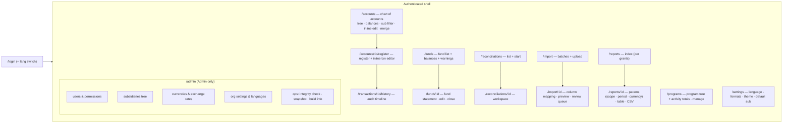
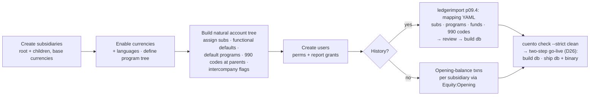
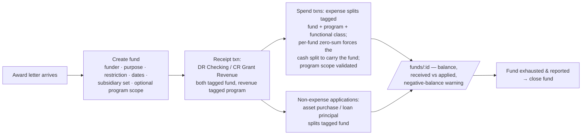
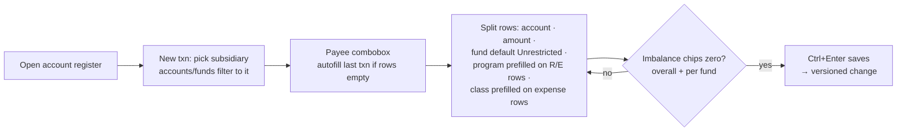
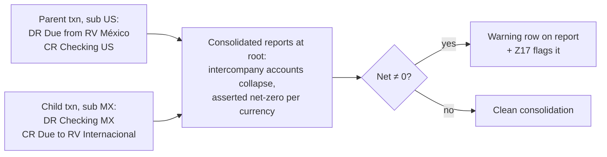
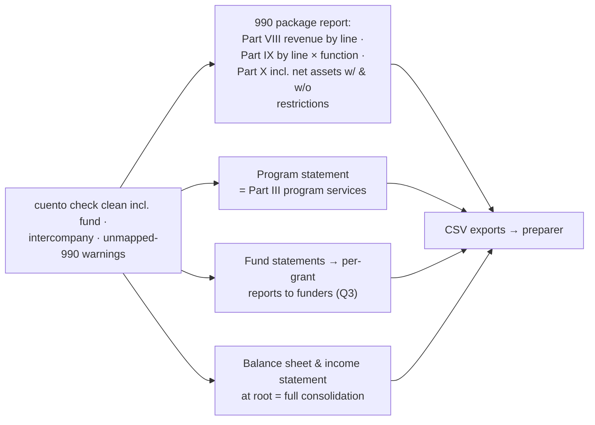

# PLAN.md — cuento implementation plan

Read AGENTS.md first; it defines the working method, hard rules, and commit format.
Execution loop per step: write the listed tests → confirm they fail for the right reason → implement to green → refactor → `make lint test check` → tick the checkbox → commit `pNN.M area: summary`.

Legend: `[ ]` todo · `[x]` done · `[P]` parallel-safe (may dispatch to a subagent alongside its siblings).
Human inputs required: place the cleaned full-ledger CSV export in `fixtures/source/` before p09.2; iterate the production mapping with the agent at p09.4 (this is the go-live gate, D26); answer open questions Q5–Q6 (below) whenever possible — affected steps are tagged.

---

## Settled decisions (p00.1 seeds docs/DECISIONS.md from this table)

| ID | Decision | Rationale |
|----|----------|-----------|
| D1 | Amounts stored as `int64` in the currency's **minor units**; exponent per currency from `currencies` table. | Exact arithmetic; JPY/BHD-style exponents cost nothing to support. |
| D2 | **Net-debit** signed amounts (debits +, credits −). Every transaction sums to exactly 0 in its currency — and to 0 **within each fund** (D20). Signed vs DR/CR is display-only, per user. | Single column; mixed revenue/expense subtrees subtotal naturally. |
| D3 | Transactions are **single-currency**. Cross-currency flows = two transactions through a multicurrency **FX Clearing** account (equity-class). Its converted balance on reports is cumulative FX gain/loss. GnuCash-style per-split value/amount pair rejected for schema+UI complexity; revisit if clearing proves awkward. | Keeps the zero-sum invariant trivial and honest. |
| D4 | Audit = append-only `*_versions` tables: entity id + `change_id` + `valid_from` + `op(create/update/delete)` + full snapshot of business columns. Current tables are the denormalized latest state. State as of time T = row with max(`valid_from`) ≤ T per entity, excluded if `op='delete'`. Versions tables never see UPDATE/DELETE. | Fast current-state queries, mechanical point-in-time, pure append. |
| D5 | v1 audit surface: per-transaction history UI + per-entity as-of store queries + integrity check that current == latest version. Whole-report "books as edited at time T" is supported by the data but deferred as a feature. | Keeps report toolkit single-plane for v1. |
| D6 | **sqlc** (queries) + **goose** (migrations, embedded). Forward-only migrations; runner backs up the db file before applying. No down migrations. | SQL stays visible/optimizable; backup beats theoretical rollbacks. |
| D7 | Driver: `modernc.org/sqlite` (pure Go). | CGO-free static binary, trivial cross-compile; perf ample at this scale. |
| D8 | Hosting: GCE **e2-micro always-free VM** + persistent disk + **Litestream → GCS** (free 5 GB). TLS via in-process autocert. Cloud Run rejected: ephemeral FS + scale-to-zero vs a single-writer SQLite file. | One binary, one VM, one systemd unit. |
| D9 | Auth primitives: scs sessions (SQLite store), argon2id, stdlib `http.CrossOriginProtection` (fallback nosurf), `html/template` escaping + strict CSP, `x/time/rate` on login. | Nothing hand-rolled; everything provable via route-registry tests. |
| D10 | Permissions: per-user `txn_perm ∈ {none,read,write}` + per-report-group read grants; `is_admin` implies everything. Report groups are declared in code and synced to the db at startup. Permissions are org-global in v1 (per-subsidiary grants → backlog, Q2). | Matches stated needs; no RBAC machinery. |
| D11 | Tree rules: A/L/E children must match parent type exactly; revenue and expense may interleave freely under R/E parents. Placeholders (accounts with children) hold no splits. | Balance sheet stays clean; mixed groupings stay possible — though the chart holds *natural* categories, since programs are a dimension (D24). |
| D12 | FX conversion happens only in reports: balance-sheet figures at the closing (as-of) rate; P&L activity at each transaction-date rate; rate lookup = latest on-or-before date, direct pair then reciprocal. Rates stored as REAL; conversion rounds half-even at final aggregates. | Standard treatment; storage stays integer-exact. |
| D13 | Splits in a **finalized** reconciliation are locked (amount/account/txn/date/fund); editing requires an audited unreconcile first. Reconciliation is per `(account, currency)` and spans all funds — a bank statement covers one balance. | Statements stay provable; a key reason funds are a dimension, not currencies (D20). |
| D14 | **Bilingual UI (en, es) in v1**, extensible: `internal/i18n` embedded key→string catalogs + `t` template func; missing key falls back to en; a parity test enforces identical key sets across catalogs; adding a language = adding one catalog file (+ account names in that language, optional). No CLDR or i18n dependency. Supersedes the earlier English-chrome-only decision. | The bookkeepers work in Spanish; catalogs are a page of code, not a framework. |
| D15 | Dependency allowlist: modernc.org/sqlite, pressly/goose/v3, sqlc (tool), alexedwards/scs/v2 (+sqlite3store), alexedwards/argon2id, golang.org/x/crypto (autocert), golang.org/x/time, google/go-cmp (tests). Additions need a DECISIONS entry. | Lightweight by construction. |
| D16 | Date/number formats are small enumerations implemented and tested in `internal/money` — no CLDR dependency. Date entry uses text inputs (never `input[type=date]`). | Users pick from a handful of formats; browsers don't get a vote. |
| D17 | IDs are `INTEGER PRIMARY KEY AUTOINCREMENT` on financial tables (no rowid reuse after delete — audit-friendly). | Cheap referential permanence. |
| D18 | **Subsidiaries**: `subsidiaries` is a tree with exactly one root; each subsidiary has a `base_currency`. Accounts map to **one or more** subsidiaries via `account_subsidiaries`, with the invariant **parent set ⊇ union of children's sets** (superset, not equality — org-wide placeholders may hold sub-specific children; assigning a sub to an account auto-propagates to its ancestors). Every transaction belongs to **exactly one** subsidiary and all its split accounts must include that subsidiary. Report scope = a chosen subsidiary **consolidated with all descendants**; the root is full consolidation. Default report currency = the scoped subsidiary's base currency. | NetSuite-shaped without OneWorld machinery; superset keeps shared placeholders from forcing sub-specific accounts org-wide. |
| D19 | **Intercompany**: cross-subsidiary funding = paired transactions through due-to/due-from accounts flagged `intercompany`. Consolidated reports whose scope covers both sides collapse flagged accounts after asserting they net to zero per currency; a nonzero net renders as a warning row (never silently dropped). Elimination journal entries are out of scope. | Single-sub transactions make this unavoidable; the flag makes consolidation honest and cheap. |
| D20 | **Restricted funds are a split dimension with fund-level conservation.** `funds` table documents grants/restricted gifts (funder, purpose, restriction type, dates); a fund is scoped to **one or more subsidiaries** via `fund_subsidiaries` (not inherited by descendants — a transaction's subsidiary must be in the fund's set, Q1 resolved) and optionally to a **program subtree** (R/E splits tagged the fund must carry a program inside it). Every split carries `fund_id` (NULL = unrestricted); every transaction must sum to zero **within each fund**, not just overall — so restricted money is conserved through *any* account: cash, buildings, loan payoffs. Modelling funds as sub-currencies (`USD.grant`) was evaluated and rejected: identical semantics (per-fund zero-sum ⇔ per-currency zero-sum), but it breaks single-statement reconciliation (D13), multiplies the currency/rate/report surface, and a grant partially converted cross-currency would mint pseudo-currencies on both sides. The UI presents the dimension as "Fund: Unrestricted General / ⟨grant⟩" per split, with a transaction-level apply-to-all. GAAP "released from restrictions" presentation is **derived** in reporting (restricted-fund expenses + non-expense applications), not journaled. | All the tracking power of the sub-currency idea, none of the collateral damage. |
| D21 | **Functional expenses (990 Part IX)** are a fixed enum `program | management | fundraising` ("development" = fundraising column). Expense accounts carry a **default** class; every expense split **requires** a class (prefilled from the account default, overridable per split — covers rent/salary allocations); non-expense splits must be NULL. Trigger-enforced. Duplicating the account hierarchy per class rejected: Part IX is natural × functional — a matrix, and matrices are dimensions. | One report renders Part IX; the tree stays single and clean. |
| D22 | Import source is the **cleaned full-ledger CSV** (former O1, resolved). `cmd/ledgerimport` is driven by a reviewable mapping file: per source account → {type, parent, subsidiaries, default functional class}; per row → subsidiary and fund (defaults: root subsidiary, unrestricted) with optional source-column overrides. | The export is already a ledger; converting it beats re-keying history. |
| D23 | Negative restricted-fund balances (spending a grant past its receipts) are surfaced as **warnings** by `cuento check` and on fund pages — never blocked at write time. | Backdated entries make hard blocks hostile; visibility beats prevention here. |
| D24 | **Programs are a dimension**: `programs` tree with a single seeded root ("General" — the unallocated default); every **revenue and expense** split carries `program_id` (required; prefilled from the account's optional default program, else root); A/L/E splits carry none. Programs are org-global (Q5). Consequence: the chart of accounts holds *natural* categories (salaries, supplies, occupancy, program fees) and mission structure lives in the program tree — same reasoning as D21, matrices are dimensions. Program and functional class are **orthogonal**: a fundraising event benefiting one program is class `fundraising` + that program; Part IX columns come from class, Part III rows from programs. | 990 needs program-level revenue *and* expenses; decision-makers need per-program statements; duplicating programs in the account tree was the same mistake as functional duplication. |
| D25 | **990 line mapping**: seeded `form990_lines` reference table (part, line, label, allowed account types) covering Parts VIII (revenue), IX (expenses), and X (balance sheet); `accounts.form990_code` nullable with **effective code = own or nearest ancestor's** (inheritable, so mapping happens at a handful of parents). Not hard-required: 990 reports render an explicit **Unmapped** bucket instead of dropping rows, and a warning check flags active R/E leaves with activity but no effective code. Goal: the full 990 package (Parts III, VIII, IX, X) is producible directly. | One field, set ~10 times, and year-end becomes running four reports. |
| D26 | **Two-step go-live**: the production database is produced by `cmd/ledgerimport` from the cleaned CSVs + a reviewed mapping file, built and rehearsed during p09.4 (locally; mapping lives gitignored beside the source data). Deploy = (1) build db + `cuento check --strict`, (2) ship db + binary. The historical mapping assigns subsidiaries, funds, programs, functional classes, and 990 codes (inherited from the created tree) up front. | Import is the deployment path, not an afterthought; rehearsing it early means cutover is mechanical. |

## Open questions (defaults chosen so work is never blocked)

Resolved (2026-07): **Q1** funds are not inherited but scope to one or more subsidiaries, optionally to a program subtree (D20). **Q2** permissions stay global (D10). **Q3** reports split only with/without donor restrictions; per-grant funder reporting = the fund statement (p15.8). **Q4** hosting, FX, and "development" = fundraising column confirmed.

| ID | Question | Default until answered | Affects |
|----|----------|------------------------|---------|
| Q5 | Should programs be scopeable per subsidiary, or org-global? | Global — every program usable in every sub; per-sub scoping → backlog if miscoding actually occurs. | p07, p08 |
| Q6 | Seed the full Form 990 line set, or the 990-EZ subset? | Full 990 (supersets EZ; EZ preparers ignore extra granularity). | p05.1, p15.11 |

---

## Functional / end-to-end tests (Playwright) — cross-cutting (added 2026-07-11 at human request)

Browser-based functional tests that drive the **real** `cuento serve -dev`. Test-only (Node/npm under `e2e/`), never a Go dependency, opt-in via `make e2e` (needs a browser; kept out of the hermetic `make test`). See DECISIONS "Functional testing". The suite grows with the UI: the harness is built once, then each UI phase adds specs for its real flows.

- [x] **pE.1 build: Playwright functional-test harness.**
  Tests first: a `login.spec` that (bad creds → error shown; good creds → authenticated landing) drives the actual login page.
  Build: `e2e/` with `package.json` (playwright pinned), `playwright.config`, a dev-server fixture (build binary → temp db → migrate → seed admin via `cuento user add --admin` → launch `serve -dev` on an ephemeral port → teardown), the login spec, and a `make e2e` target. `.gitignore` node_modules + Playwright artifacts. Prove it runs green locally (chromium is available).
- [ ] **pE.2+ per-UI-phase specs.** As phases 11–17 land, each adds functional specs for its delivered flows (chart of accounts CRUD, transaction entry incl. per-fund imbalance + keyboard entry, funds workspace, reconciliation toggle, reports params→table, bank-import review→post, settings/locale). Tracked as part of each UI step's work; `docs/qa-entry.md` (p12.6) references the keyboard-entry spec.

---

## Phase 0 — Scaffold

- [x] **p00.1 chore: repository scaffold.**
  No tests (bootstrap). `go mod init cuento` (module path placeholder — rename if it gets a home on GitHub). Directory layout per AGENTS. Makefile with all targets (stubs where the phase hasn't arrived). `.golangci.yml` (govet, staticcheck, errcheck, gofumpt or gofmt). `.gitignore`: `fixtures/source/`, `fixtures/sample.db`, `*.db*`, `/bin`, `.env`. Seed `docs/DECISIONS.md` from the table above. Commit AGENTS.md, PLAN.md, DECISIONS.md.
- [x] **p00.2 web: hello server.**
  Tests first: `TestHealthz` (200, JSON `{status:"ok",version}`), `TestStaticEmbedded` (a placeholder asset serves from the embedded FS).
  Build: `cuento serve` with graceful shutdown (context + signal), `/healthz`, embedded `web/static` skeleton.
- [x] **p00.3 chore: CI.**
  Checks: `go vet`, golangci-lint, `go test ./...`, `govulncheck`. Done when they pass **locally** (no hosted CI; the GitHub Actions workflow was removed 2026-07-11 at the human's request — DoD clarified in DECISIONS p00.3).

## Phase 1 — Database foundation

- [x] **p01.1 db: Open with pragmas.**
  Tests: `TestOpenSetsPragmas` (query `journal_mode`, `foreign_keys`, `busy_timeout`, `synchronous`), `TestForeignKeysEnforced` (violating insert fails).
  Build: `db.Open(path)` — DSN, pragmas, sane pool settings; the only place pragmas are set.
- [x] **p01.2 db: migration runner.**
  Tests: `TestMigrateFreshReachesLatest`, `TestMigrateIdempotent`, `TestMigrateBacksUpFile` (a `<db>.pre-<version>.bak` copy exists before changes apply; skipped for brand-new files).
  Build: goose with embedded FS; `cuento migrate` subcommand; auto-migrate on `serve` start.
- [x] **p01.3 db: sqlc + test harness.**
  Tests: `TestNewDBIsolated` (two harness dbs don't interfere), `TestSqlcSmoke` (one trivial generated query round-trips).
  Build: `sqlc.yaml` (engine sqlite, schema = migrations dir, queries dir), `make gen`, `testutil.NewDB(t)` returning migrated temp-file db.

## Phase 2 — Change & versioning framework

- [x] **p02.1 db: users (minimal) + changes.**
  Tests: schema smoke via sqlc; `TestChangesRequiresActor` (FK to users enforced); system user (id 1, `system`) seeded.
  Build: migration — `users(id, username UNIQUE, display_name, created_at, disabled_at)`; `changes(id, actor_id → users, at RFC3339, kind, note)`.
- [x] **p02.2 store: write funnel.**
  Tests: `TestWriteRequiresActor` (no actor in ctx → error, nothing written), `TestWriteRecordsChange` (exactly one `changes` row per call), `TestWriteAtomicRollback` (fn error → no change row, no side effects).
  Build: `store.Store`, `store.Actor` + `WithActor(ctx)/ActorFrom(ctx)`, internal `write(ctx, kind, note, fn(tx, changeID))` helper; per-table version-append helpers follow the Appendix A pattern; `testutil.AssertVersioned` contract helper.

## Phase 3 — Money, formats & i18n

- [x] **p03.1 db: currencies.**
  Tests: `TestSeedCurrencies` (USD, MXN, EUR present with correct exponents), `TestExponentBounds` (CHECK 0–4).
  Build: migration `currencies(code PK, exponent, symbol, name, active)` + seed; store reads.
- [x] **p03.2 [P] money: Amount.**
  Tests: table tests for parse/format across all number formats, negative styles (minus/parentheses), and display modes (signed, DR/CR); property test `parse(format(x)) == x` over random minors and formats; `TestAddCurrencyMismatch`; `TestConvertRoundsHalfEven` (explicit tie cases).
  Build: `money.Amount{Minor, Currency}`, `Add/Neg/Split-safe` ops erroring on currency mismatch, `Parse`, `Format(opts)`, `ConvertMinor(minor, rate float64, fromExp, toExp)` with half-even rounding.
- [x] **p03.3 [P] money: date & number format enums.**
  Tests: format/parse tables for `DateFormat{ISO, US, EU}` (ISO always accepted on input regardless of setting); invalid inputs rejected with useful errors.
  Build: enums + tiny formatter/parser; these are the only date/number formatting entry points for the UI.
- [x] **p03.4 [P] i18n: catalog.**
  Tests: `TestCatalogParity` (en and es expose the exact same key set — the test that keeps translations honest forever), `TestFallbackToEnglish` (unknown lang / missing key), `TestInterpolation` (positional args).
  Build: `internal/i18n` — embedded `en.toml`/`es.toml` (flat key→string; hand-rolled minimal parser or key=value format to stay inside D15), `T(lang, key, args...)`, `Langs()`; template func registration happens in phase 10. Every later step adding a UI string adds it to **both** catalogs (AGENTS rule 9).

## Phase 4 — Subsidiaries

- [x] **p04.1 db: subsidiaries + versions.**
  Tests (direct SQL): exactly-one-root enforced (second NULL-parent insert rejected by trigger); FK to currencies; versions table exists.
  Build: migration — `subsidiaries(id, parent_id → subsidiaries, name UNIQUE, base_currency → currencies, active, sort_order)` + `subsidiaries_versions`; trigger `trg_subsidiaries_single_root`; seed root subsidiary (`Organization`, USD) so a single-entity org works with zero setup.
- [x] **p04.2 store: subsidiary operations.**
  Tests: `TestCreateSubsidiaryVersioned`, `TestMoveRejectsCycle`, `TestRootImmovable` (root keeps NULL parent), `TestDeactivateBlockedWithActiveChildren`, `TestSubTree` (depth-first order), `TestDescendants` (self + transitive closure — the primitive report scoping uses).
  Build: `CreateSubsidiary`, `UpdateSubsidiary` (rename/move/base-currency — base-currency change allowed; it only affects report defaults), `DeactivateSubsidiary` (blocked while it has active children; deactivated subs reject new transactions but keep history), `SubTree()`, `Descendants(id)` via recursive CTE.

## Phase 5 — Accounts

- [x] **p05.1 db: accounts + names + subsidiary map + versions + triggers.**
  Tests (direct SQL): inserting an expense under an asset fails; asset under asset succeeds; revenue under expense succeeds; `functional_class` on a non-expense account rejected; `form990_lines` seeded (spot-check known Part VIII/IX/X codes, Q6 default: full 990); versions tables exist for `accounts`, `account_names`, `account_subsidiaries`.
  Build: migration per Appendix A — `form990_lines(code PK, part, line, label, account_types, sort)` seeded reference (static; updated only by migration, not versioned), `accounts` (with `functional_class` default column, `intercompany` flag, `form990_code → form990_lines`), `account_names(account_id, lang, name)`, `account_subsidiaries(account_id, subsidiary_id)`, all three `*_versions`, triggers `trg_accounts_parent_typeclass`, `trg_accounts_function_expense_only`. (Leaf/no-splits triggers arrive in p08.1 when `splits` exists; `default_program_id` arrives in p07.1 once `programs` exists.)
- [x] **p05.2 store: account operations.**
  Tests: `TestCreateAccountVersioned` (AssertVersioned for account + names + sub map), `TestCreateRequiresAtLeastOneSub`, `TestMoveRejectsCycle`, `TestMoveRejectsCrossTypeClass`, `TestMoveRejectsSubMismatch` (new parent's sub set must cover the moving account's), `TestAssignSubPropagatesToAncestors` (adding sub S to a leaf silently adds S up the chain), `TestRemoveSubBlockedByChildOrSplits` (can't remove S while a child has S; split-usage guard lands in p08 and is noted here as a TODO test tag), `TestDeactivate`, `TestTreeOrdering`, `TestAccountNameAsOf` (rename, then query the old name at an earlier T via versions), `TestEffective990Inherited` (code set on a parent resolves for all descendants; a child's own code wins), `TestSet990CodeTypeMismatch` (a revenue line on an expense account rejected against `form990_lines.account_types`).
  Build: `CreateAccount(subs ≥ 1)`, `UpdateAccount` (move/flags/default currency/functional default/intercompany/990 code), `SetAccountName(lang)`, `SetAccountSubsidiaries` (superset invariant per D18, ancestor auto-propagation), `DeactivateAccount`, `Tree(lang, subFilter)` and `Effective990Codes()` (nearest-ancestor resolution, D25) via recursive CTE.
- [x] **p05.3 store: name fallback.**
  Tests: user lang → en → any, exercised through `Tree`.
  Build: COALESCE join in the tree/name queries.

## Phase 6 — AuthN/Z

- [x] **p06.1 db+auth: credentials, perms, settings columns.**
  Tests: `TestHashVerify` (argon2id wrapper), `TestUsersVersionOmitsPasswordHash` (**critical** — snapshot never contains the hash), grant FK tests.
  Build: migration — users gain `password_hash`, `is_admin`, `txn_perm CHECK(none/read/write)`, settings columns (`locale`, `date_format`, `number_format`, `display_mode`, `neg_style`, `theme`, `default_subsidiary_id`); `report_groups`, `user_report_grants` (+ versions for users and grants).
- [x] **p06.2 web: sessions, login, security middleware.**
  Tests: `TestLoginSuccessSetsSession`, `TestLoginWrongPassword` (uniform error, no user enumeration), `TestLoginRateLimited`, `TestCookieFlags` (HttpOnly, SameSite=Lax, Secure outside `-dev`), `TestCrossOriginBlocked` (spoofed `Sec-Fetch-Site: cross-site` → 403), `TestSecurityHeaders` (CSP, X-Content-Type-Options, Referrer-Policy), `TestLoginPageLocalized` (`?lang=es` or es cookie renders Spanish strings via the catalog).
  Build: scs + sqlite3store (its `sessions` table created by our migration so goose stays canonical); middleware chain: secure headers → CSRF → session → auth → lang resolution (user setting → cookie → en); login/logout handlers with minimal templates (styling comes in phase 10); `x/time/rate` limiter keyed by IP+username.
- [x] **p06.3 web: route registry + provable enforcement.**
  Tests: `TestRouteRegistryComplete` (mounting happens only through the registry; every pattern accounted for), `TestPermissionMatrix` (auto-generated: every route × persona {anon, NoAccess, ReadOnly, Bookkeeper, ReportsOnly, Admin} → expected status).
  Build: `routes.go` — `[]Route{Method, Pattern, Perm, Handler}` with `Perm ∈ {Public, AnyUser, TxnRead, TxnWrite, ReportGroup(name), Admin}`; single mount function; middleware enforcement; startup sync of code-declared report groups into `report_groups`.
- [x] **p06.4 cli: user management + bootstrap.**
  Tests: `TestUserAddAndLogin`, `TestDisabledUserCannotLogin`.
  Build: `cuento user add|passwd|disable` (add supports `--admin`); `serve` logs a bootstrap hint when no human users exist.

## Phase 7 — Programs & funds

- [x] **p07.1 db+store: programs.**
  Tests: single root enforced by trigger; versions table exists; `TestCreateProgramVersioned`, `TestMoveRejectsCycle`, `TestRootImmovable`, `TestDeactivateBlocksNewUseOnly` (history intact; asserted fully once splits exist), `TestProgramTree` (depth-first), `TestDescendants`, `TestAccountDefaultProgramREOnly` (default program on an A/L/E account rejected).
  Build: migration — `programs(id, parent_id → programs, name UNIQUE, active, sort_order)` + `programs_versions`, trigger `trg_programs_single_root`, seed root program (i18n-labeled "General" — the unallocated default, D24); `ALTER TABLE accounts ADD COLUMN default_program_id REFERENCES programs(id)` (meaningful only on R/E accounts, store-enforced). Store: `CreateProgram`, `UpdateProgram` (rename/move), `DeactivateProgram`, `ProgramTree()`, `Descendants(id)`.
- [x] **p07.2 db: funds + scoping + versions.**
  Tests (direct SQL): restriction CHECK; program FK; date GLOB checks; versions tables exist for `funds` and `fund_subsidiaries`.
  Build: migration — `funds(id, name, funder, purpose, restriction CHECK ('purpose','time','perpetual'), program_id REFERENCES programs(id), start_date, end_date, notes, active)` + `fund_subsidiaries(fund_id, subsidiary_id)` (≥1 enforced in store) + both `*_versions`. NULL `fund_id` on splits *is* unrestricted (D20) — no seeded "general fund" row; the UI label comes from the i18n catalog.
- [x] **p07.3 store: fund operations.**
  Tests: `TestCreateFundVersioned` (fund + sub map under one change), `TestCreateRequiresAtLeastOneSub`, `TestCloseFundBlocksNewUse` (asserted properly in p08, tagged here), `TestActiveFundsForSubsidiary` (only funds whose set contains the sub, D20/Q1), `TestProgramScopeStored`, `TestNarrowSubsBlockedBySplits` (tagged; enforced once splits exist in p08), `TestReopenAudited`.
  Build: `CreateFund(subs ≥ 1)`, `UpdateFund` (incl. subsidiary-set and program-scope changes), `CloseFund`/`ReopenFund`, `ActiveFunds(subsidiary)` (the transaction editor's option source).

## Phase 8 — Transactions & splits core

- [x] **p08.1 db: payees, transactions, splits (+versions, triggers, indexes).**
  Tests (direct SQL): split on a placeholder account rejected; adding a child under an account with splits rejected; `amount = 0` rejected; expense split with NULL `functional_class` rejected and non-expense split with a class rejected; revenue/expense split with NULL `program_id` rejected and A/L/E split carrying a program rejected (triggers join accounts); deleting a referenced account/currency/subsidiary/fund/program rejected; indexes exist.
  Build: migration per Appendix A — `transactions` (with `subsidiary_id NOT NULL`), `splits` (with `fund_id`, `program_id`, `functional_class`); triggers `trg_splits_leaf_active_only`, `trg_accounts_no_children_over_splits`, `trg_splits_function_matches_type`, `trg_splits_program_matches_type`.
- [x] **p08.2 store: post / update / delete transactions.**
  Tests: `TestPostBalanced` (AssertVersioned: txn + every split under one change), `TestPostUnbalancedRejected` (typed `ErrUnbalanced`), `TestPostFundUnbalancedRejected` (**the D20 invariant**: overall zero-sum but fund groups don't individually net to zero → typed `ErrFundUnbalanced`), `TestPostMixedFundsBalanced` (60/40 grant/unrestricted expense with correspondingly split cash side posts fine), `TestPostSingleSplitRejected`, `TestPostPlaceholderRejected`, `TestPostInactiveAccountRejected`, `TestPostAccountNotInSubsidiary` (split account lacking the txn's sub → typed error), `TestPostFundSubsidiaryScope` (fund scoped to two subs posts in both, rejected in a third), `TestPostInactiveFundRejected`, `TestPostExpenseRequiresFunction` / `TestPostNonExpenseFunctionRejected`, `TestPostProgramDefaulted` (omitted program on an R/E split → account default, else root), `TestPostProgramOnBalanceSheetRejected`, `TestPostInactiveProgramRejected`, `TestPostFundProgramScope` (R/E split tagged a fund whose program scope excludes the split's program → typed error), `TestUpdateDiffsSplits` (changed/added/removed splits each get correct version ops; untouched splits get none), `TestDeleteIsSoft`, `TestTransactionAsOf` (post → edit → edit; as-of between edits reconstructs the middle state including splits), `TestConcurrentPostsSerialize`.
  Build: `PostTransaction(input)` validating ≥2 splits, zero-sum in txn currency overall **and per fund group (NULL = one group)**, leaf+active accounts each mapped to the txn's active subsidiary, active currency, funds active with the txn's subsidiary in their scope, program present exactly on R/E splits (defaulted account default → root; active; inside the fund's program subtree when both are set), functional class present exactly on expense splits (defaulted from the account when omitted); `UpdateTransaction` (replace-set diff by split id, same validations); `DeleteTransaction` (soft flag + delete version op). Also: complete the deferred guards — removing a subsidiary from an account (p05.2) or a fund (p07.3) is blocked if splits exist in that subsidiary.
- [x] **p08.3 ledger: integrity suite (`cuento check`).**
  Tests: fixture passes clean; one negative test per rule (corrupt a copy of the db with raw SQL, assert the rule flags it); warning-severity rules reported but exit-zero unless `--strict`.
  Rules (severity **error** unless noted): Z1 every non-deleted txn sums to 0 · Z2 splits reference leaf accounts · Z3 each current row equals its latest version snapshot · Z4 `PRAGMA foreign_key_check` clean · Z5 every version row has a valid change · Z6 no orphan splits · Z7 account tree acyclic · Z8 reconciled splits match their reconciliation's account and currency · Z9 finalized reconciliations still sum to their statement chain · **Z10** every txn sums to 0 within each fund group · **Z11** every split's account is mapped to its txn's subsidiary · **Z12** every account's subsidiary set ⊇ union of its children's · **Z13** every non-NULL split fund's subsidiary set contains the txn's subsidiary · **Z14** functional_class present iff expense account · **Z15** program_id present iff revenue/expense account, and inside the fund's program subtree when both are set · **Z16** subsidiary and program trees acyclic, exactly one root each · **Z17 (warning)** intercompany-flagged accounts net to zero per currency at full consolidation · **Z18 (warning)** no restricted fund has a negative cumulative balance in any currency (D23) · **Z19 (warning)** every active R/E leaf with activity has an effective 990 code (D25).
  Build: `ledger.Check(db) []Violation` (with severity) as named SQL checks; `cuento check` prints violations, exits non-zero on errors; wired into `make check` and CI.
- [x] **p08.4 store: balance queries.**
  Tests: hand-computed expectations on a small in-test dataset for `SubtreeBalancesAsOf(date, scope)` (per account, per currency; scope = subsidiary + descendants), `PeriodActivity(from, to, scope)`, `FundBalancesAsOf(date, scope)` (per fund incl. NULL/unrestricted, per currency), `FunctionalActivity(from, to, scope)` (expense account × class), `ProgramActivity(from, to, scope)` (R/E account × program, rollup-ready over both trees), `RegisterPage(account, cursor, filters)` including window-function running balance per currency, fund/sub/program filters, and keyset paging edges.
  Build: recursive CTE + window functions; these queries are the backbone of registers, fund pages, program pages, and reports.
- [x] **p08.5 store: merge accounts.**
  Tests: `TestMergeRepointsSplitsAndRecons`, `TestMergeBlockedCrossTypeClass`, `TestMergeBlockedIntoPlaceholder`, `TestMergeBlockedSubsetSubs` (destination's sub set must cover the source's), `TestMergeFunctionDefaultKept`, `TestMergeHistoryIntact` (as-of before the merge still shows splits on the source account), all under a single change.
  Build: `MergeAccount(src, dst)` — both leaves, same type-class, dst subs ⊇ src subs; repoint splits and reconciliations; deactivate source; fully versioned.

## Phase 9 — Fixtures & historical ledger import

- [x] **p09.1 testutil: canonical synthetic fixture.**
  Tests: `TestFixtureIntegrity` (`ledger.Check` clean, warnings included), `TestFixtureKnownAggregates` (exported constants: trial-balance zero per sub, specific account balances, fund balances, functional-matrix cells, per-program activity, 990 line rollups at specific dates).
  Build: `testutil.Fixture(t)` constructing Appendix D exactly — deterministic dates, amounts, edit history, one finalized reconciliation, FX pair, intercompany pair, restricted grant lifecycle. This is what CI and goldens use; the real export never is.
- [x] **p09.2 docs: inspect the real export.** *(needs the CSV in `fixtures/source/`)*
  Deliverable: `docs/ledger-export.md` describing file format, columns, encodings, quirks — **structure only, zero data values copied**. No code.
- [x] **p09.3 import: ledger converter.**
  Tests: parsers exercised against synthetic lines embedded in tests (shape per `docs/ledger-export.md`, fake values); `TestMappingAppliesSubFundProgramFunction` (defaults + per-account/per-column overrides per D22/D26 — program defaults account default → root); `TestImportedBooksBalance` (every produced txn balances overall and per fund; `ledger.Check` clean on output, warnings surfaced).
  Build: `cmd/ledgerimport accounts` emits a reviewable account-mapping YAML (type, parent, subsidiaries, functional default, default program, 990 code, en/es names); `cmd/ledgerimport build -o fixtures/sample.db` creates subsidiaries, programs, and funds (from mapping), accounts, opening balances (via `Equity:Opening Balances`, per subsidiary), payees, transactions with sub/fund/program/function assigned per D22; `--anonymize` hashes payees/memos. `make fixture` wires it (local only).
- [x] **p09.4 import: production mapping & go-live rehearsal.** *(best-guess rehearsal — `cuento check` Error-clean (0 errors, 151 Z19 unmapped-990 warnings); mappings, `--strict`, and the spreadsheet spot-check still await human review before cutover — see docs/golive.md)*
  Tests: none automated against real data (AGENTS rule 11); the acceptance gate is mechanical — `ledgerimport build` from `fixtures/source/` + the reviewed mapping → `cuento check --strict` clean, and spot-checked balances match the current reporting spreadsheet.
  Build: iterate `fixtures/source/mapping.yaml` (gitignored beside the data) with the human until the gate passes — subsidiaries, the natural account tree with 990 codes at parents, the program tree, funds with scopes, and functional defaults are all decided *here*, once; `docs/golive.md` documents the D26 two-step deploy: (1) `ledgerimport build -o cuento.db && cuento check --strict`, (2) ship db + binary per docs/deploy.md. Re-runnable any time before cutover to pick up newer CSVs.

## Phase 10 — Web shell & asset pipeline

- [ ] **p10.1 web: hashed assets.**
  Tests: `TestAssetURLHashed` (`asset "app.css"` → `/static/app.<8hex>.css`), `TestAssetImmutableCacheHeaders`, `TestHTMLNoStore`, `TestDevModeUnhashed`.
  Build: startup manifest from embedded FS (SHA-256 → 8 hex), serving handler, `asset` template func.
- [ ] **p10.2 web: base layout + theme + i18n wiring + CSS foundation.**
  Tests: `TestThemeCookieSSR` (request with theme cookie → `<html data-theme=...>`, no flash), `TestNavLocalized` (same page, en vs es user → catalog strings differ, keys resolve), nav renders only permitted sections per persona, `<html lang>` matches the resolved locale.
  Build: `base.tmpl` (landmarks, perm-gated nav, flash region, `{{t}}` used for every string), `t` template func bound to the request lang, theme toggle endpoint persisting cookie + user setting, lang switcher on the login page (post-login it's a user setting), CSS token/reset/component layers using `color-scheme` + `light-dark()`, `-dev`-only `/styleguide` page for visual review.
- [ ] **p10.3 web: htmx wiring + form-error convention.**
  Tests: `TestFormErrorPartial` (invalid POST → 422 re-render of the form region with localized field errors and `autofocus` on the first invalid field).
  Build: vendored pinned htmx, response conventions (targeted swaps, error partials keyed by i18n error keys), `hx-boost` for top-level nav only.

## Phase 11 — Accounts & org structure UI

- [ ] **p11.1 web: chart of accounts.**
  Tests: handler CRUD happy paths + permission denials; `TestParentOptionsExcludeDescendantsAndWrongClass`; `TestSubsidiaryFilter` (tree filtered to accounts mapped to the selected sub); `TestSubAssignmentPropagation` surfaces the p05.2 behavior in the form; balances column matches p08.4 queries.
  Build: tree table with per-currency balances, subsidiary filter, active filter; inline htmx create/edit (names en/es, type constrained by parent, default currency, reconcilable flag, subsidiary checklist, functional-class default and default program for R/E accounts, 990 line select filtered to the account's type with the inherited effective code shown as placeholder when unset, intercompany flag); move via filtered parent select. Extra test: `TestForm990OptionsFilteredByType`.
- [ ] **p11.2 [P] web: merge UI.**
  Tests: handler-level, confirm-step required, consequences summarized (split count, recons repointed), sub-coverage rule surfaced as a validation message.
- [ ] **p11.3 [P] web: subsidiaries admin.**
  Tests: CRUD + matrix perms (Admin); root protections; deactivation guard messages.
  Build: `/admin/subsidiaries` — tree list, create/edit (name, parent, base currency), deactivate.
- [ ] **p11.4 [P] web+db: org settings & languages.**
  Tests: adding a language exposes a name column in account forms; org settings persist.
  Build: `org_settings(key, value)` migration (org name, enabled languages); minimal admin form. (Report base currency is no longer an org setting — it follows the scoped subsidiary, D18.)
- [ ] **p11.5 [P] web: programs management.**
  Tests: CRUD + perms (view TxnRead, manage TxnWrite — program structure is bookkeeping, like funds); root protected; move options exclude descendants; deactivate messaging (blocks new use, history intact); activity totals match p08.4.
  Build: `/programs` — tree list with period R/E activity totals per program, inline create/edit/move/deactivate.

## Phase 12 — Transaction entry & register (the heart of the app)

- [ ] **p12.1 web: account register.**
  Tests: keyset paging (boundaries, stable ordering by date+id), filters (date range, text, fund, subsidiary, program), running balance per currency, fund chip renders on restricted splits, subsidiary badge renders when the account maps to >1 sub, recon mark rendered only for `reconcilable` accounts, perms.
  Build: `/accounts/{id}/register` — date, sub badge, payee, memo, counter-account (or "Split"), fund chip, amount, running balance; htmx paging that appends/replaces without scroll loss.
- [ ] **p12.2 web+js: transaction editor.**
  Tests: handler create/edit round-trips in both display modes (signed single column; DR/CR twin columns mapping to sign, entering one clears the other); subsidiary select filters both account comboboxes and the fund options (funds via `fund_subsidiaries`); fund apply-to-all sets empty rows only; program select appears only on R/E rows, prefilled account default → root; a fund-program scope violation renders a per-row error; functional-class select appears only on expense rows, prefilled from the account default; `node --test` units for amount-input parsing and the keyboard-grid state machine; server re-render keeps stable input ids.
  Build: editor grid per Appendix C — subsidiary select at the header (default = user's `default_subsidiary_id`, else sole sub), account/payee comboboxes (ARIA 1.2 listbox pattern in `combobox.js`) filtered by subsidiary, per-split fund select (default Unrestricted) + header apply-to-all, per-R/E-split program select (account default → root), per-expense-split functional class, select-on-focus module, text date field with `t`/`+`/`-` shortcuts, live imbalance chips **overall and per fund** (client-side display; server revalidates), sticky totals bar.
- [ ] **p12.3 web: payee autocomplete + autofill.**
  Tests: `TestPayeeSuggestRanking` (prefix match, most-recent first), `TestPayeeTemplatePrefills` (last non-deleted txn's splits — accounts, memos, amounts, funds, programs, functional classes — become editable rows), `TestAutofillNeverOverwrites` (fires only when all split rows are empty), `TestAutofillRespectsSubsidiary` (template splits with accounts outside the selected sub are dropped with a notice).
  Build: `GET /payees/suggest?q=`, `GET /payees/{id}/template?sub=` returning an editor partial.
- [ ] **p12.4 web: edit / void / duplicate + history panel.**
  Tests: history timeline renders actor, timestamp, per-field diffs and split-set diffs (including fund and functional-class changes) for create/update/delete; TxnRead may view history; void requires confirm and TxnWrite.
  Build: edit loads the same editor; delete = void with confirm; `/transactions/{id}/history` from versions.
- [ ] **p12.5 web: funds workspace.**
  Tests: fund list shows per-currency balance, funder/scope columns, and warning badge on negative (Z18); fund detail = a filtered ledger of the fund's splits across all accounts with opening/closing balance; create/edit/close forms incl. subsidiary checklist and program scope; perms (view TxnRead, manage TxnWrite).
  Build: `/funds` (active + closed toggle, balances from p08.4), `/funds/{id}` statement view, `/funds/new` + edit — grants are bookkeeping data, so TxnWrite manages them; subsidiaries/users stay Admin.
- [ ] **p12.6 ux: entry-flow hardening.**
  Tests: automate what's automatable (stable ids across all swap responses; no full-page redirects on in-flow actions).
  Build: manual QA script `docs/qa-entry.md` (focus retention, zero layout shift, scroll preservation, keyboard-only entry of a 4-split mixed-fund transaction end to end, es locale pass); fix all findings.

## Phase 13 — Settings & admin

- [ ] **p13.1 web: my settings.**
  Tests: `TestFormatsFollowUserSettings` — two users with different date/number/display settings see the same register rendered differently, end to end; `TestLocaleSwitchSwapsChrome` (es user sees es catalog everywhere).
  Build: settings page (language, formats, display mode, negative style, theme, default subsidiary); audit all render paths go through the p03 formatters and `{{t}}`.
- [ ] **p13.2 web: admin.**
  Tests: feature tests + `TestPermChangeVersioned` (grant/perm changes produce version rows naming the acting admin); matrix test picks the new routes up automatically.
  Build: users list/create/disable/reset-password, txn_perm select, report-group grants, currencies management, org settings.

## Phase 14 — Exchange rates

- [ ] **p14.1 db+store: rates.**
  Tests: `TestRateOnOrBefore`, `TestRateReciprocalFallback`, `TestRateMissing` (typed error), `TestRateStaleness` (lookup returns the rate's actual date so reports can footnote gaps).
  Build: migration `exchange_rates(rate_date, base, quote, rate REAL, source, change_id, PK(rate_date, base, quote))`; `PutRates` (batch, one change), `RateOn(base, quote, date)`.
- [ ] **p14.2 tools: ratesync + CSV import.**
  Tests: fetch parser against recorded response bodies in `testdata/`; `TestRatesCSVImport`.
  Build: `cuento ratesync` pulling configured pairs from Yahoo Finance behind a `RateSource` interface (it's unofficial and will break someday — isolate it); admin CSV upload for manual/backfill rates; systemd timer documented in phase 18.

## Phase 15 — Reporting

- [ ] **p15.1 reports: framework.**
  Tests: registry sync creates groups; unknown report id → 404; new reports appear in the permission matrix automatically; CSV output escapes correctly; params form includes the subsidiary scope selector on every report.
  Build: `reports.Report{ID, TitleKey, Group, ParamsSpec, Run(ctx, *Toolkit, Params) (Table, error)}`; `Table` with typed cells (money/date/text), indent levels, subtotal flags, warning rows (for D19); HTML + CSV renderers; auto-mounted routes under `/reports/{id}` gated by `ReportGroup`; shared params form (**subsidiary scope** — default user's, consolidating descendants per D18; as-of / period; granularity; target currency defaulting to the scope's base).
- [ ] **p15.2 reports: toolkit.**
  Tests: hand-computed expectations on `testutil.Fixture` — `BalancesAsOf` with `Scope{Sub}` at root vs a leaf sub, `ConvertOpts{To, Mode: Closing}`, `Activity` with `Mode: TxnDate`, `Rollup` (placeholder subtotal rows in tree order), `NetIncome(from, to)`, `FundBalances` (per fund per currency; unrestricted line), `FunctionalMatrix` cells, `ProgramActivity` (rollup over the program tree), `Group990` (effective-code rollup per D25 with an explicit Unmapped bucket; a fixture leaf overriding its parent's code lands on its own line), `IntercompanyNet` (zero on the balanced fixture; nonzero on a corrupted copy → warning row), conversion rounding edge cases.
  Build: Appendix E signatures over the p08.4 queries; conversion per D12; consolidation = the scope's descendant closure; intercompany collapse per D19.
- [ ] **p15.3 [P] report: trial balance** (as-of; per scope; native currencies + converted column) + goldens.
- [ ] **p15.4 [P] report: balance sheet** (as-of; A/L/E sections; equity section shows **Net assets without donor restrictions** and **Net assets with donor restrictions** (Q3) computed from fund tagging, plus "Net surplus to date"; intercompany collapse with warning row when nonzero; per-currency detail toggle; converted totals at closing rate) + goldens including the multicurrency, multi-sub case.
- [ ] **p15.5 [P] report: income statement** (period; mixed R/E tree preserved; comparative monthly/quarterly columns; conversion at txn-date rates) + goldens.
- [ ] **p15.6 [P] report: account ledger** (printable register for a range with opening/closing balances; fund column) + goldens.
- [ ] **p15.7 [P] report: functional expenses — 990 Part IX** (period; expense accounts grouped and subtotaled under their effective Part IX lines, Unmapped bucket last; columns = Program / Management & general / Fundraising / Total) + goldens.
- [ ] **p15.8 [P] report: fund balances & activity** (as-of balances per fund with funder/restriction metadata; drill parameters for one fund's period statement: opening, received, applied — split into expenses vs non-expense applications like asset purchases and loan principal — closing) + goldens.
- [ ] **p15.9 [P] report: activities by restriction** (statement of activities with Without / With donor-restrictions columns; the "net assets released from restrictions" line **derived** as total applications of restricted funds in the period per D20 — no journaled transfers) + goldens.
- [ ] **p15.10 [P] report: program statement** (period; revenue and expense by natural account per program, program-tree rollup, net per program; parameterized to one program subtree or all top-level programs as comparative columns; this is the decision-maker view and feeds 990 Part III) + goldens.
- [ ] **p15.11 [P] report: 990 package** (fiscal year; one page per part — Part VIII revenue by effective line · Part IX totals cross-checked against p15.7 · Part X balance-sheet lines at year-end incl. the net-assets with/without-restrictions split · Part III program service summary (expenses + revenue per top-level program from p15.10's toolkit calls); every section renders an explicit Unmapped bucket rather than dropping rows) + goldens.
- [ ] **p15.12 reports: index + recipe.**
  Tests: index lists only permitted groups/reports per persona.
  Build: `/reports` index; `reports/README.md` — the "adding a report" checklist (folder, query, template, i18n keys, register, golden) so future reports are code-only additions.

## Phase 16 — Reconciliation

- [ ] **p16.1 db: reconciliations + split lock.**
  Tests (direct SQL): updating amount/account/transaction/fund of a split in a *finalized* recon is rejected by trigger; allowed while the recon is open; `reconciliation_id` FK valid.
  Build: migration — `reconciliations(id, account_id, statement_date, statement_balance, currency, status CHECK(open/finalized), notes, ...)` + versions; `ALTER TABLE splits ADD COLUMN reconciliation_id REFERENCES reconciliations(id)`; trigger `trg_split_locked_when_finalized`.
- [ ] **p16.2 store: reconciliation lifecycle.**
  Tests: full lifecycle with AssertVersioned; `TestFinalizeRequiresZeroDifference` (opening = prior finalized statement balance; opening + Σ this recon's splits must equal the new statement balance); `TestReconSpansFunds` (**the D13/D20 payoff**: restricted and unrestricted splits reconcile against one statement); `TestToggleValidatesAccountAndCurrency`; `TestReopenAudited`; `TestEditReconciledTxnBlocked` (store refuses date/amount/account/fund edits touching finalized-reconciled splits; memo/payee allowed).
  Build: `StartReconciliation`, `SetSplitReconciled(on/off)`, `Finalize`, `Reopen`; recon is per account **and** currency, across all funds and regardless of subsidiary badge.
- [ ] **p16.3 web: reconciliation workspace.**
  Tests: handler toggles persist without scroll loss (targeted swap of the row + the diff chip); finalize disabled until difference is zero; perms (view TxnRead, act TxnWrite).
  Build: recon list (reconcilable accounts only, prior statement prefill) → workspace: uncleared splits, Space toggles the focused row, sticky cleared/difference summary.
- [ ] **p16.4 web+reports: recon history + statement report.**
  Tests: goldens for the statement detail report; history page lists finalized recons per account.
  Build: report (group `reconciliation`): statement info, included splits, opening/closing chain.

## Phase 17 — Bank CSV import

- [ ] **p17.1 db: import schema.**
  Tests: schema smoke; dedupe hash uniqueness scoped per account.
  Build: migration — `mapping_profiles(id, name, config JSON)`, `import_batches(id, filename, account_id, subsidiary_id, profile_id, uploaded_by/at)`, `import_rows(id, batch_id, raw_json, parsed date/amount/payee/memo, status CHECK(pending/posted/discarded), dedupe_hash, posted_transaction_id)`. Batch binds one target account **and one subsidiary** (the account must map to it).
- [ ] **p17.2 web: upload + mapping + staging.**
  Tests: parser table tests (delimiter sniffing, header detection, single signed amount vs debit/credit column pairs, sign flip, date formats); `TestDedupeFlagsExistingSplitsAndPendingRows`; `TestBatchSubValidated`.
  Build: upload → mapping UI (assign columns; pick account + subsidiary) → 20-row preview → save profile → stage rows with `dedupe_hash = sha256(account|date|amount|normalized payee+memo)`.
- [ ] **p17.3 web: review queue → post.**
  Tests: posting links the row and creates a balanced txn (one side = batch account, other side prefilled via payee template — including fund and functional class); discard requires a reason and writes a change; `TestReimportFlagsDuplicates` (idempotent re-upload).
  Build: pending queue; "edit & post" opens the phase-12 editor prefilled with the batch's subsidiary locked; batch progress indicator.

## Phase 18 — Ops, deploy, hardening

- [ ] **p18.1 build: release binary.**
  Tests: version string surfaces on `/healthz` and the footer.
  Build: `make release` — CGO-free linux/amd64, `-trimpath`, version from `git describe` via ldflags.
- [ ] **p18.2 ops: config, TLS, deploy docs.**
  Tests: config parsing (flags/env `CUENTO_DATA_DIR`, `CUENTO_ADDR`, `CUENTO_DOMAIN`, `CUENTO_DEV`).
  Build: if `CUENTO_DOMAIN` set → autocert on :443 with :80 redirect (cert cache in data dir), else plain HTTP; `deploy/` — `cuento.service`, `litestream.service`, `ratesync.timer`, `litestream.yml` (replica → GCS); `docs/deploy.md` — e2-micro walkthrough (always-free region, 30 GB pd-standard, firewall 80/443, Litestream restore drill, backup retention).
- [ ] **p18.3 web: admin ops page.**
  Tests: admin-only (matrix); snapshot download is a valid SQLite file (`PRAGMA quick_check` on the result); actions audited.
  Build: run `ledger.Check` with rendered violations (errors and warnings, incl. Z17–Z19); backup snapshot via `VACUUM INTO`; build info.
- [ ] **p18.4 hardening sweep.**
  Tests: security-header assertions across all routes; CSP console clean in a `-dev` click-through; catalog parity green with the final key set.
  Build: govulncheck green, dependency prune to D15, session lifetime settings reviewed, `make check` run against local `sample.db`, `docs/security.md` (threat model: authenticated misuse + commodity web attacks; explicitly not storing bank credentials), DECISIONS.md tidy.

## Phase 19 — Backlog (explicit non-goals for v1)

Budgets (incl. per-fund and per-program budgets) · per-subsidiary permissions · per-subsidiary program scoping (Q5) · intercompany elimination entries beyond the D19 collapse · receipt attachments · global audit browser and "books as edited at time T" reports (data already supports both, per D4/D5) · recurring/scheduled transactions · board-designated (quasi-restricted) funds · additional UI languages beyond en/es (catalogs make it a file-drop) · API tokens · dashboard/home page · multi-org.

---

## Appendix A — Target schema reference (authoritative source: migrations)

Versions pattern — one table per versioned business table (`subsidiaries`, `programs`, `accounts`, `account_names`, `account_subsidiaries`, `funds`, `fund_subsidiaries`, `payees`, `transactions`, `splits`, `reconciliations`, `users`†, `user_report_grants`):

```sql
CREATE TABLE <t>_versions (
  id         INTEGER PRIMARY KEY AUTOINCREMENT,
  entity_id  INTEGER NOT NULL,          -- composite for account_names (account_id, lang)
                                        -- and account_subsidiaries (account_id, subsidiary_id)
  change_id  INTEGER NOT NULL REFERENCES changes(id),
  valid_from TEXT NOT NULL,             -- equals changes.at
  op         TEXT NOT NULL CHECK (op IN ('create','update','delete')),
  -- ... full snapshot of <t>'s business columns ...
);
CREATE INDEX <t>_versions_entity ON <t>_versions(entity_id, valid_from);
-- State at time T: row with max(valid_from) <= T per entity; absent or op='delete' ⇒ not present.
-- † users_versions NEVER includes password_hash.
```

Core tables:

```sql
CREATE TABLE currencies (
  code TEXT PRIMARY KEY, exponent INTEGER NOT NULL CHECK (exponent BETWEEN 0 AND 4),
  symbol TEXT NOT NULL, name TEXT NOT NULL, active INTEGER NOT NULL DEFAULT 1
);

CREATE TABLE changes (
  id INTEGER PRIMARY KEY AUTOINCREMENT,
  actor_id INTEGER NOT NULL REFERENCES users(id),
  at TEXT NOT NULL, kind TEXT NOT NULL, note TEXT
);

CREATE TABLE subsidiaries (
  id INTEGER PRIMARY KEY AUTOINCREMENT,
  parent_id INTEGER REFERENCES subsidiaries(id),   -- NULL only for the single root
  name TEXT NOT NULL UNIQUE,
  base_currency TEXT NOT NULL REFERENCES currencies(code),
  active INTEGER NOT NULL DEFAULT 1,
  sort_order INTEGER NOT NULL DEFAULT 0
);
-- trg_subsidiaries_single_root: at most one row with parent_id IS NULL

CREATE TABLE programs (
  id INTEGER PRIMARY KEY AUTOINCREMENT,
  parent_id INTEGER REFERENCES programs(id),       -- NULL only for the single seeded root ("General")
  name TEXT NOT NULL UNIQUE,
  active INTEGER NOT NULL DEFAULT 1,
  sort_order INTEGER NOT NULL DEFAULT 0
);
-- trg_programs_single_root (D24)

CREATE TABLE form990_lines (                        -- static seeded reference (D25); not versioned
  code TEXT PRIMARY KEY,                            -- e.g. 'VIII.1e', 'IX.16', 'X.25'
  part TEXT NOT NULL, line TEXT NOT NULL, label TEXT NOT NULL,
  account_types TEXT NOT NULL,                      -- CSV of allowed account types
  sort INTEGER NOT NULL
);

CREATE TABLE accounts (
  id INTEGER PRIMARY KEY AUTOINCREMENT,
  parent_id INTEGER REFERENCES accounts(id),
  type TEXT NOT NULL CHECK (type IN ('asset','liability','equity','revenue','expense')),
  default_currency TEXT NOT NULL REFERENCES currencies(code),
  functional_class TEXT CHECK (functional_class IN ('program','management','fundraising')),
    -- default class; non-NULL only on expense accounts (trg_accounts_function_expense_only)
  default_program_id INTEGER REFERENCES programs(id),  -- added p07.1; meaningful only on R/E accounts
  form990_code TEXT REFERENCES form990_lines(code),    -- effective code = own or nearest ancestor's (D25)
  intercompany INTEGER NOT NULL DEFAULT 0,         -- D19
  reconcilable INTEGER NOT NULL DEFAULT 0,
  active INTEGER NOT NULL DEFAULT 1,
  sort_order INTEGER NOT NULL DEFAULT 0,
  created_at TEXT NOT NULL
);
-- trg_accounts_parent_typeclass: A/L/E child type = parent type; R/E child requires R/E parent
-- trg_accounts_no_children_over_splits (added with splits)

CREATE TABLE account_names (
  account_id INTEGER NOT NULL REFERENCES accounts(id),
  lang TEXT NOT NULL, name TEXT NOT NULL,
  PRIMARY KEY (account_id, lang)
);

CREATE TABLE account_subsidiaries (
  account_id INTEGER NOT NULL REFERENCES accounts(id),
  subsidiary_id INTEGER NOT NULL REFERENCES subsidiaries(id),
  PRIMARY KEY (account_id, subsidiary_id)
);
-- Invariant (store + Z12): parent's set ⊇ union of children's sets.

CREATE TABLE funds (
  id INTEGER PRIMARY KEY AUTOINCREMENT,
  name TEXT NOT NULL,
  funder TEXT NOT NULL DEFAULT '',
  purpose TEXT NOT NULL DEFAULT '',
  restriction TEXT NOT NULL CHECK (restriction IN ('purpose','time','perpetual')),
  program_id INTEGER REFERENCES programs(id),      -- optional scope: R/E splits tagged this fund
                                                   -- must carry a program in this subtree (D20)
  start_date TEXT, end_date TEXT,
  notes TEXT NOT NULL DEFAULT '',
  active INTEGER NOT NULL DEFAULT 1
);

CREATE TABLE fund_subsidiaries (
  fund_id INTEGER NOT NULL REFERENCES funds(id),
  subsidiary_id INTEGER NOT NULL REFERENCES subsidiaries(id),
  PRIMARY KEY (fund_id, subsidiary_id)
);
-- ≥1 row per fund (store-enforced); a txn's subsidiary must be in its fund's set (Z13).
-- NULL fund_id on a split == unrestricted; no seeded "general fund" row (D20).

CREATE TABLE payees (
  id INTEGER PRIMARY KEY AUTOINCREMENT,
  name TEXT NOT NULL UNIQUE COLLATE NOCASE,
  active INTEGER NOT NULL DEFAULT 1
);

CREATE TABLE transactions (
  id INTEGER PRIMARY KEY AUTOINCREMENT,
  date TEXT NOT NULL CHECK (date GLOB '[0-9][0-9][0-9][0-9]-[0-9][0-9]-[0-9][0-9]'),
  subsidiary_id INTEGER NOT NULL REFERENCES subsidiaries(id),   -- D18: exactly one
  payee_id INTEGER REFERENCES payees(id),
  memo TEXT NOT NULL DEFAULT '',
  currency TEXT NOT NULL REFERENCES currencies(code),
  deleted INTEGER NOT NULL DEFAULT 0
);

CREATE TABLE splits (
  id INTEGER PRIMARY KEY AUTOINCREMENT,
  transaction_id INTEGER NOT NULL REFERENCES transactions(id),
  account_id INTEGER NOT NULL REFERENCES accounts(id),
  amount INTEGER NOT NULL CHECK (amount <> 0),   -- minor units, net-debit sign
  fund_id INTEGER REFERENCES funds(id),          -- NULL = unrestricted (D20)
  program_id INTEGER REFERENCES programs(id),    -- required iff R/E account (trg_splits_program_matches_type + Z15)
  functional_class TEXT CHECK (functional_class IN ('program','management','fundraising')),
    -- required iff the account is expense-type (trg_splits_function_matches_type + Z14)
  memo TEXT NOT NULL DEFAULT '',
  reconciliation_id INTEGER REFERENCES reconciliations(id),  -- added p16.1
  position INTEGER NOT NULL
);
CREATE INDEX splits_account ON splits(account_id);
CREATE INDEX splits_txn     ON splits(transaction_id);
CREATE INDEX splits_fund    ON splits(fund_id);
CREATE INDEX splits_program ON splits(program_id);
CREATE INDEX txn_date       ON transactions(date);
CREATE INDEX txn_sub        ON transactions(subsidiary_id);
-- trg_splits_leaf_active_only; trg_splits_function_matches_type; trg_splits_program_matches_type;
-- trg_split_locked_when_finalized (p16)
-- Zero-sum per transaction AND per (transaction, fund) are NOT schema constraints (SQLite triggers
-- fire per-row, no deferred checks): enforced in store (the only writer) and proven by `cuento check`
-- (Z1, Z10). Split-account ∈ txn-subsidiary, fund subsidiary/program scopes likewise (Z11, Z13, Z15).

CREATE TABLE reconciliations (
  id INTEGER PRIMARY KEY AUTOINCREMENT,
  account_id INTEGER NOT NULL REFERENCES accounts(id),
  statement_date TEXT NOT NULL,
  statement_balance INTEGER NOT NULL,            -- minor units
  currency TEXT NOT NULL REFERENCES currencies(code),
  status TEXT NOT NULL CHECK (status IN ('open','finalized')),
  notes TEXT NOT NULL DEFAULT ''
);

CREATE TABLE exchange_rates (
  rate_date TEXT NOT NULL, base TEXT NOT NULL, quote TEXT NOT NULL,
  rate REAL NOT NULL, source TEXT NOT NULL,
  change_id INTEGER NOT NULL REFERENCES changes(id),
  PRIMARY KEY (rate_date, base, quote)
);
```

Plus: users (see p06.1), `org_settings(key, value)`, scs `sessions`, and the phase-17 import tables.

## Appendix B — Initial route/permission map (excerpt)

| Route | Perm |
|---|---|
| GET/POST `/login`, GET `/healthz`, GET `/static/…` | Public |
| POST `/logout`, GET/POST `/settings`, POST `/theme` | AnyUser |
| GET `/accounts`, `/accounts/{id}/register`, `/transactions/{id}/history`, `/payees/suggest`, `/funds`, `/funds/{id}`, `/programs`, `/reconciliations` | TxnRead |
| POST `/accounts…`, `/transactions…`, `/funds…`, `/programs…`, `/reconciliations…`, `/import…` | TxnWrite |
| GET `/reports`, `/reports/{id}` | ReportGroup(id's group) |
| `/admin/**` (users, subsidiaries, currencies, rates, org settings, ops) | Admin |

## Appendix C — Data-entry UX spec

- **Select on focus:** tabbing or clicking into any text/amount input selects its content (delegated `focusin` + the standard one-shot `mouseup` preventDefault so a second click still places the caret).
- **Keys:** Tab/Shift+Tab between fields · Enter = next logical field, and on a row's last field creates/moves to the next row · Ctrl/Cmd+Enter saves the transaction · Esc cancels the edit (confirm if dirty) · Alt+↑/↓ moves rows.
- **Combobox** (payee, account): ↓ opens/advances, type-to-filter, Enter selects, Esc closes the list without cancelling the row. ARIA 1.2 combobox/listbox pattern, visible focus, ≥24 px hit targets even at compact density.
- **Subsidiary:** one select in the txn header (defaults to the user's default subsidiary, or the only one); changing it re-filters account comboboxes and fund options; rows referencing now-invalid accounts get a per-row error, never silent clearing.
- **Fund:** compact per-split select, default "Unrestricted General" (i18n label for NULL), options limited to funds scoped to the selected subsidiary; header-level "apply fund to all rows" fills empty selections only. The per-fund imbalance chip appears whenever ≥2 funds are in play; a fund-program scope violation is a per-row error.
- **Program:** compact select on revenue/expense rows only, prefilled account default → root ("General"); one keystroke to change; carried by payee autofill.
- **Functional class:** appears only on expense rows, prefilled from the account default, one keystroke to override (P/M/F access keys).
- **Date field:** text input honoring the user's date format (ISO always accepted); `t` = today, `+`/`-` = ±1 day. Never `input[type=date]`.
- **Amounts:** signed mode = one column; DR/CR mode = twin columns mapping to sign, filling one clears the other. Client-side live imbalance chips — overall and per fund (display only — server revalidates), sticky totals bar.
- **Payee autofill:** selecting a payee while all split rows are empty fetches that payee's last transaction and prefills accounts/memos/amounts/funds/classes as editable rows, focusing the first amount. Never fires once any split has content.
- **Anti-jank:** row add/remove shifts nothing outside the row; error responses re-render only the form region with `autofocus` on the first invalid field; list paging appends without scroll jumps; input ids stay stable across every swap.

## Appendix D — Canonical synthetic fixture (`testutil.Fixture`)

Org: root subsidiary **"Río Verde Internacional"** (USD) with children **"RV Estados Unidos"** (USD) and **"RV México"** (MXN). Currencies USD + MXN.

Programs (D24): root **General** with children **Educación** and **Food Pantry**.

~22 accounts, **natural categories** (mission structure lives in the program dimension): Assets{Checking US (USD, reconcilable, sub US), Checking MX (MXN, reconcilable, sub MX), Savings (USD, root), Cash MXN (sub MX), Building (USD, sub US, 990 X line), Due from RV México (USD, **intercompany**, sub US), FX Clearing (root, all subs)}, Liabilities{Credit Card (USD, reconcilable, sub US), Due to RV Internacional (USD, **intercompany**, sub MX)}, Equity{Opening Balances (all subs)}, Revenue (placeholder, 990 codes at children){Contributions (VIII.1f), Government Grants (VIII.1e), Program Service Fees (VIII.2, default program Educación), Event Income}, Expenses (placeholder){Salaries (IX salaries line, default `program`), Program Supplies (default `program`, default program Educación), Food Purchases (default `program`, default program Food Pantry), Occupancy (IX.16, `management`), Insurance (`management`), Bank Fees (`management`), Event Costs (`fundraising`)}. 990 codes are set mostly on parents to exercise inheritance, with **one leaf override** (e.g. Bank Fees overriding the Expenses parent's line) for the `Effective990Codes` test; one active R/E leaf is deliberately left unmapped to exercise Z19 + the Unmapped bucket.

Funds: **"Beca Agua 2025"** (purpose-restricted grant, scoped to subs {RV México, RV Estados Unidos} to exercise multi-sub scoping, program scope **Educación**), **"Building Fund"** (purpose-restricted, scoped to {RV Estados Unidos}, no program scope).

~36 transactions spanning 2025-01 → 2026-06 including: opening-balance txn per subsidiary; repeat payee (autofill tests incl. program prefill); MXN cash expenses (program General); restricted grant receipt (MXN, fund Beca Agua, program Educación) and two restricted spends — one with a mixed 60/40 fund split proving per-fund balancing, one posted in RV Estados Unidos proving the multi-sub fund scope; a Building Fund receipt applied to a **Building asset purchase** (restricted non-expense application — no program on the asset splits — feeding the p15.8/p15.9 "applied" derivation); one intercompany funding pair (US → MX via due-to/due-from, netting to zero at consolidation); one cross-currency transfer via FX Clearing (−5,000.00 MXN cash→clearing; clearing→ +260.00 USD checking); one transaction edited twice (as-of tests, including fund and program changes in the edit history); one deleted; one finalized Checking US reconciliation (2026-05-31) spanning restricted and unrestricted splits, leaving two uncleared. Monthly USD/MXN rates 2025-01 → 2026-06 (synthetic drift 17.00 → 18.10). The fixture exports expected aggregates as constants — per-sub trial balances, fund balances, functional-matrix cells, per-program activity, 990 line rollups (incl. the Unmapped bucket), intercompany net (zero) — and goldens and integrity tests assert against them.

## Appendix E — Report toolkit signatures (sketch)

```go
type Scope struct{ Sub SubsidiaryID }               // report scope = Sub + all descendants (D18)
type ConvertOpts struct{ To string; Mode RateMode } // None | Closing | TxnDate
type Class string                                   // program | management | fundraising

func (t *Toolkit) BalancesAsOf(s Scope, d ledger.Date, o ConvertOpts) (map[AccountID][]CurAmt, error)
func (t *Toolkit) Activity(s Scope, from, to ledger.Date, o ConvertOpts) (map[AccountID][]CurAmt, error)
func (t *Toolkit) FundBalancesAsOf(s Scope, d ledger.Date, o ConvertOpts) (map[FundID][]CurAmt, error) // zero FundID = unrestricted
func (t *Toolkit) FundActivity(s Scope, f FundID, from, to ledger.Date) (FundStatement, error)          // received / applied(exp, non-exp) / closing
func (t *Toolkit) FunctionalMatrix(s Scope, from, to ledger.Date, o ConvertOpts) (map[AccountID]map[Class]CurAmt, error)
func (t *Toolkit) ProgramActivity(s Scope, from, to ledger.Date, o ConvertOpts) (map[ProgramID]map[AccountID]CurAmt, error)
func (t *Toolkit) Group990(part string, leaf map[AccountID]CurAmt) []LineRow // effective-code rollup (D25); Unmapped bucket last
func (t *Toolkit) IntercompanyNet(s Scope, d ledger.Date) ([]CurAmt, error) // D19 collapse check; nonzero → warning row
func (t *Toolkit) ByPeriod(from, to ledger.Date, g Granularity, f func(pFrom, pTo ledger.Date) error) error
func (t *Toolkit) Rollup(leaf map[AccountID]CurAmt) []TreeRow // placeholder subtotals, tree order
func (t *Toolkit) NetIncome(s Scope, from, to ledger.Date, o ConvertOpts) (CurAmt, error)
func (t *Toolkit) RateOn(base, quote string, d ledger.Date) (Rate, error) // returns actual rate date for staleness footnotes
```

## Appendix F — Page map

Every page below is bilingual via the i18n catalog; nav entries render only for permitted personas.



| Page | Route | Perm | Built in |
|---|---|---|---|
| Login | `/login` | Public | p06.2 |
| Chart of accounts | `/accounts` | TxnRead (write actions TxnWrite) | p11.1–.2 |
| Account register + editor | `/accounts/{id}/register` | TxnRead / TxnWrite | p12.1–.4 |
| Transaction history | `/transactions/{id}/history` | TxnRead | p12.4 |
| Funds list / statement / manage | `/funds`, `/funds/{id}` | TxnRead / TxnWrite | p12.5 |
| Programs tree / manage | `/programs` | TxnRead / TxnWrite | p11.5 |
| Reconciliations list / workspace | `/reconciliations…` | TxnRead / TxnWrite | p16.3 |
| Bank import | `/import…` | TxnWrite | p17.2–.3 |
| Reports index + 11 reports | `/reports…` | ReportGroup | p15 |
| My settings | `/settings` | AnyUser | p13.1 |
| Admin: users, subsidiaries, currencies/rates, org, ops | `/admin/**` | Admin | p11.3–.4, p13.2, p14.2, p18.3 |
| Styleguide (dev only) | `/styleguide` | dev | p10.2 |

## Appendix G — Business process workflows

**W1 · Initial setup (admin)**



**W2 · Grant lifecycle (restricted fund)**



**W3 · Everyday entry (bookkeeper)**



**W4 · Intercompany funding (D19)**



**W5 · Month-end close**


**W6 · Year-end / 990 preparation**


